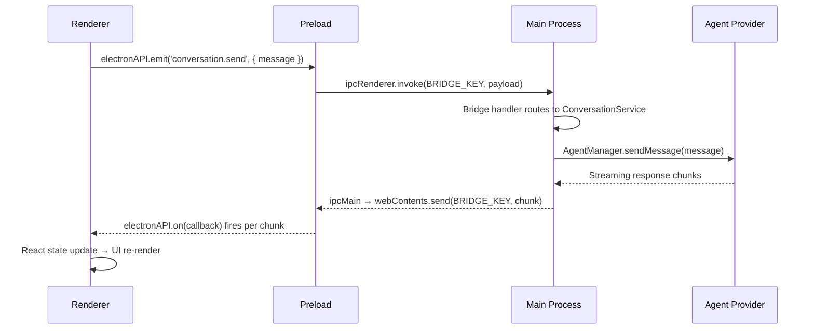
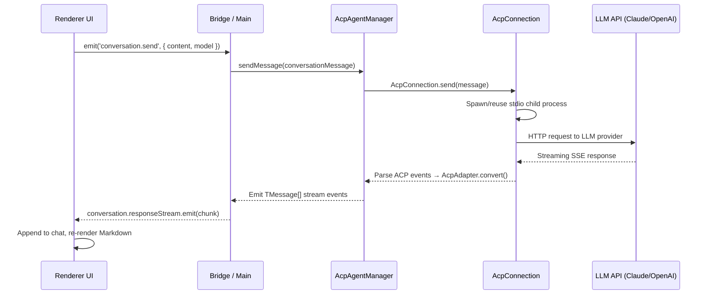
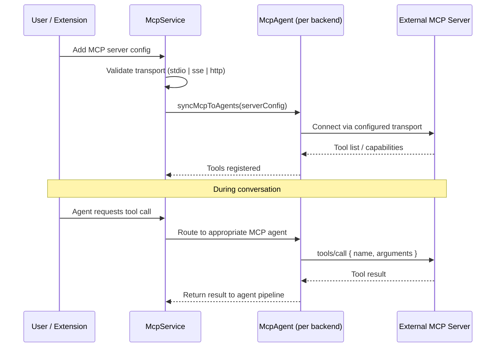
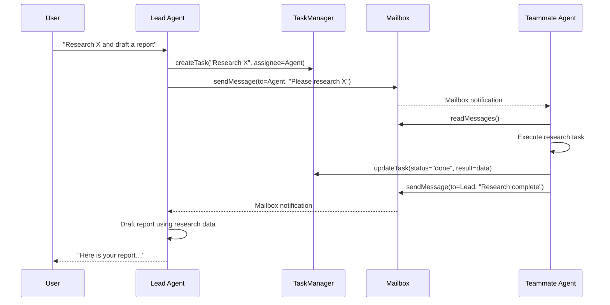

# Largo — Architecture Documentation

> **Version**: 1.9.16 · **Framework**: AionUi · **Runtime**: Electron 37 + Node.js 22+

Largo is an AI-powered M&A assistant built on the AionUi framework. It ships as an
Electron desktop application with an optional WebUI mode for browser-based access and
a mobile companion app.

---

## Table of Contents

1. [High-Level Architecture](#1-high-level-architecture)
2. [Process Boundaries](#2-process-boundaries)
3. [Directory Map](#3-directory-map)
4. [IPC Bridge Pattern](#4-ipc-bridge-pattern)
5. [AI Agent Pipeline](#5-ai-agent-pipeline)
6. [Extension System](#6-extension-system)
7. [MCP Integration](#7-mcp-integration)
8. [Multi-Channel Messaging](#8-multi-channel-messaging)
9. [Team Mode — Multi-Agent Collaboration](#9-team-mode--multi-agent-collaboration)
10. [Database Layer](#10-database-layer)
11. [Deployment Topology](#11-deployment-topology)
12. [Security Model](#12-security-model)
13. [Tech Stack Summary](#13-tech-stack-summary)

---

## 1. High-Level Architecture

```
┌──────────────────────────────────────────────────────────────────────────┐
│                          Largo Application                               │
│                                                                          │
│  ┌─────────────────┐   contextBridge   ┌──────────────────────────────┐  │
│  │  Renderer        │◄════════════════►│  Main Process                 │  │
│  │  (React 19)      │    IPC Bridge    │  (Electron / Node.js)        │  │
│  │                   │                  │                               │  │
│  │  ┌─────────────┐ │                  │  ┌────────┐  ┌────────────┐  │  │
│  │  │ Pages       │ │                  │  │ Bridge │  │ Services   │  │  │
│  │  │ Components  │ │                  │  │ Layer  │  │ Database   │  │  │
│  │  │ Hooks       │ │                  │  │        │  │ i18n       │  │  │
│  │  │ Services    │ │                  │  │        │  │ Cron       │  │  │
│  │  └─────────────┘ │                  │  └────────┘  └────────────┘  │  │
│  │                   │                  │                               │  │
│  │  Arco Design      │                  │  ┌────────────────────────┐  │  │
│  │  UnoCSS           │                  │  │ Agent Providers        │  │  │
│  │  SWR              │                  │  │ ACP │ Gemini │ Aionrs  │  │  │
│  └─────────────────┘                  │  │ OpenClaw │ Nanobot     │  │  │
│                                        │  │ Remote                  │  │  │
│                                        │  └────────────────────────┘  │  │
│                                        │                               │  │
│                                        │  ┌────────────────────────┐  │  │
│                                        │  │ Extensions │ Channels  │  │  │
│                                        │  │ MCP        │ Team Mode │  │  │
│                                        │  │ WebServer  │ Workers   │  │  │
│                                        │  └────────────────────────┘  │  │
│                                        └──────────────────────────────┘  │
│                                                                          │
│  ┌────────────────────────────────────────────────────────────────────┐  │
│  │  src/common/ — Shared code (types, API clients, config, utils)     │  │
│  │  Importable by both Main and Renderer processes                    │  │
│  └────────────────────────────────────────────────────────────────────┘  │
└──────────────────────────────────────────────────────────────────────────┘
         │                              │                        │
         ▼                              ▼                        ▼
   ┌───────────┐              ┌──────────────┐          ┌──────────────┐
   │ SQLite DB │              │ External LLM │          │ MCP Servers  │
   │ (WAL)     │              │ APIs         │          │ (stdio/HTTP) │
   └───────────┘              └──────────────┘          └──────────────┘
```

---

## 2. Process Boundaries

Largo enforces strict process isolation. Mixing APIs across boundaries is
**prohibited**.

| Process      | Location              | Allowed APIs                                  | Forbidden                  |
| ------------ | --------------------- | --------------------------------------------- | -------------------------- |
| **Main**     | `src/process/`        | Node.js, Electron Main, `fs`, `child_process` | DOM, `window`, `document`  |
| **Renderer** | `src/renderer/`       | DOM, React, Browser APIs                      | `require()`, `fs`, Node.js |
| **Worker**   | `src/process/worker/` | Node.js (forked child)                        | Electron APIs, DOM         |
| **Preload**  | `src/preload.ts`      | `contextBridge`, limited Node.js              | Direct main-process access |

```
┌─────────────┐        ┌─────────────┐        ┌─────────────┐
│  Renderer    │        │   Preload   │        │    Main     │
│  (Chromium)  │───────►│ contextBridge│───────►│  (Node.js)  │
│              │◄───────│             │◄───────│             │
│  NO Node.js  │  IPC   │  Sanitized  │  IPC   │  NO DOM     │
└─────────────┘        └─────────────┘        └──────┬──────┘
                                                      │ fork()
                                               ┌──────▼──────┐
                                               │   Worker    │
                                               │  (Node.js)  │
                                               │ NO Electron │
                                               └─────────────┘
```

---

## 3. Directory Map

```
src/
├── common/                  # Shared code — importable by any process
│   ├── adapter/             # Cross-platform adapters
│   ├── api/                 # API client implementations
│   ├── chat/                # Chat utilities (approval, document, navigation, slash)
│   ├── config/              # Configuration (appEnv, constants, i18n, storage)
│   ├── platform/            # Platform abstractions (OS, shell, paths)
│   ├── types/               # Shared TypeScript types
│   ├── update/              # Auto-update logic
│   └── utils/               # Shared utility functions
│
├── process/                 # Main process — Electron + Node.js
│   ├── agent/               # AI provider integrations
│   │   ├── acp/             #   ACP protocol (Claude, Codex, Codebuddy, Qwen, Iflow)
│   │   ├── aionrs/          #   Rust-based agent
│   │   ├── gemini/          #   Google Gemini
│   │   ├── nanobot/         #   Stateless CLI agent
│   │   ├── openclaw/        #   Gateway-based agent
│   │   └── remote/          #   HTTP/WebSocket remote agent
│   ├── bridge/              # IPC handler implementations
│   ├── channels/            # Multi-channel messaging
│   │   ├── actions/         #   Action execution
│   │   ├── agent/           #   Agent ↔ channel routing
│   │   ├── core/            #   ChannelManager, PluginManager, SessionManager
│   │   ├── gateway/         #   Gateway connections
│   │   ├── pairing/         #   Secure pairing codes
│   │   └── plugins/         #   Telegram, Lark, DingTalk, WeChat, WeCom
│   ├── extensions/          # Plugin/extension system
│   │   ├── hub/             #   Extension marketplace
│   │   ├── lifecycle/       #   Install, activate, deactivate, uninstall
│   │   ├── protocol/        #   Extension communication protocol
│   │   ├── resolvers/       #   10+ contribution resolvers
│   │   └── sandbox/         #   Extension isolation
│   ├── pet/                 # Desktop pet/mascot feature
│   ├── resources/           # Built-in resources
│   │   ├── assistant/       #   Assistant preset JSONs
│   │   ├── builtinMcp/      #   Built-in MCP server scripts
│   │   └── skills/          #   Skill definitions
│   ├── services/            # Business logic services
│   │   ├── cron/            #   Scheduled tasks
│   │   ├── database/        #   SQLite (schema, drivers, repositories)
│   │   ├── i18n/            #   Server-side i18n
│   │   └── mcpServices/     #   MCP service coordination
│   ├── task/                # Task/agent management
│   ├── team/                # Multi-agent team collaboration
│   │   ├── mcp/             #   Team MCP servers
│   │   ├── prompts/         #   Role prompts and templates
│   │   └── repository/      #   Team persistence (SQLite)
│   ├── utils/               # Process utilities
│   ├── webserver/           # WebUI Express server
│   │   ├── auth/            #   JWT authentication
│   │   ├── config/          #   Server constants
│   │   ├── middleware/      #   Rate limiting, CORS, CSRF
│   │   ├── routes/          #   REST API endpoints
│   │   ├── websocket/       #   Real-time streaming
│   │   └── types/           #   Server type definitions
│   └── worker/              # Background fork workers
│
├── renderer/                # React UI — browser context only
│   ├── assets/              # Static assets (images, logos)
│   ├── components/          # Reusable UI components
│   │   ├── Markdown/        #   Markdown renderer
│   │   ├── agent/           #   Agent UI widgets
│   │   ├── base/            #   Primitive components
│   │   ├── chat/            #   Chat interface components
│   │   ├── layout/          #   Shell, sidebar, panels
│   │   ├── media/           #   Audio, video, image
│   │   ├── settings/        #   Settings forms
│   │   └── workspace/       #   Workspace management
│   ├── hooks/               # Custom React hooks
│   │   ├── agent/           #   Agent state hooks
│   │   ├── assistant/       #   Assistant selection
│   │   ├── chat/            #   Chat hooks
│   │   ├── context/         #   React context hooks
│   │   ├── file/            #   File handling
│   │   ├── mcp/             #   MCP UI hooks
│   │   ├── system/          #   System info hooks
│   │   └── ui/              #   UI state hooks
│   ├── pages/               # Route-level page components
│   │   ├── conversation/    #   Main chat view
│   │   ├── cron/            #   Scheduled tasks UI
│   │   ├── guid/            #   Setup / onboarding
│   │   ├── login/           #   Authentication
│   │   ├── settings/        #   Application settings
│   │   └── team/            #   Team collaboration UI
│   ├── services/            # Client-side services
│   │   ├── i18n/            #   react-i18next setup
│   │   ├── FileService/     #   File operations
│   │   ├── PasteService/    #   Clipboard handling
│   │   ├── SpeechToText/    #   Voice input
│   │   └── PWA/             #   Progressive Web App
│   ├── styles/              # Global styles (Mint Whisper theme)
│   └── utils/               # React utilities
│
├── preload.ts               # IPC bridge — contextBridge exposure
└── server.ts                # WebUI standalone entry point
```

---

## 4. IPC Bridge Pattern

All communication between Renderer and Main goes through the preload
`contextBridge`. Direct `ipcRenderer`/`ipcMain` calls are forbidden.

### Bridge Architecture

```
┌──────────────────────────┐
│      Renderer Process     │
│                           │
│  window.electronAPI       │
│    .emit(name, data)  ────┼──►  ipcRenderer.invoke(BRIDGE_KEY, {name, data})
│    .on(callback)      ◄───┼──   ipcRenderer.on(BRIDGE_KEY, ...)
│    .getPathForFile()      │
│    .webuiResetPassword()  │
│    .collectFeedbackLogs() │
└──────────────────────────┘
              │
              │  contextBridge.exposeInMainWorld('electronAPI', api)
              ▼
┌──────────────────────────┐
│      Preload Script       │
│  (src/preload/main.ts)    │
│                           │
│  Sanitizes & proxies      │
│  all IPC calls            │
└──────────────────────────┘
              │
              │  ipcMain.handle(BRIDGE_KEY, handler)
              ▼
┌──────────────────────────┐
│      Main Process         │
│  (src/process/bridge/)    │
│                           │
│  Bridge handlers route    │
│  calls to services        │
└──────────────────────────┘
```

### Exposed API Surface

The preload script exposes a controlled API via `window.electronAPI`:

```typescript
// Core messaging (all bridge calls funnel through these)
electronAPI.emit(name: string, data: unknown)   // Renderer → Main
electronAPI.on(callback: (event) => void)        // Main → Renderer

// File access
electronAPI.getPathForFile(file: File)           // Resolve drag-and-drop paths

// WebUI management (direct IPC, bypass bridge)
electronAPI.webuiGetStatus()
electronAPI.webuiResetPassword()
electronAPI.webuiChangePassword(newPassword)
electronAPI.webuiChangeUsername(newUsername)
electronAPI.webuiGenerateQRToken()

// WeChat login flow
electronAPI.weixinLoginStart()
electronAPI.weixinLoginOnQR(callback)
electronAPI.weixinLoginOnScanned(callback)
electronAPI.weixinLoginOnDone(callback)

// Diagnostics
electronAPI.collectFeedbackLogs()
```

### Example: Sending a Chat Message



---

## 5. AI Agent Pipeline

Largo supports six agent backends. All share a common `BaseAgentManager`
interface so the UI layer is backend-agnostic.

### Provider Architecture

```
┌─────────────────────────────────────────────────────┐
│                  Agent Providers                     │
│                                                      │
│  ┌──────────┐ ┌──────────┐ ┌──────────┐            │
│  │   ACP    │ │  Gemini  │ │  Aionrs  │            │
│  │ (Claude, │ │ (Google  │ │ (Rust    │            │
│  │  Codex,  │ │  GenAI)  │ │  binary) │            │
│  │  Qwen…)  │ │          │ │          │            │
│  └────┬─────┘ └────┬─────┘ └────┬─────┘            │
│       │             │             │                  │
│  ┌────┴─────┐ ┌────┴─────┐ ┌────┴─────┐            │
│  │ OpenClaw │ │ Nanobot  │ │  Remote  │            │
│  │ (Gateway │ │ (CLI     │ │ (HTTP/WS │            │
│  │  TCP)    │ │  spawn)  │ │  proxy)  │            │
│  └──────────┘ └──────────┘ └──────────┘            │
│                                                      │
│  All implement: BaseAgentManager<Data, Confirm>      │
│    ├── sendMessage(msg)                              │
│    ├── cancelMessage()                               │
│    ├── getStatus()                                   │
│    └── dispose()                                     │
└─────────────────────────────────────────────────────┘
```

### Message Flow (ACP — Primary Provider)



### ACP Protocol Detail

ACP (Agent Communication Protocol) is the primary integration layer:

1. **AcpConnection** — manages a stdio child process per session
2. **AcpAdapter** — converts ACP wire format to internal `TMessage[]`
3. **AcpApprovalStore** — session-scoped permission grants for tool use
4. **MCP Injection** — MCP server configs are injected into ACP sessions via
   `mcpSessionConfig.ts`

### Provider Comparison

| Provider     | Transport               | Stateful             | Use Case                                        |
| ------------ | ----------------------- | -------------------- | ----------------------------------------------- |
| **ACP**      | stdio (child process)   | Yes                  | Primary — Claude, Codex, Codebuddy, Qwen, Iflow |
| **Gemini**   | @office-ai/aioncli-core | Yes                  | Google Gemini models                            |
| **Aionrs**   | Rust binary (stdio)     | Yes (session resume) | High-performance Rust agent                     |
| **OpenClaw** | TCP socket to gateway   | Yes                  | Gateway-routed agents                           |
| **Nanobot**  | CLI spawn per message   | No                   | Lightweight stateless tasks                     |
| **Remote**   | HTTP / WebSocket        | Varies               | External agent services                         |

---

## 6. Extension System

The extension system provides a full plugin lifecycle with sandboxing,
permissions, and typed contribution points.

### Extension Lifecycle

```
                    ┌─────────────┐
                    │  Discovered  │
                    └──────┬──────┘
                           │ loadAll()
                           ▼
                    ┌─────────────┐
         ┌─────────│  Validated   │──────────┐
         │ Engine  └──────┬──────┘  Deps     │
         │ mismatch       │ OK     missing   │
         ▼                ▼                   ▼
    ┌─────────┐    ┌─────────────┐     ┌──────────┐
    │ Skipped │    │ onInstall() │     │  Error   │
    └─────────┘    │ (120s max)  │     └──────────┘
                   └──────┬──────┘
                          │ first run only
                          ▼
                   ┌──────────────┐
              ┌───►│ onActivate() │◄──── User enables
              │    │ (30s max)    │
              │    └──────┬───────┘
              │           │
              │           ▼
              │    ┌─────────────┐
              │    │   Active    │ ◄── Resolvers process contributions
              │    └──────┬──────┘
              │           │ User disables
              │           ▼
              │    ┌──────────────┐
              └────│onDeactivate()│
                   │ (30s max)    │
                   └──────┬───────┘
                          │ User uninstalls
                          ▼
                   ┌──────────────┐
                   │ onUninstall()│
                   │ (60s max)    │
                   └──────────────┘
```

### Lifecycle Execution Model

Each lifecycle hook runs in a **forked child process** (`child_process.fork()`)
for safety. Hooks can be defined as:

```jsonc
{
  "lifecycle": {
    "onActivate": "scripts/activate.js", // Simple path
    "onInstall": { "script": "setup.js", "timeout": 90 },
    "onDeactivate": {
      "shell": { "cliCommand": "cleanup", "args": ["--all"] },
      "timeout": 15,
    },
  },
}
```

### Contribution Types

Extensions declare capabilities via a typed `contributes` manifest:

| Contribution     | Resolver              | Purpose                               |
| ---------------- | --------------------- | ------------------------------------- |
| `acpAdapters`    | AcpAdapterResolver    | Custom ACP backend adapters           |
| `mcpServers`     | McpServerResolver     | MCP server definitions                |
| `assistants`     | AssistantResolver     | Assistant presets                     |
| `agents`         | AssistantResolver     | Agent definitions                     |
| `skills`         | SkillResolver         | Skill / tool definitions              |
| `themes`         | ThemeResolver         | CSS themes                            |
| `channelPlugins` | ChannelPluginResolver | Messaging channel plugins             |
| `webui`          | WebuiResolver         | WebUI routes, WS handlers, middleware |
| `settingsTabs`   | SettingsTabResolver   | Custom settings panels                |
| `modelProviders` | ModelProviderResolver | Additional model providers            |
| `i18n`           | I18nResolver          | Translation bundles                   |

### Permission System

Extensions request permissions; the system assesses risk:

```
Permissions: Storage | Network | Shell | Filesystem | Clipboard | ActiveUser | Events
                                  │
                                  ▼
                      analyzePermissions() → Risk Level
                      ├── Low    (Storage, Events only)
                      ├── Medium (Network, Clipboard)
                      └── High   (Shell, Filesystem)
```

### Loading Pipeline

```
1. ExtensionLoader.loadAll()
   ├── Scan sources (local, appdata, env)
   ├── Filter by engine/apiVersion compatibility
   ├── Topological sort by dependency graph
   └── Restore persisted enabled/disabled state

2. Run lifecycle hooks
   ├── onInstall (first-time only, forked process)
   └── onActivate (for enabled extensions)

3. Resolve contributions
   └── Each resolver processes its contribution type
       └── Register with the appropriate service
```

---

## 7. MCP Integration

[Model Context Protocol (MCP)](https://modelcontextprotocol.io) enables Largo to
connect to external tools and data sources.

### Transport Layer

```
┌────────────────────────────────────────────────────────┐
│                    MCP Transports                       │
│                                                         │
│  ┌─────────────┐  ┌─────────────┐  ┌───────────────┐  │
│  │    stdio     │  │     SSE     │  │     HTTP      │  │
│  │  (local CLI) │  │ (streaming) │  │ (request/res) │  │
│  └──────┬──────┘  └──────┬──────┘  └───────┬───────┘  │
│         │                │                  │           │
│         └────────────────┼──────────────────┘           │
│                          │                               │
│                   ┌──────▼──────┐                        │
│                   │  McpService │                        │
│                   │ (Coordinator)│                       │
│                   └──────┬──────┘                        │
│                          │                               │
│         ┌────────────────┼────────────────┐              │
│         ▼                ▼                ▼              │
│  ┌────────────┐  ┌────────────┐  ┌────────────┐        │
│  │ ClaudeMcp  │  │ GeminiMcp  │  │ CodexMcp   │  ...   │
│  │ Agent      │  │ Agent      │  │ Agent      │        │
│  └────────────┘  └────────────┘  └────────────┘        │
└────────────────────────────────────────────────────────┘
```

### MCP Service Operations



### MCP Configuration Schema

```typescript
type McpTransport =
  | { type: 'stdio'; command: string; args?: string[]; env?: Record<string, string> }
  | { type: 'sse'; url: string; headers?: Record<string, string> }
  | { type: 'http'; url: string; headers?: Record<string, string> }
  | { type: 'streamable_http'; url: string; headers?: Record<string, string> };
```

### Backend-Specific MCP Agents

Each AI backend has a dedicated MCP agent wrapper that handles protocol
translation:

| Agent             | Backend            | Notes                          |
| ----------------- | ------------------ | ------------------------------ |
| ClaudeMcpAgent    | Claude (Anthropic) | Native MCP support             |
| GeminiMcpAgent    | Gemini (Google)    | Tool format conversion         |
| CodexMcpAgent     | Codex              | OpenAI function-calling bridge |
| CodebuddyMcpAgent | Codebuddy          | Custom adapter                 |
| QwenMcpAgent      | Qwen               | Alibaba Cloud integration      |
| IflowMcpAgent     | Iflow              | Workflow engine                |
| AionrsMcpAgent    | Aionrs             | Rust agent MCP relay           |
| AionuiMcpAgent    | AionUI native      | @office-ai/aioncli-core        |

### Built-in MCP Servers

Located in `src/process/resources/builtinMcp/`, these are bundled MCP servers
that ship with the application (e.g., filesystem access, web search).

---

## 8. Multi-Channel Messaging

Largo can act as a bot across multiple messaging platforms simultaneously.

```
┌─────────────────────────────────────────────────────┐
│                  Channel System                      │
│                                                      │
│  ┌──────────────┐                                   │
│  │ChannelManager│─── manages ──► PluginManager      │
│  └──────┬───────┘                SessionManager     │
│         │                        PairingService     │
│         ├──────────────┬──────────────┬─────────┐   │
│         ▼              ▼              ▼         ▼   │
│  ┌───────────┐  ┌───────────┐ ┌─────────┐ ┌─────┐ │
│  │ Telegram  │  │   Lark    │ │DingTalk │ │WeChat│ │
│  │ Plugin    │  │  Plugin   │ │ Plugin  │ │ Work │ │
│  └─────┬─────┘  └─────┬─────┘ └────┬────┘ └──┬──┘ │
│        │               │            │          │    │
│        └───────────────┼────────────┼──────────┘    │
│                        ▼                             │
│              ChannelMessageService                   │
│              (route ↔ agent pipeline)                │
│                        │                             │
│              ChannelEventBus                         │
│              (lifecycle events)                      │
└─────────────────────────────────────────────────────┘
```

### Plugin Interface

Each channel plugin implements `BasePlugin`:

- **Credential fields** — API keys, bot tokens, webhook secrets
- **Config fields** — User-specific settings (language, greeting)
- **Message sending** — Platform-specific formatting (cards, keyboards, rich text)
- **Session management** — Track user sessions per channel
- **Notification handling** — Push notifications from agents to channels

### Supported Platforms

| Platform      | Plugin           | Features                                |
| ------------- | ---------------- | --------------------------------------- |
| Telegram      | `TelegramPlugin` | Inline keyboards, markdown, file upload |
| Lark (Feishu) | `LarkPlugin`     | Interactive cards, rich text            |
| DingTalk      | `DingTalkPlugin` | Action cards, @mentions                 |
| WeChat        | `WeixinPlugin`   | QR login, typing indicators             |
| WeCom         | `WecomPlugin`    | Crypto, streaming state                 |

---

## 9. Team Mode — Multi-Agent Collaboration

Team mode enables multiple AI agents to collaborate on complex tasks with
a shared workspace, mailbox, and task graph.

### Team Architecture

```
┌──────────────────────────────────────────────────────────────┐
│                       TeamSession                             │
│                                                               │
│  ┌───────────────────────────────────────────────────────┐   │
│  │ TeammateManager                                        │   │
│  │  ├── Lead Agent (orchestrator)                         │   │
│  │  ├── Agent Slot 1 (specialist)                         │   │
│  │  ├── Agent Slot 2 (specialist)                         │   │
│  │  └── Agent Slot N …                                    │   │
│  └────────────────┬──────────────────────────────────────┘   │
│                   │                                           │
│  ┌────────────────┼─────────────────────────────────────┐    │
│  │                ▼                                      │    │
│  │  ┌───────────────┐  ┌──────────────┐  ┌───────────┐ │    │
│  │  │    Mailbox     │  │ TaskManager  │  │TeamMcp    │ │    │
│  │  │ (async queue)  │  │ (dependency  │  │Server     │ │    │
│  │  │                │  │  graph)      │  │(stdio)    │ │    │
│  │  │ to/from agents │  │              │  │           │ │    │
│  │  │ read tracking  │  │ status:      │  │ callTool  │ │    │
│  │  │                │  │  pending     │  │ getMailbox│ │    │
│  │  │                │  │  in_progress │  │ createTask│ │    │
│  │  │                │  │  blocked     │  │ getStatus │ │    │
│  │  │                │  │  done        │  │           │ │    │
│  │  └───────────────┘  └──────────────┘  └───────────┘ │    │
│  └──────────────────────────────────────────────────────┘    │
│                                                               │
│  teamEventBus: agent.spawn | agent.wake | agent.remove       │
│                task.change | mailbox.notify                   │
└──────────────────────────────────────────────────────────────┘
```

### Team Collaboration Flow



### Prompt System

Team prompts (in `src/process/team/prompts/`) define agent behavior:

| Prompt                | Purpose                                               |
| --------------------- | ----------------------------------------------------- |
| `leadPrompt.ts`       | Lead agent: task decomposition, delegation, synthesis |
| `teammatePrompt.ts`   | Teammate: focused execution, status reporting         |
| `teamGuidePrompt.ts`  | Team advisor: best practices, suggestions             |
| `buildRolePrompt.ts`  | Dynamic role construction from agent config           |
| `toolDescriptions.ts` | MCP tool documentation for agents                     |

---

## 10. Database Layer

Largo uses **SQLite** via `better-sqlite3` (with `bun:sqlite` as an alternative
driver) in **WAL mode** for concurrent read/write performance.

### Configuration

- **WAL mode** — Write-Ahead Logging for non-blocking reads during writes
- **Busy timeout** — 5 seconds for lock contention
- **Foreign keys** — enabled for referential integrity
- **Schema version** — 25 (auto-migrated on startup)

### Schema Overview

```
┌─────────────┐       ┌──────────────────┐       ┌──────────────┐
│    users     │       │  conversations   │       │   messages    │
├─────────────┤       ├──────────────────┤       ├──────────────┤
│ id       PK │◄──┐   │ id            PK │◄──┐   │ id        PK │
│ username UQ │   └───│ user_id       FK │   └───│ conv_id   FK │
│ email       │       │ name             │       │ msg_id       │
│ password_   │       │ type             │       │ type         │
│   hash      │       │ model            │       │ content      │
│ jwt_secret  │       │ status           │       │ position     │
│ created_at  │       │ created_at       │       │ status       │
│ updated_at  │       │ updated_at       │       │ created_at   │
└─────────────┘       └──────────────────┘       └──────────────┘

┌─────────────┐       ┌──────────────────┐       ┌──────────────┐
│    teams     │       │     mailbox      │       │  team_tasks   │
├─────────────┤       ├──────────────────┤       ├──────────────┤
│ id       PK │◄──┐   │ id            PK │       │ id        PK │
│ user_id  FK │   ├───│ team_id       FK │   ┌───│ team_id   FK │
│ name        │   │   │ to_agent_id      │   │   │ subject      │
│ workspace   │   │   │ from_agent_id    │   │   │ status       │
│ lead_agent  │   │   │ type             │   │   │ owner        │
│   _id       │   │   │ content          │   │   │ blocked_by   │
│ agents JSON │   │   │ read             │   │   │   (JSON)     │
│ created_at  │   └───│ created_at       │   │   │ blocks JSON  │
└─────────────┘       └──────────────────┘   │   │ metadata     │
                                              │   └──────────────┘
                                              │
                                              └── team_id FK
```

### Index Strategy

| Table           | Indices                         | Purpose                     |
| --------------- | ------------------------------- | --------------------------- |
| `conversations` | `(user_id, updated_at DESC)`    | Efficient conversation list |
| `messages`      | `(conversation_id, created_at)` | Message history retrieval   |
| `teams`         | `(user_id, updated_at)`         | Team list per user          |
| `mailbox`       | `(team_id, to_agent_id, read)`  | Unread message queries      |
| `team_tasks`    | `(team_id, status)`             | Task filtering by status    |

### Driver Abstraction

```typescript
interface ISqliteDriver {
  prepare(sql: string): Statement;
  exec(sql: string): void;
  transaction(fn: () => void): void;
  close(): void;
}

// Implementations:
// - BetterSqlite3Driver  (Node.js native, synchronous)
// - BunSqliteDriver      (Bun runtime)
```

---

## 11. Deployment Topology

Largo supports three deployment modes sharing the same codebase:

```
┌──────────────────────────────────────────────────────────────────┐
│                     Deployment Modes                              │
│                                                                   │
│  ┌─────────────────┐  ┌──────────────────┐  ┌────────────────┐  │
│  │   Desktop App   │  │    WebUI Mode    │  │  Mobile App    │  │
│  │  (Electron)     │  │  (Express + WS)  │  │  (Companion)   │  │
│  ├─────────────────┤  ├──────────────────┤  ├────────────────┤  │
│  │ macOS (dmg)     │  │ src/server.ts    │  │ React Native   │  │
│  │  - x64          │  │                  │  │ or PWA         │  │
│  │  - arm64        │  │ Browser clients  │  │                │  │
│  │ Windows (nsis)  │  │ connect via      │  │ Pairs with     │  │
│  │  - x64          │  │ HTTP + WebSocket │  │ desktop or     │  │
│  │  - arm64        │  │                  │  │ WebUI via QR   │  │
│  │ Linux (deb)     │  │ JWT auth         │  │                │  │
│  │  - x64          │  │ Rate limiting    │  │                │  │
│  │  - arm64        │  │ CSRF protection  │  │                │  │
│  └────────┬────────┘  └────────┬─────────┘  └───────┬────────┘  │
│           │                    │                     │           │
│           └────────────────────┼─────────────────────┘           │
│                                │                                  │
│                    ┌───────────▼───────────┐                     │
│                    │   Shared Core Logic    │                     │
│                    │   (src/process/*)      │                     │
│                    │   (src/common/*)       │                     │
│                    └───────────┬────────────┘                    │
│                                │                                  │
│            ┌───────────────────┼───────────────────┐             │
│            ▼                   ▼                   ▼             │
│     ┌───────────┐      ┌────────────┐      ┌───────────┐       │
│     │  SQLite   │      │ LLM APIs   │      │   MCP     │       │
│     │  (local)  │      │ (remote)   │      │ Servers   │       │
│     └───────────┘      └────────────┘      └───────────┘       │
└──────────────────────────────────────────────────────────────────┘
```

### Desktop Mode (Electron)

- Full native access: filesystem, notifications, tray, system menu
- Auto-update via `electron-updater`
- Native module support (better-sqlite3, node-pty, bcrypt)
- IPC via `contextBridge` preload script
- Build targets: macOS DMG/ZIP, Windows NSIS/ZIP, Linux DEB

### WebUI Mode (Express Server)

```
┌──────────┐  HTTPS   ┌──────────────────────────────────────┐
│ Browser  │─────────►│  Express Server (src/server.ts)       │
│ Client   │◄─────────│                                       │
│          │  WS      │  ┌──────────┐  ┌───────────────────┐ │
│ React    │◄────────►│  │  Auth    │  │   Bridge Adapter  │ │
│ SPA      │          │  │  (JWT)   │  │ (standalone mode) │ │
└──────────┘          │  └──────────┘  └───────────────────┘ │
                      │                                       │
                      │  Same process, services, agents       │
                      └──────────────────────────────────────┘
```

- `src/server.ts` bootstraps without Electron dependencies
- Uses `webserver/adapter.ts` to bridge IPC calls in standalone mode
- Serves the React renderer as static assets
- Real-time streaming via WebSocket connections
- Default port: 3000 (configurable via `PORT` env)

### Mobile Companion

- Located in `mobile/` directory
- Pairs with desktop or WebUI instance via QR code (`PairingService`)
- WebSocket-based communication for real-time sync

---

## 12. Security Model

### Trust Boundaries

```
┌─────────────────────────────────────────────────────────────────┐
│  TRUSTED ZONE (local machine)                                    │
│                                                                   │
│  ┌──────────────┐    ┌──────────────┐    ┌───────────────────┐  │
│  │ Main Process │    │  SQLite DB   │    │ Extension Sandbox │  │
│  │ (full Node)  │    │ (encrypted   │    │ (forked process,  │  │
│  │              │    │  storage)    │    │  permission-gated)│  │
│  └──────────────┘    └──────────────┘    └───────────────────┘  │
│                                                                   │
│  ┌──────────────┐                                                │
│  │ Renderer     │ ◄── contextBridge (no direct Node.js access)  │
│  │ (sandboxed)  │                                                │
│  └──────────────┘                                                │
│                                                                   │
├─────────────────────── NETWORK BOUNDARY ─────────────────────────┤
│                                                                   │
│  SEMI-TRUSTED ZONE (authenticated network)                       │
│                                                                   │
│  ┌──────────────┐    ┌──────────────┐    ┌──────────────┐       │
│  │ WebUI Client │    │ Mobile App   │    │ Channel Bots │       │
│  │ (JWT auth)   │    │ (QR pairing) │    │ (webhook     │       │
│  │              │    │              │    │  validation) │       │
│  └──────────────┘    └──────────────┘    └──────────────┘       │
│                                                                   │
├─────────────────────── EXTERNAL BOUNDARY ────────────────────────┤
│                                                                   │
│  UNTRUSTED ZONE (external services)                              │
│                                                                   │
│  ┌──────────────┐    ┌──────────────┐    ┌──────────────┐       │
│  │ LLM APIs     │    │ MCP Servers  │    │ Extension    │       │
│  │ (API keys)   │    │ (stdio/HTTP) │    │ Registries   │       │
│  └──────────────┘    └──────────────┘    └──────────────┘       │
└─────────────────────────────────────────────────────────────────┘
```

### Security Controls

| Layer                   | Mechanism               | Implementation                                         |
| ----------------------- | ----------------------- | ------------------------------------------------------ |
| **Authentication**      | JWT tokens              | `webserver/auth/AuthService` — bcrypt-hashed passwords |
| **Session**             | HTTP-only cookies       | Secure, SameSite=Strict in production                  |
| **CSRF**                | Token validation        | `tiny-csrf` middleware                                 |
| **Rate Limiting**       | Request throttling      | `express-rate-limit` per route                         |
| **API Keys**            | Local encrypted storage | Keys never leave the device; per-provider isolation    |
| **Extensions**          | Permission system       | Declared permissions analyzed for risk level           |
| **Extension Isolation** | Forked processes        | Lifecycle hooks run in `child_process.fork()`          |
| **Renderer**            | Context isolation       | `contextBridge` — no direct Node.js access             |
| **Database**            | Encrypted storage       | SQLite with application-level encryption               |
| **Telemetry**           | None                    | No third-party telemetry or analytics                  |

### Data Flow Security

1. **API keys** are stored locally and injected into agent sessions at runtime —
   they are never embedded in the renderer bundle or sent to third parties
2. **WebUI authentication** requires JWT with bcrypt-hashed passwords; sessions
   are cookie-based with CSRF protection
3. **MCP servers** running via `stdio` execute locally; HTTP-based MCP servers
   are subject to the user's network trust model
4. **Extensions** must declare permissions; `Shell` and `Filesystem` permissions
   trigger a high-risk warning before installation

---

## 13. Tech Stack Summary

### Core Runtime

| Component          | Technology | Version     |
| ------------------ | ---------- | ----------- |
| Desktop Shell      | Electron   | 37          |
| JavaScript Runtime | Node.js    | 22+         |
| Package Manager    | Bun        | latest      |
| Language           | TypeScript | strict mode |

### Frontend

| Component         | Technology              | Version                 |
| ----------------- | ----------------------- | ----------------------- |
| UI Framework      | React                   | 19                      |
| Component Library | Arco Design             | 2.66                    |
| Icons             | Icon Park React         | latest                  |
| Styling           | UnoCSS + CSS Modules    | latest                  |
| Data Fetching     | SWR                     | latest                  |
| i18n              | i18next + react-i18next | 9 languages, 20 modules |

### Backend / Main Process

| Component     | Technology                  | Version |
| ------------- | --------------------------- | ------- |
| Database      | SQLite (better-sqlite3)     | 12.4    |
| Web Framework | Express                     | 5.1     |
| WebSocket     | ws                          | 8.18    |
| Auth          | JWT (jsonwebtoken) + bcrypt | —       |
| MCP SDK       | @modelcontextprotocol/sdk   | 1.20    |

### AI Integrations

| Provider           | SDK                             | Version |
| ------------------ | ------------------------------- | ------- |
| Anthropic (Claude) | @anthropic-ai/sdk               | 0.71    |
| Google (Gemini)    | @google/genai                   | 1.16    |
| OpenAI             | openai                          | 5.12    |
| AWS Bedrock        | @aws-sdk/client-bedrock-runtime | latest  |
| AionUI Core        | @office-ai/aioncli-core         | 0.30    |

### Build & Quality

| Component    | Technology                                      |
| ------------ | ----------------------------------------------- |
| Bundler      | electron-vite 5 + Vite 6                        |
| Transpiler   | esbuild                                         |
| Unit Testing | Vitest 4                                        |
| E2E Testing  | Playwright                                      |
| Linter       | oxlint                                          |
| Formatter    | oxfmt                                           |
| Path Aliases | `@/*`, `@process/*`, `@renderer/*`, `@worker/*` |

---

_This document is auto-maintained. For contribution guidelines, see
[CONTRIBUTING.md](../CONTRIBUTING.md). For file structure conventions, see
[docs/conventions/file-structure.md](conventions/file-structure.md)._
