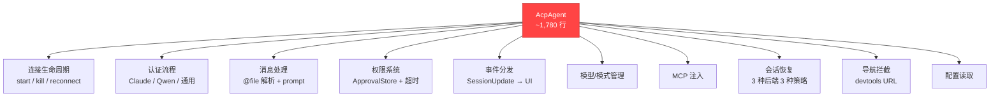
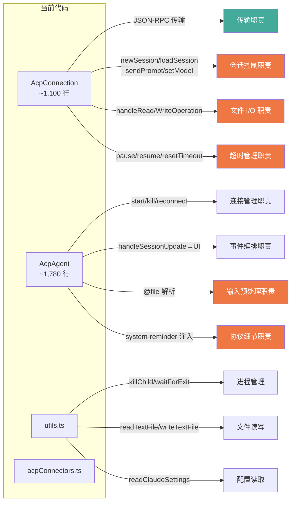
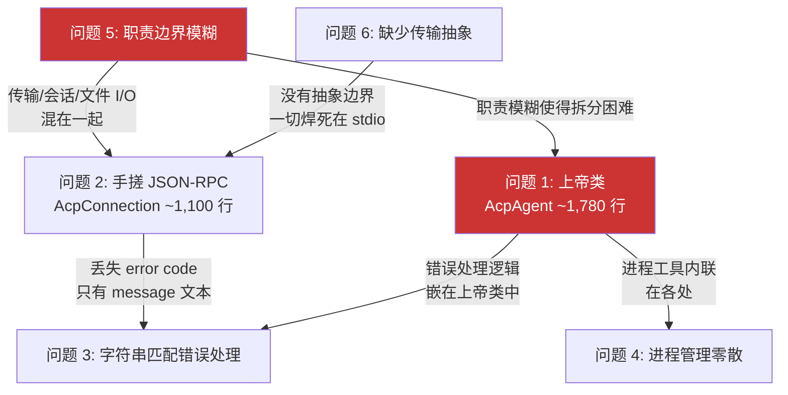

# ACP 层现状问题分析

> **版本**: v1.0 | **最后更新**: 2026-04-14 | **状态**: Draft
> **摘要**: 系统化分析 AionUi 当前 ACP 实现的 6 大架构问题，论证为什么需要全面重构而非局部修补
> **受众**: ACP 重构实现开发者、新加入团队的开发者

---

## 目录

- [1. 背景](#1-背景)
- [2. 问题一：AcpAgent 上帝类](#2-问题一acpagent-上帝类)
- [3. 问题二：AcpConnection 手搓 JSON-RPC](#3-问题二acpconnection-手搓-json-rpc)
- [4. 问题三：错误处理基于字符串匹配](#4-问题三错误处理基于字符串匹配)
- [5. 问题四：进程管理工具零散](#5-问题四进程管理工具零散)
- [6. 问题五：职责边界模糊](#6-问题五职责边界模糊)
- [7. 问题六：缺少协议层抽象](#7-问题六缺少协议层抽象)
- [8. 问题间的耦合关系](#8-问题间的耦合关系)
- [9. 为什么需要重构而不是修补](#9-为什么需要重构而不是修补)
- [参考文档](#参考文档)

---

## 1. 背景

AionUi 是一个 Electron 桌面客户端，通过 ACP (Agent Client Protocol) 与 25+ 种 AI Agent 后端通信（Anthropic Claude、Google Gemini、OpenAI Codex、阿里通义千问等）。ACP 是一个基于 JSON-RPC 2.0 的会话式 AI Agent 通信协议，定义了 session 管理、prompt 交互、权限控制等标准化接口。ACP 层是 AionUi 最复杂的子系统，负责进程管理、协议通信、会话生命周期、权限系统、配置同步等核心功能。

当前 ACP 实现位于 `src/process/agent/acp/`，主要由以下文件构成：

| 文件                   | 行数   | 职责                                        |
| ---------------------- | ------ | ------------------------------------------- |
| `AcpAgent`（index.ts） | ~1,780 | 会话编排、事件路由、认证、权限、配置、重连  |
| `AcpConnection.ts`     | ~1,100 | JSON-RPC 通信、超时管理、文件 I/O、会话控制 |
| `acpConnectors.ts`     | -      | 后端连接器、NPX 启动、环境准备              |
| `utils.ts`             | -      | 进程管理、文件读写、配置读取                |

这些文件合计近 3,000 行，职责高度重叠，缺乏清晰的模块边界。以下逐一分析各个问题。

---

## 2. 问题一：AcpAgent 上帝类

### 2.1 问题描述

`AcpAgent`（index.ts，约 1,780 行）是典型的上帝类 (God Class)，单个类承担了 12+ 项不相关的职责：

| 职责类别     | 具体功能                                                                   |
| ------------ | -------------------------------------------------------------------------- |
| 连接生命周期 | start / kill / auto-reconnect                                              |
| 认证流程     | performAuthentication / ensureQwenAuth / ensureClaudeAuth                  |
| 消息处理     | 消息发送 + `@` 文件引用解析 + 工作区文件搜索                               |
| 权限系统     | 权限请求处理 + ApprovalStore 缓存 + 超时管理                               |
| 导航拦截     | chrome-devtools URL 提取 + preview_open 事件                               |
| 模型管理     | Model 切换 + `<system-reminder>` 注入通知 AI 模型已变更                    |
| 事件分发     | Session update -> UI 事件（content / thought / tool_call / plan）          |
| 状态管理     | 状态消息 / 错误消息 emit                                                   |
| 模式管理     | YOLO mode / session mode 管理                                              |
| MCP 注入     | builtin / team / aion MCP server 注入                                      |
| 会话恢复     | 三种后端三种策略（Claude resume、Codex loadSession、通用 resumeSessionId） |
| 配置管理     | Prompt 超时配置读取                                                        |

上述分类基于 SRP（单一职责原则）的粒度判断，不同分类者可能合并或拆分某些条目，但即使保守估计也超过 8 项。

### 2.2 影响范围

- **所有 ACP 功能的开发和维护**。任何单一职责的修改（如调整权限缓存策略）都需要在 1,780 行文件中定位上下文，理解与其他职责的交互。
- **代码审查效率低下**。PR 中对 `AcpAgent` 的修改难以判断是否影响了不相关的功能。
- **无法独立测试**。测试权限逻辑需要 mock 整个 AcpAgent 的连接、认证、消息处理等依赖。

### 2.3 严重程度

**高**。这是最核心的架构问题，直接导致了维护成本居高不下和 bug 修复的高风险。

### 2.4 代码证据

职责爆炸可以用以下方式直观理解：一个"只负责编排"的类，却同时包含文件系统搜索（`@` 文件引用解析）、字符串模板构造（`<system-reminder>` 注入）、URL 解析（chrome-devtools 导航拦截）、缓存管理（ApprovalStore）等完全不属于编排层的实现细节。



### 2.5 新架构如何解决

新架构将上帝类拆分为"一个聚合根 (Aggregate Root) + 多个独立组件"的扁平组合：`AcpSession`（<= 450 行）只保留状态机和编排逻辑，权限、队列、配置、消息适配等职责各自独立为 `PermissionResolver`、`PromptQueue`、`ConfigTracker`、`MessageTranslator` 等组件。详见 [03-architecture-design.md](03-architecture-design.md)，各组件的类型定义见 [04-type-catalog.md](04-type-catalog.md)。

---

## 3. 问题二：AcpConnection 手搓 JSON-RPC

### 3.1 问题描述

`AcpConnection`（约 1,100 行）手写了完整的 JSON-RPC 2.0 客户端，没有使用 `@agentclientprotocol/sdk` 或任何 JSON-RPC 库。这导致了多个子问题。

### 3.2 子问题 A：无消息校验

收到的 JSON 消息直接按字段存在性分发，没有校验 `jsonrpc: "2.0"` 版本号、`id` 类型、`error` 结构体等。以下代码来自当前实现的 `AcpConnection.ts` 第 612 行：

```typescript
if ('method' in message) {
  this.handleIncomingRequest(message as AcpIncomingMessage);
} else if ('id' in message && typeof message.id === 'number') {
  // response
}
```

按 JSON-RPC 2.0 规范，`response` 的 `id` 可以是 `string | number | null`，`notification` 的特征是有 `method` 且无 `id`。当前实现对这些边界情况均未处理。一个 `id` 为字符串类型的合法 response 会被当前代码静默忽略。

### 3.3 子问题 B：超时管理与传输职责耦合

为了在权限请求期间暂停 prompt 超时，`AcpConnection` 实现了 pause / resume / reset 三套机制（约 70 行），散布在 `sendRequest`、`handlePermissionRequest`、`handleIncomingRequest` 三个方法中：

- `pauseRequestTimeout(id)` / `resumeRequestTimeout(id)` -- 单个请求
- `pauseSessionPromptTimeouts()` / `resumeSessionPromptTimeouts()` -- 批量
- `resetSessionPromptTimeouts()` -- 收到流式更新时重置

超时管理是业务逻辑，不应与 JSON-RPC 传输层混在一起。

### 3.4 子问题 C：错误响应硬编码

向 agent 返回错误时，固定使用 `-32603`（Internal error），没有根据错误类型选择合适的 JSON-RPC error code：

```typescript
this.sendResponseMessage({
  jsonrpc: JSONRPC_VERSION,
  id: message.id,
  error: { code: -32603, message: error.message },
});
```

规范定义了多种 error code（`-32601` Method not found、`-32602` Invalid params 等），一律报 Internal error 会导致 agent 端无法准确判断错误原因。

### 3.5 子问题 D：无背压控制

`child.stdout.on('data')` 直接 JSON.parse + handleMessage，没有使用 Web Streams API（ReadableStream / WritableStream）的背压 (Backpressure) 机制。当 agent 高频发送 session update 时（如大量 tool_call_update），消息会在 Node.js 事件队列中积压，可能导致内存峰值和 UI 更新延迟。

### 3.6 影响范围

- **协议兼容性风险**。不校验消息格式意味着与不同 agent 后端交互时可能出现静默错误。
- **可维护性**。超时管理逻辑与传输层代码交织，修改一个必须理解另一个。
- **扩展性**。如需支持非 stdio 传输（如 WebSocket、HTTP SSE），需要重写 `AcpConnection` 的大部分代码。

### 3.7 严重程度

**高**。手搓协议层是技术债务的主要来源，且已有成熟的 SDK（`@agentclientprotocol/sdk`）可直接使用。

### 3.8 新架构如何解决

新架构引入 `@agentclientprotocol/sdk` 的 `ClientSideConnection` 处理 JSON-RPC 路由，`NdjsonTransport` 负责字节流与类型化消息的双向转换（含背压控制，highWaterMark=64），`AcpProtocol` 作为 SDK 的薄包装提供类型安全的 ACP 方法调用。详见 [03-architecture-design.md](03-architecture-design.md)。

---

## 4. 问题三：错误处理基于字符串匹配

### 4.1 问题描述

`AcpAgent.sendMessage()` 中的错误分类完全依赖字符串包含判断：

```typescript
if (errorMsg.includes('authentication') || errorMsg.includes('认证失败') || errorMsg.includes('[ACP-AUTH-')) {
  errorType = AcpErrorType.AUTHENTICATION_FAILED;
} else if (errorMsg.includes('timeout') || errorMsg.includes('Timeout') || errorMsg.includes('timed out')) {
  errorType = AcpErrorType.TIMEOUT;
} else if (errorMsg.includes('permission') || errorMsg.includes('Permission')) {
  errorType = AcpErrorType.PERMISSION_DENIED;
} else if (errorMsg.includes('connection') || errorMsg.includes('Connection')) {
  errorType = AcpErrorType.NETWORK_ERROR;
}
```

### 4.2 具体问题

| 问题               | 说明                                                                                                                 |
| ------------------ | -------------------------------------------------------------------------------------------------------------------- |
| **脆弱**           | 错误消息文本随上游依赖版本变化，一次 agent 更新就可能导致分类失效                                                    |
| **大小写敏感**     | `'Timeout'` 与 `'timeout'` 需要逐个列举，容易遗漏                                                                    |
| **混合语言**       | 中文 `'认证失败'` 硬编码在协议层，与国际化原则冲突                                                                   |
| **丢失结构化信息** | ACP 错误响应本身携带 `code`（如 -32001、-32603），但完全没有利用                                                     |
| **无法判断重试**   | 无法区分瞬态错误 (Transient Error)（网络中断、模型 API 500）和永久错误 (Permanent Error)（认证失败、session 不存在） |

### 4.3 影响范围

- **错误恢复能力**。无法判断重试可行性，导致要么不重试（用户手动操作），要么盲目重试（浪费资源、延长错误时间）。
- **错误定位效率**。用户报告的错误消息缺乏结构化信息（error code、data），增加排查成本。

### 4.4 严重程度

**中高**。在 25+ 种后端的场景下，字符串匹配的脆弱性被放大 -- 每个后端的错误消息格式和语言都可能不同。

### 4.5 新架构如何解决

新架构引入三层错误处理：`errorExtract` 递归提取 ACP 错误 payload（`{code, message, data}`），`errorNormalize` 按 error code 而非文本进行分类并判断重试可行性，`errorJsonRpc` 构建规范的 JSON-RPC error response。详见 [03-architecture-design.md](03-architecture-design.md)。

---

## 5. 问题四：进程管理工具零散

### 5.1 问题描述

进程生命周期相关的工具函数分散在多个文件中，功能重叠、风格不一致：

| 功能           | 位置                             | 问题                                                                             |
| -------------- | -------------------------------- | -------------------------------------------------------------------------------- |
| 进程存活检查   | `utils.ts: isProcessAlive()`     | 用 `process.kill(pid, 0)` 信号探测                                               |
| 等待进程退出   | `utils.ts: waitForProcessExit()` | 50ms 轮询，不是事件驱动                                                          |
| 杀进程         | `utils.ts: killChild()`          | 平台特化（taskkill / SIGTERM->SIGKILL），但耦合了 descendant 收集                |
| 子进程运行检查 | `AcpConnection.ts` 内联          | `child.killed` 判断（不准确，`killed` 只表示 signal 被发送过，不代表进程已退出） |
| spawn 等待     | `AcpConnection.ts` 内联          | `setImmediate` + 检查 `spawnError`，非标准模式                                   |
| 命令行解析     | `acpConnectors.ts` 内联          | `cliPath.split(' ')` 散装写法，不支持带引号的参数                                |

### 5.2 影响范围

- **跨平台稳定性**。进程管理是桌面应用的关键路径。散乱的实现增加了平台特定 bug 的风险（如 Windows 上的进程树清理、macOS 上的信号传播）。
- **代码复用困难**。相似功能在不同位置有不同实现，新开发者不知道应该用哪个。

### 5.3 严重程度

**中**。不影响核心功能正确性，但增加了维护成本和引入细微 bug 的风险。

### 5.4 新架构如何解决

新架构将所有进程工具函数集中到 `processUtils.ts`，提供 `splitCommandLine`（支持引号转义）、`waitForSpawn`（事件驱动）、`waitForExit`（带超时，事件驱动而非轮询）、`isAlive`（基于 exitCode/signalCode 而非 killed 标志）等统一接口。

---

## 6. 问题五：职责边界模糊

### 6.1 问题描述

当前文件之间的职责划分不清晰，存在大量职责越界：

- **AcpConnection** 既管连接也管 session（`newSession` / `loadSession` / `sendPrompt` / `setModel` / `setConfigOption` / `setSessionMode` / `cancelPrompt`），还直接处理文件读写请求
- **AcpAgent** 既是业务编排层也直接操作连接细节（注入 `<system-reminder>`、处理 `@` 文件引用）
- **utils.ts** 混合了三类完全不相关的功能：进程管理（`killChild`）、文件 I/O（`readTextFile` / `writeTextFile`）、Claude 配置读取（`readClaudeSettings` / `getClaudeModel`）
- **acpConnectors.ts** 同时包含：通用 spawn 逻辑（`createGenericSpawnConfig`）、npx 后端特化逻辑（`prepareClaude` / `prepareCodex` / `prepareCodebuddy`）、环境变量清理（`prepareCleanEnv`）、Node 版本检查（`ensureMinNodeVersion`）

### 6.2 职责交叉示意



图中红色节点表示越界的职责 -- 它们不应出现在当前所属的文件中。

### 6.3 影响范围

- **修改波及范围不可预测**。由于职责交叉，修改"超时逻辑"可能需要同时改动 `AcpConnection` 和 `AcpAgent`。
- **新开发者学习曲线陡峭**。需要阅读和理解多个大文件才能定位一个功能的完整实现。

### 6.4 严重程度

**高**。职责模糊是其他问题的放大器 -- 它使得上帝类更难拆分、错误处理更难统一、进程管理更难集中。

---

## 7. 问题六：缺少协议层抽象

### 7.1 问题描述

当前实现没有独立的传输层抽象 (Transport Abstraction)。JSON-RPC 消息的序列化/反序列化、字节流读写、消息路由全部硬编码在 `AcpConnection` 中，与 stdio 子进程耦合。

### 7.2 影响范围

- **扩展性受阻**。如果未来需要支持非 stdio 传输（如 WebSocket 用于远程 agent、HTTP SSE 用于服务端部署），需要重写 `AcpConnection` 的大部分代码。当前已有 `WebSocketConnector` 需求（用于远程 agent），但在现有架构下实现代价高昂。
- **测试困难**。无法用 mock 传输替换真实的子进程 stdio，所有测试都需要真实进程。

### 7.3 严重程度

**中**。不影响当前功能，但制约未来演进。

### 7.4 对比

参考实现 acpx 通过 `ReadableStream<AnyMessage>` / `WritableStream<AnyMessage>` 抽象了传输层。切换传输方式只需替换 stream 构造，协议逻辑完全不变。详见 [02-reference-implementation.md](02-reference-implementation.md)。

### 7.5 新架构如何解决

新架构的 `NdjsonTransport` 负责 byte stream 与 typed message stream 的双向转换，`AgentConnector` 接口抽象了连接建立方式（`IPCConnector` 用于本地子进程，`WebSocketConnector` 用于远程连接），上层的 `AcpProtocol` 和 `AcpSession` 完全不感知传输细节。

---

## 8. 问题间的耦合关系

这 6 个问题不是孤立的，它们相互强化，形成一个难以局部修复的系统性困局：



**核心因果链**：

1. **职责边界模糊**（问题 5）是根因 -- 没有清晰的模块契约，代码自然长成大泥球
2. 边界模糊导致 **AcpAgent 成为上帝类**（问题 1）和 **AcpConnection 承担过多职责**（问题 2）
3. **手搓 JSON-RPC** 丢失结构化错误信息，迫使上层回退到**字符串匹配**（问题 3）
4. **缺少传输抽象**（问题 6）使得 AcpConnection 无法拆分传输层和业务层
5. **进程管理零散**（问题 4）是上帝类和职责模糊的附带症状

---

## 9. 为什么需要重构而不是修补

### 9.1 修补方案的不可行性

| 修补思路                    | 为什么行不通                                                                                                       |
| --------------------------- | ------------------------------------------------------------------------------------------------------------------ |
| 从 AcpAgent 提取子类        | 12+ 职责之间存在隐式耦合（如权限超时与 prompt 超时共享状态），提取后需要大量跨对象协调                             |
| 引入 SDK 替换 AcpConnection | AcpConnection 同时承担传输、会话控制、超时管理、文件 I/O 四类职责，引入 SDK 只解决传输部分，其余三类仍需大规模重构 |
| 改善错误处理                | 根源在 AcpConnection 没有保留 error code，改善错误处理需要先重构连接层                                             |
| 集中进程管理                | 进程工具内联在 AcpAgent 和 AcpConnection 的业务流程中，集中意味着修改两个大文件的内部实现                          |

每个局部修补都会触发对其他模块的连锁修改。按问题间的耦合关系（见上节），不存在一个可以独立改善的模块 -- 改善任何一个问题都需要同时处理至少 2-3 个相关问题。

### 9.2 量化判断

| 指标             | 当前值                     | 业界警戒线         | 差距                  |
| ---------------- | -------------------------- | ------------------ | --------------------- |
| 最大单类行数     | ~1,780 行（AcpAgent）      | 300-500 行         | 3.5x - 5.9x           |
| 单类职责数       | 12+（AcpAgent）            | 1（SRP）           | 12x                   |
| JSON-RPC 实现    | 手搓 ~1,100 行             | SDK ~0 行          | ~1,100 行可消除的代码 |
| 错误分类方式     | 字符串匹配（4 个 if-else） | 结构化 error code  | 完全缺失              |
| 传输层抽象       | 无                         | 接口 + 至少 1 实现 | 完全缺失              |
| 自动化测试覆盖率 | 0%（无正式测试）           | 目标 >= 85%        | 从无到有              |

### 9.3 结论

当前 ACP 实现的问题是**系统性的架构问题**，而非个别代码质量问题。6 个问题相互耦合，不存在渐进式的局部修复路径。全面重构（替换而非修补）是唯一可行的方案。

新架构的设计已在 5 轮迭代（Round 01-05 的设计审查过程，每轮由不同角色提出方案并辩论）中完成，通过聚合根模式、状态机集中、SDK 替代手搓协议、结构化错误处理等方案系统性地解决了上述所有问题。详见 [03-architecture-design.md](03-architecture-design.md)。

---

## 参考文档

- [02-reference-implementation.md](02-reference-implementation.md) -- 参考实现（acpx）分析
- [03-architecture-design.md](03-architecture-design.md) -- 新架构总览（待撰写）
- 源材料：`01-current-problems.md`（原始问题分析）、`prd.md`（产品需求文档）
