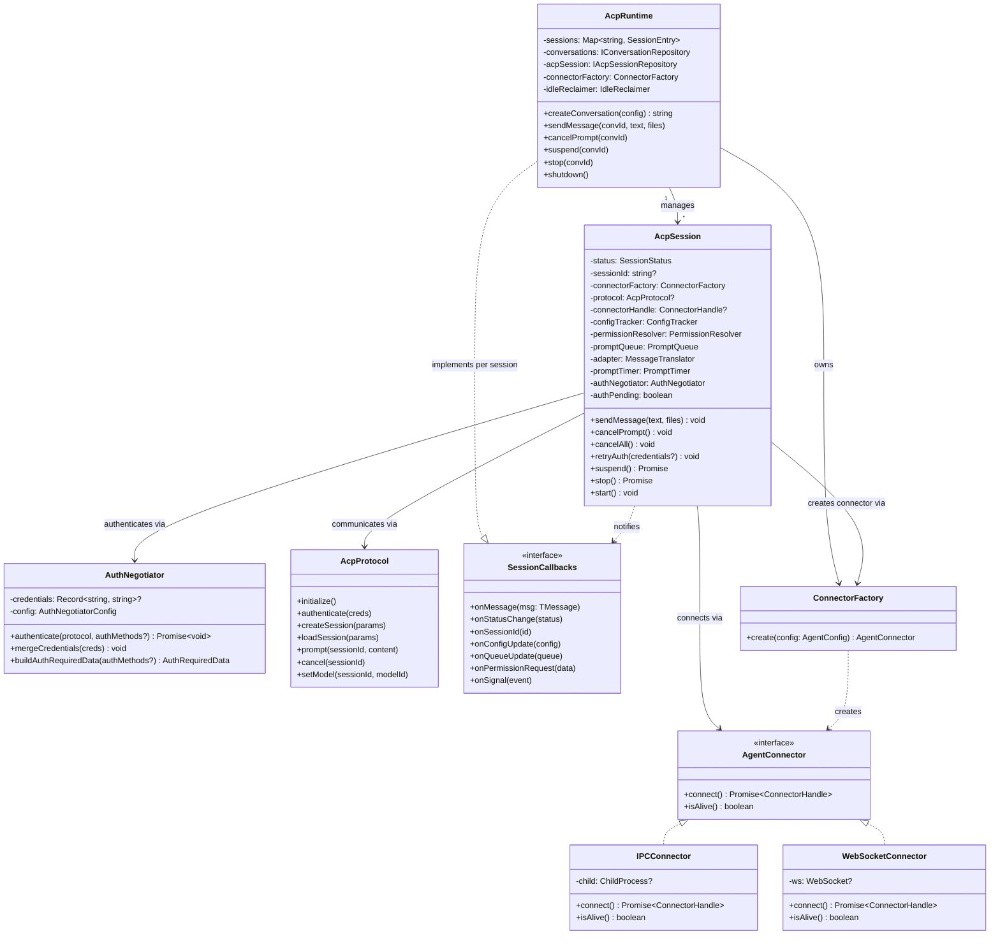
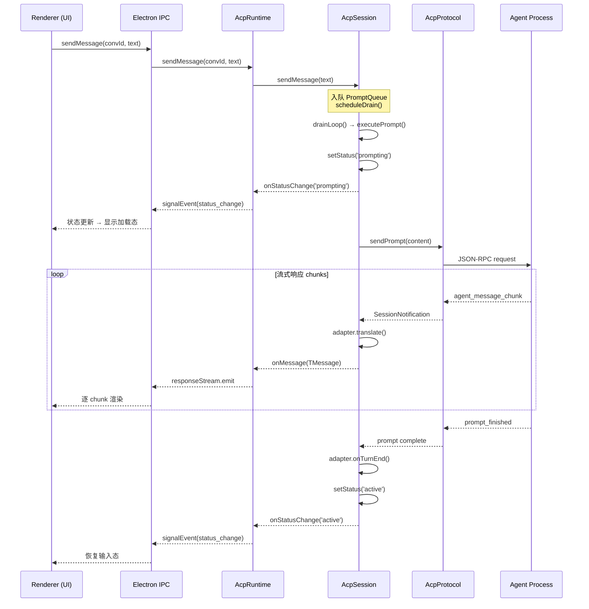
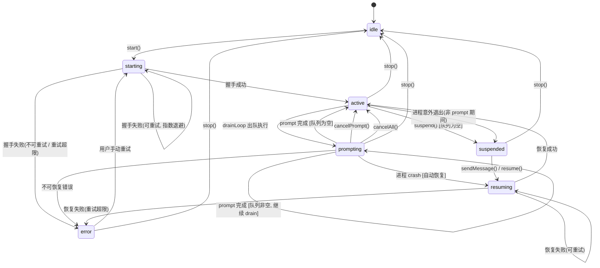
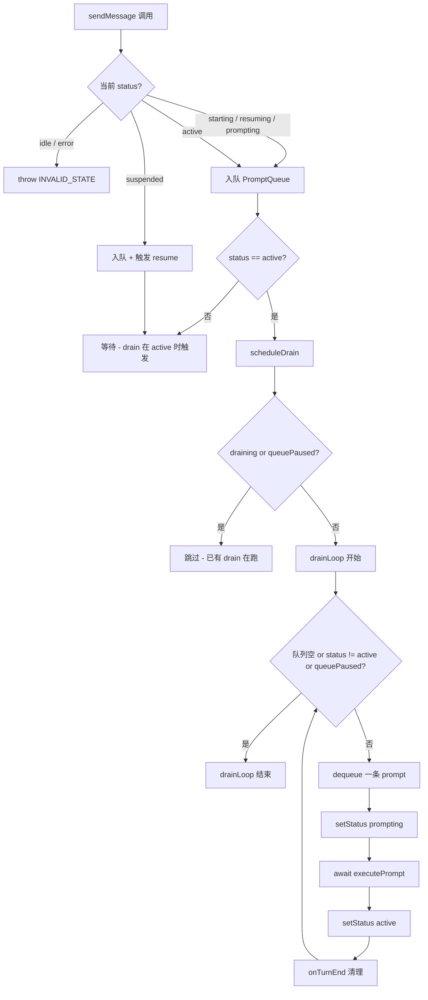
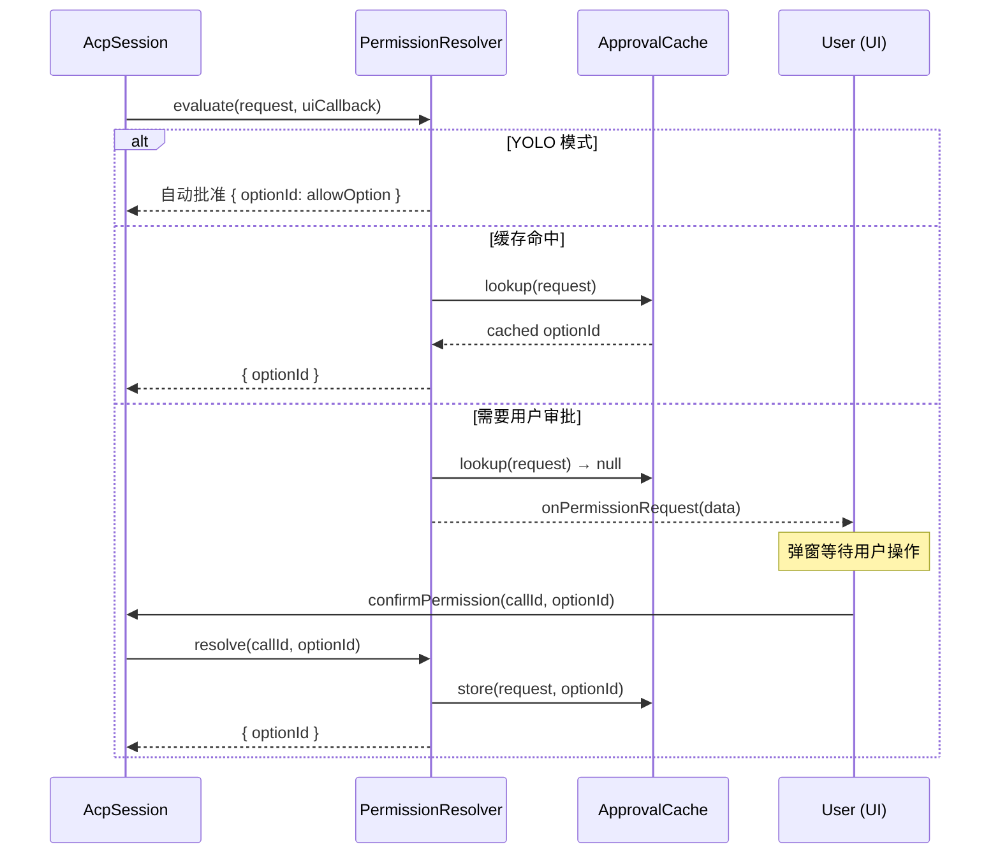
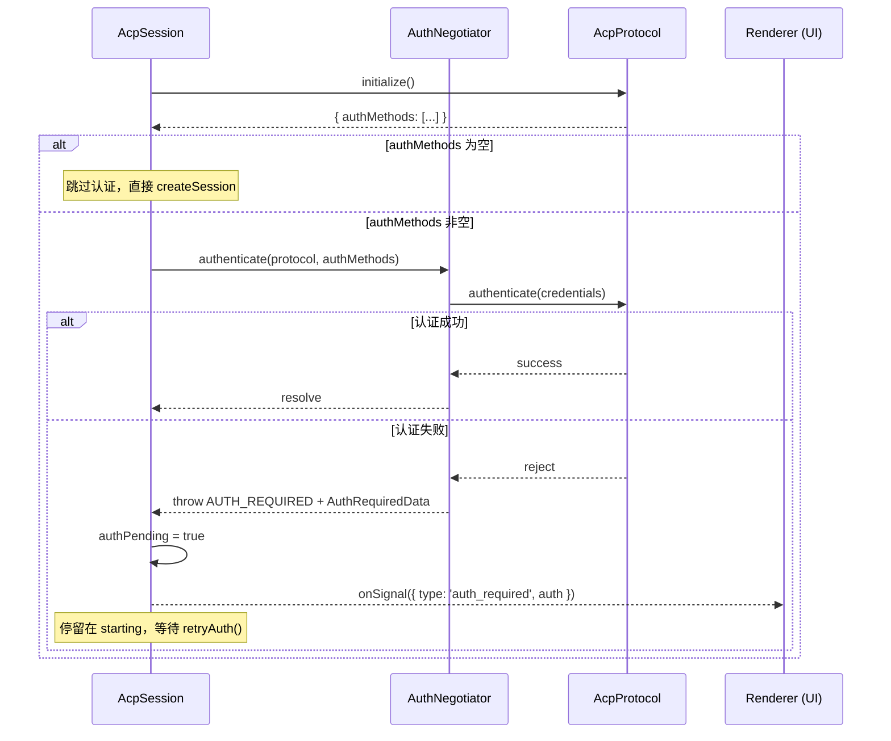

# ACP 模块架构设计

> **版本**: v1.1 | **最后更新**: 2026-04-14 | **状态**: Draft
> **摘要**: ACP 层全新架构的完整设计 — 三层结构、7 态状态机、26 个文件、23 条不变量、20 项共识决议
> **受众**: ACP 重构实现开发者、新加入团队的开发者

---

## 目录

- [1. 设计目标与核心原则](#1-设计目标与核心原则)
- [2. 架构总览](#2-架构总览)
- [3. Infrastructure Layer](#3-infrastructure-layer)
- [4. Session Layer（核心）](#4-session-layer核心)
- [5. Application Layer](#5-application-layer)
- [6. 横切关注点](#6-横切关注点)
- [7. 数据库持久化方案](#7-数据库持久化方案)
- [8. 部署模型](#8-部署模型)
- [9. 不变量清单](#9-不变量清单)
- [10. 共识决议汇总](#10-共识决议汇总)
- [11. 代码骨架文件清单](#11-代码骨架文件清单)
- [参考文档](#参考文档)

---

## 1. 设计目标与核心原则

### 1.1 设计目标

当前 ACP 实现存在严重架构问题（详见 [当前问题分析](01-current-problems.md)）：

| 问题      | 现状                                                |
| --------- | --------------------------------------------------- |
| God Class | `AcpAgent` 单文件 ~1,780 行，承担 12+ 职责          |
| 手搓协议  | `AcpConnection` 手搓 JSON-RPC ~1,120 行，无消息校验 |
| 隐式状态  | 6+ 布尔标志隐式组合代替状态机，是核心 bug 来源      |
| 后端耦合  | `switch(backend)` 分支遍布核心代码                  |
| 不可测试  | 无正式接口定义，无法独立测试                        |

目标是**全新重建** ACP 层，将上述 ~2,900 行的两个巨型文件替换为 26 个职责单一的文件（总计 ~2,370-3,020 行），最大单文件不超过 450 行。

### 1.2 六条核心原则

**P1: 组合优于深层 (Composition over Depth)**

用"一个聚合根 (Aggregate Root) + 多个组件"的扁平组合，代替"层层委托"的深栈调用。代价是聚合根略大（上限 450 行），收益是调用链短、状态集中、调试直观。一个开发者打开 `AcpSession.ts` 就能看到完整的消息发送流程，而不是追 7 层抽象。

**P2: 状态机集中，组件无状态 (Centralized State Machine)**

只有一个地方拥有状态机 — AcpSession。其余组件要么是纯函数/纯数据，要么是受控的 IO 封装。消除双状态机同步这一异步系统排名第一的隐蔽 bug 来源。

**P3: 只在真实的变化轴上抽象 (Abstract on Real Axes of Change)**

已知的两个变化轴：部署模式（本地子进程 vs 远程 WebSocket）和输出格式（ACP SessionUpdate -> TMessage）。只在这两处定义接口（`AgentConnector`、`SessionCallbacks`），其余直接依赖具体实现。

**P4: 先 ACP，后抽象 (ACP First, Abstract Later)**

ACP 是 session-based 协议，A2A 是 task-based 协议。从单一协议猜公共抽象只会产生 leaky abstraction。正确做法：实现 `A2aSession` 后再从两个具体实现提取公共接口。

**P5: 单队列不变 (Single Queue Invariant)**

Prompt 路由只有一条路径：统一入队 -> drain loop 出队。不存在旁路。`sendMessage()` 永远入队，`drainLoop()` 串行出队执行。一条路进，一条路出。

**P6: 内存有界 (Bounded Memory)**

桌面应用用户可能让会话开着好几天。所有有状态的数据结构必须有明确上限（构造参数可配），无上限的内存结构是定时炸弹。

---

## 2. 架构总览

### 2.1 三层结构

新架构分为三层 + 横切关注点：

```
┌──────────────────────────────────────────────────────────────────────┐
│  Application Layer                                                   │
│                                                                      │
│  AcpRuntime                                                          │
│  . Map<convId, AcpSession>      . 空闲回收策略 (IdleReclaimer)       │
│  . IPC 路由 (渲染层方法 -> session 方法)                             │
│  . 持久化桥接 (callback -> DB write)                                 │
│  . 对话创建/关闭/lazy rebuild                                        │
│  . ConnectorFactory                                                  │
│                                                                      │
├──────────────────────────────────────────────────────────────────────┤
│  Session Layer                                      * 核心 *         │
│                                                                      │
│  AcpSession (aggregate root, <= 450 行)                              │
│  . 状态机 (idle/starting/active/prompting/suspended/resuming/error)  │
│  . 生命周期编排 (start/stop/suspend/resume)                          │
│  . Prompt 流编排 (sendMessage/cancel/drain loop)                     │
│  ┌────────────────────────────────────────────────────────────┐      │
│  │  组合的组件 (各自独立, 无互相依赖):                        │      │
│  │  PermissionResolver    -- 权限决策 + 审批缓存 (LRU 500)    │      │
│  │  ConfigTracker         -- model/mode/configOption 追踪     │      │
│  │  PromptQueue           -- 排队 (maxSize=5) + 暂停/恢复语义 │      │
│  │  MessageTranslator     -- SessionUpdate -> TMessage 翻译   │      │
│  │  InputPreprocessor     -- @file 解析, 输入转换             │      │
│  │  McpConfig             -- MCP/Skill 注入配置构建           │      │
│  │  PromptTimer           -- Prompt 超时计时器                │      │
│  │  AuthNegotiator        -- 条件认证 + 凭据缓存 + 登录选项   │      │
│  └────────────────────────────────────────────────────────────┘      │
│                                                                      │
├──────────────────────────────────────────────────────────────────────┤
│  Infrastructure Layer                                                │
│                                                                      │
│  AgentConnector <<interface>>                                        │
│   ├─ IPCConnector           -- 所有本地子进程 agent 统一启动器       │
│   └─ WebSocketConnector     -- 远程 WebSocket                        │
│                                                                      │
│  AcpProtocol         -- SDK ClientSideConnection 薄包装              │
│  NdjsonTransport     -- byte stream <-> typed message stream         │
│  processUtils        -- splitCommandLine, gracefulShutdown 等        │
│                                                                      │
├──────────────────────────────────────────────────────────────────────┤
│  Cross-cutting                                                       │
│  errors/   AcpError . errorExtract . errorNormalize . errorJsonRpc   │
│  metrics/  AcpMetrics (Phase 1: 接口 + no-op)                        │
└──────────────────────────────────────────────────────────────────────┘

  Discovery (AcpDetector + Hub) -- 独立模块, 不在本次重构范围
```

### 2.2 1:1:1 原则

**1 Conversation = 1 AcpSession = 1 Agent Process（或远程连接）**

- 每个 `AcpSession` 实例管理一个 ACP protocol session（由 `sessionId` 标识）
- AcpRuntime 通过 `Map<convId, AcpSession>` 管理所有活跃对话
- 团队模式下每个 agent 是独立的完整栈，团队协调通过共享 MCP server 实现，不在 ACP 层内部

**术语区分**：

- **AcpSession（类）**: Session Layer 的聚合根，管理一个对话的完整生命周期
- **session（ACP 协议概念）**: 由 `sessionId` 标识的协议会话，通过 `createSession` / `loadSession` 创建

### 2.3 核心类图



### 2.4 消息流转全链路

用户发送消息到 Agent 响应再到 UI 渲染的完整链路：



### 2.5 与旧架构的对比

| 维度               | 旧架构                                       | 新架构                                                   |
| ------------------ | -------------------------------------------- | -------------------------------------------------------- |
| 核心类             | AcpAgent ~1,780 行 + AcpConnection ~1,120 行 | AcpSession <= 450 行 + 7 个组件各 50-200 行              |
| 状态管理           | 6+ 布尔标志隐式组合                          | 单一显式状态机 7 态                                      |
| JSON-RPC           | 手搓, 无校验                                 | SDK (`@agentclientprotocol/sdk`) 薄包装                  |
| 错误处理           | 字符串匹配                                   | 结构化错误码 + 重试判断                                  |
| 连接方式           | switch 分支在单文件中                        | 2 种 Connector 实现, 各自独立                            |
| 队列               | 无显式队列, 无并发保护                       | 统一队列 + drain loop, maxSize=5                         |
| 接口数             | 无正式接口                                   | 2 个核心接口 (AgentConnector + SessionCallbacks)         |
| 典型操作调用链深度 | 不确定, 混杂在 God Class 中                  | 3 跳: Runtime -> Session -> Protocol（以 setModel 为例） |

---

## 3. Infrastructure Layer

Infrastructure Layer 处理"如何与 Agent 进程通信"。纯 IO，无业务逻辑。

### 3.1 AgentConnector 接口

唯一的 Infrastructure 层接口。隔离本地/远程部署模式。

```typescript
interface AgentConnector {
  /** 建立连接, 返回可通信的 Stream */
  connect(): Promise<ConnectorHandle>;
  /** 当前连接是否存活 */
  isAlive(): boolean;
}

type ConnectorHandle = {
  stream: Stream; // SDK 定义: { readable, writable }
  shutdown: () => Promise<void>; // 关闭连接 + 清理资源
};
```

**AgentConnector 是一次性的**: `shutdown()` 之后不能再 `connect()`。需要重连时，由 AcpSession 通过 ConnectorFactory 创建新实例。进程不能复活，WebSocket 关闭后不能复用，一次性语义最简单。

**职责边界**: Connector 只负责"建立通信通道"（spawn 进程或 WebSocket 连接）。"找到 agent 二进制"是 Agent 发现层 (AcpDetector) 的职责，其输出（完整的 `command` + `args`）通过 `AgentConfig` 传入 Connector。

### 3.2 IPCConnector

所有本地子进程 agent 的统一启动器。适用于内置 agent（goose, qwen, gemini 等）、Hub 安装的 agent（bun 启动）、以及任何通过 command + args 描述的本地 agent。

```typescript
class IPCConnector implements AgentConnector {
  constructor(private config: LocalProcessConfig) {}

  async connect(): Promise<ConnectorHandle> {
    const child = spawn(this.config.command, this.config.args, {
      cwd: this.config.cwd,
      env: prepareCleanEnv(this.config.env),
      stdio: ['pipe', 'pipe', 'pipe'],
    });
    await waitForSpawn(child);
    const stream = NdjsonTransport.fromChildProcess(child);
    return {
      stream,
      shutdown: () => gracefulShutdown(child, this.config.gracePeriodMs),
    };
  }

  isAlive(): boolean {
    return this.child !== null && isProcessAlive(this.child.pid);
  }
}

type LocalProcessConfig = {
  command: string; // 完整路径或可执行文件名, 由 AcpDetector 决定
  args: string[];
  cwd: string;
  env?: Record<string, string>;
  gracePeriodMs?: number; // stdin.end() 等待时间, 默认 100ms
};
```

**关键行为**: spawn -> waitForSpawn -> NdjsonTransport -> Stream。

**错误契约**: spawn 失败抛 `AcpError { code: 'CONNECTION_FAILED', retryable: true }`。

### 3.3 WebSocketConnector

通过 WebSocket 连接远程 Agent。

```typescript
class WebSocketConnector implements AgentConnector {
  private ws: WebSocket | null = null;

  constructor(private config: RemoteConfig) {}

  async connect(): Promise<ConnectorHandle> {
    const ws = new WebSocket(this.config.url, { headers: this.config.headers });
    await waitForOpen(ws);
    this.ws = ws;
    const stream = NdjsonTransport.fromWebSocket(ws);
    return { stream, shutdown: () => closeWebSocket(ws) };
  }

  isAlive(): boolean {
    return this.ws?.readyState === WebSocket.OPEN;
  }
}

type RemoteConfig = {
  url: string;
  headers?: Record<string, string>;
};
```

**WebSocket 场景的 Transport**: WebSocket 场景使用 `NdjsonTransport.fromWebSocket(ws)` 创建 Stream（与 `fromChildProcess` 对应的工厂方法）。两者共享 ndjson 编解码逻辑，区别仅在底层 IO 源（WebSocket message 事件 vs 子进程 stdio）。

### 3.4 AcpProtocol

SDK `ClientSideConnection` 的薄包装。不定义接口 — 它就是 SDK 的门面，除非换掉 SDK 本身。

**ProtocolFactory 的跨层位置**: `ProtocolFactory` 类型定义在 `session/types.ts`（因为它是 AcpSession 的构造注入点），但它创建的 AcpProtocol 实例属于 Infrastructure 层。这是标准的"依赖反转"模式 — 上层定义接口，下层提供实现。

```typescript
class AcpProtocol {
  private sdk: ClientSideConnection;

  constructor(stream: Stream, handlers: ProtocolHandlers) {
    this.sdk = new ClientSideConnection(stream);
    this.sdk.onSessionUpdate = handlers.onSessionUpdate;
    this.sdk.onRequestPermission = handlers.onRequestPermission;
    this.sdk.onReadTextFile = handlers.onReadTextFile;
    this.sdk.onWriteTextFile = handlers.onWriteTextFile;
  }

  initialize(): Promise<InitializeResponse> { ... }
  authenticate(creds?: AuthCredentials): Promise<AuthenticateResponse> { ... }
  createSession(params: CreateSessionParams): Promise<NewSessionResponse> { ... }
  loadSession(params: LoadSessionParams): Promise<LoadSessionResponse> { ... }
  prompt(sessionId: string, content: PromptContent): Promise<PromptResponse> { ... }
  cancel(sessionId: string): Promise<void> { ... }
  setModel(sessionId: string, modelId: string): Promise<void> { ... }
  setMode(sessionId: string, modeId: string): Promise<void> { ... }
  setConfigOption(sessionId: string, id: string, value: string | boolean): Promise<void> { ... }
  closeSession(sessionId: string): Promise<void> { ... }

  /** SDK 尚未覆盖的 RFD 方法 */
  extMethod(method: string, params: unknown): Promise<unknown> { ... }

  /** 连接关闭信号 */
  get closed(): Promise<void> { return this.sdk.closed; }
}

type ProtocolHandlers = {
  onSessionUpdate: (notification: SessionNotification) => void;
  onRequestPermission: (req: RequestPermissionRequest) => Promise<RequestPermissionResponse>;
  onReadTextFile: (req: ReadTextFileRequest) => Promise<ReadTextFileResponse>;
  onWriteTextFile: (req: WriteTextFileRequest) => Promise<WriteTextFileResponse>;
};
```

### 3.5 NdjsonTransport

将子进程 stdio 转为 SDK Stream。内置 ndjson 编解码 + Web Streams 背压控制。

```typescript
class NdjsonTransport {
  static fromChildProcess(child: ChildProcess): Stream {
    const readable = new ReadableStream<AnyMessage>(
      { /* ndjson 解码逻辑: buffer + split('\n') + safeJsonParse */ },
      new CountQueuingStrategy({ highWaterMark: 64 }), // D6 决议
    );
    const writable = new WritableStream<AnyMessage>({
      write(message) { /* JSON.stringify + '\n' -> stdin */ },
    });
    return { readable, writable };
  }

  static fromWebSocket(ws: WebSocket): Stream {
    // WebSocket message 事件 -> ReadableStream，send -> WritableStream
    // 共享 ndjson 编解码逻辑，区别仅在底层 IO 源
    ...
  }
}
```

`highWaterMark = 64` 利用 Web Streams 原生背压机制。Phase 1 不在应用层加 `BoundedBuffer`，但 `handleSessionUpdate -> callbacks.onMessage` 路径设计为可插入缓冲的管道结构，确保 Phase 2 可无侵入地在 AcpRuntime 层加入 `BoundedBuffer<TMessage>(256)`。

### 3.6 processUtils

进程管理工具函数集合：

| 函数                                     | 职责                               |
| ---------------------------------------- | ---------------------------------- |
| `splitCommandLine(cmd)`                  | 解析命令行字符串（支持引号、转义） |
| `waitForSpawn(child)`                    | 等待子进程 spawn 完成              |
| `waitForExit(child, timeoutMs)`          | 等待子进程退出，带超时             |
| `isProcessAlive(pid)`                    | signal-0 探测进程是否存活          |
| `gracefulShutdown(child, gracePeriodMs)` | 三阶段优雅关闭                     |
| `prepareCleanEnv(customEnv)`             | 构建干净的子进程环境变量           |

**三阶段优雅关闭**（借鉴 [acpx 参考实现](02-reference-implementation.md)）：

1. `stdin.end()` -> 等待 gracePeriodMs（默认 100ms）
2. `SIGTERM` -> 等待 1,500ms
3. `SIGKILL` -> 等待 1,000ms -> `child.unref()` 兜底

---

## 4. Session Layer（核心）

Session Layer 只有一个聚合根：**AcpSession**。它接收外部命令，根据当前状态决定做什么，调用 Infrastructure 层执行，通过 callback 输出结果。

组件（PermissionResolver, ConfigTracker, PromptQueue, MessageTranslator, InputPreprocessor, McpConfig, PromptTimer）都是 AcpSession 的内部组件，不对外暴露，不跨模块传递，不互相依赖。共同特点：**纯逻辑或纯数据，不持有 IO 引用**。

### 4.1 AcpSession 接口定义

```typescript
class AcpSession {
  constructor(
    private readonly agentConfig: AgentConfig,
    private readonly connectorFactory: ConnectorFactory,  // 注入（每次 connect/resume 创建新 Connector）
    private readonly callbacks: SessionCallbacks,         // 注入
    private readonly options?: SessionOptions,            // protocolFactory, metrics 等可选字段在此
  );

  // ---- 生命周期 ----
  start(): void;              // idle -> starting -> active; error -> starting (用户手动重试)
  stop(): Promise<void>;      // any -> idle (清理资源)
  suspend(): Promise<void>;   // active -> suspended (保留 sessionId)

  // ---- 消息 ----
  sendMessage(text: string, files?: string[]): void;  // void, 入队即返回
  cancelPrompt(): void;       // 取消当前 prompt
  cancelAll(): void;          // 取消当前 + 清空队列
  resumeQueue(): void;        // crash recovery 后恢复队列

  // ---- 权限 ----
  confirmPermission(callId: string, optionId: string): void;

  // ---- 认证重试 (来自 UI, reset 模式) ----
  retryAuth(credentials?: Record<string, string>): void;

  // ---- 配置 ----
  setModel(modelId: string): void;
  setMode(modeId: string): void;
  setConfigOption(id: string, value: string | boolean): void;
  getConfigOptions(): ConfigOption[] | null;

  // ---- 只读状态 ----
  readonly status: SessionStatus;
  readonly sessionId: string | null;
}
```

**关键设计决策**:

1. **sendMessage 返回 void**: 入队即返回，不返回 Promise。消除 dangling promise 问题。结果通过 callback 异步推送。
2. **ConnectorFactory 注入（而非单个 Connector）**: AgentConnector 是一次性的（见 Section 3.1），首次 `start()` 和 `resume()` 都通过 `connectorFactory.create(agentConfig)` 创建新的 Connector 实例。
3. **ProtocolFactory / AcpMetrics 通过 SessionOptions 注入**: 可选字段收归 `SessionOptions`（见 [类型目录 SessionOptions](04-type-catalog.md#315-sessionoptions)），默认值为 `defaultProtocolFactory` / `noopMetrics`。T2/T3 测试可注入 fake 实现精确控制行为。

### 4.2 状态机（7 态）

#### 状态枚举

```typescript
type SessionStatus =
  | 'idle' // 已创建, 未启动
  | 'starting' // connect -> init -> auth -> createSession
  | 'active' // session 就绪, 等待用户输入
  | 'prompting' // prompt 执行中
  | 'suspended' // 进程已杀, sessionId 保留
  | 'resuming' // 正在恢复 (与 starting 区分: UI 显示"重新连接中")
  | 'error'; // 不可恢复错误
```

**为什么是 7 态而非 6 态**: 外部观察者（UI）在首次连接和恢复连接时需要展示不同文案（"连接中" vs "重新连接中"）。隐藏 `resuming` 会迫使 Session 内部维护隐式布尔标志 — 这正是当前代码的核心 bug 来源。7 态 vs 6 态只多了一个状态转换（`suspended -> resuming`），不显著增加复杂度。

#### 状态转换图



#### 完整状态转换表

| #   | 当前状态  | 触发             | 目标状态  | 条件               | 动作                                                                                                                                                                       |
| --- | --------- | ---------------- | --------- | ------------------ | -------------------------------------------------------------------------------------------------------------------------------------------------------------------------- |
| T1  | idle      | `start()`        | starting  | --                 | 创建连接, 开始握手                                                                                                                                                         |
| T2  | starting  | 握手成功         | active    | --                 | 同步配置, reassert, 通知 UI, 开始 drain                                                                                                                                    |
| T3  | starting  | 握手失败         | starting  | 可重试且未超限     | 指数退避重试 (1s/2s/4s)                                                                                                                                                    |
| T4  | starting  | 握手失败         | error     | 不可重试或重试超限 | 通知 UI 错误                                                                                                                                                               |
| T5  | active    | drainLoop 出队   | prompting | 队列非空           | 执行 prompt                                                                                                                                                                |
| T6  | active    | `suspend()`      | suspended | 队列为空           | 保存 sessionId, 关闭连接                                                                                                                                                   |
| T7  | active    | `stop()`         | idle      | --                 | 关闭连接, 清理资源                                                                                                                                                         |
| T8  | active    | 进程意外退出     | suspended | 非 prompt 期间     | 静默挂起, 等下次操作                                                                                                                                                       |
| T9  | prompting | prompt 完成      | active    | 队列为空           | onTurnEnd 清理                                                                                                                                                             |
| T10 | prompting | prompt 完成      | prompting | 队列非空           | drain 下一个（逻辑简化：实际路径为 T9 setStatus('active') 后 drainLoop 立即出队走 T5，快速经过 active 再回到 prompting。T10 是对这个 drain loop 内部快速序列的等效描述。） |
| T11 | prompting | `cancelPrompt()` | active    | --                 | cancel 当前 prompt，drainLoop 继续出队下一条                                                                                                                               |
| T12 | prompting | `cancelAll()`    | active    | --                 | cancel 当前 + 清空队列，drainLoop 循环因队列空而终止                                                                                                                       |
| T13 | prompting | 进程 crash       | resuming  | --                 | 自动 resume, queuePaused=true                                                                                                                                              |
| T14 | prompting | 不可恢复错误     | error     | --                 | 清空队列, 通知 UI                                                                                                                                                          |
| T15 | prompting | `stop()`         | idle      | --                 | cancel + 关闭                                                                                                                                                              |
| T16 | suspended | `sendMessage()`  | resuming  | --                 | 入队 + 开始恢复                                                                                                                                                            |
| T17 | suspended | `stop()`         | idle      | --                 | 清理（无进程需杀）                                                                                                                                                         |
| T18 | resuming  | 恢复成功         | active    | --                 | 同步配置, reassert, drain                                                                                                                                                  |
| T19 | resuming  | 恢复失败         | resuming  | 可重试且未超限     | 指数退避重试                                                                                                                                                               |
| T20 | resuming  | 恢复失败         | error     | 重试超限           | 通知 UI                                                                                                                                                                    |
| T21 | error     | 用户手动重试     | starting  | --                 | 重置重试计数                                                                                                                                                               |
| T22 | error     | `stop()`         | idle      | --                 | 清理                                                                                                                                                                       |

#### 命令 x 状态矩阵

| 命令 \ 状态      | idle    | starting       | active      | prompting    | suspended   | resuming       | error          |
| ---------------- | ------- | -------------- | ----------- | ------------ | ----------- | -------------- | -------------- |
| **start**        | 执行    | reject         | reject      | reject       | reject      | reject         | 执行(重置重试) |
| **sendMessage**  | throw   | 入队           | 入队+drain  | 入队         | 入队+resume | 入队           | throw          |
| **cancelPrompt** | no-op   | no-op          | no-op       | cancel 当前  | no-op       | no-op          | no-op          |
| **cancelAll**    | no-op   | 清空队列       | 清空队列    | cancel+清空  | no-op       | 清空队列       | no-op          |
| **setModel**     | throw   | 缓存意图       | 立即 apply  | 缓存意图     | 缓存意图    | 缓存意图       | throw          |
| **setMode**      | throw   | 缓存意图       | 立即 apply  | 缓存意图     | 缓存意图    | 缓存意图       | throw          |
| **confirmPerm**  | no-op   | no-op          | no-op       | resolve      | no-op       | no-op          | no-op          |
| **retryAuth**    | no-op   | teardown+start | no-op       | no-op        | no-op       | teardown+start | no-op          |
| **suspend**      | no-op   | reject         | 执行        | reject       | already     | reject         | no-op          |
| **stop**         | cleanup | abort+clean    | close+clean | cancel+close | cleanup     | abort+clean    | cleanup        |

### 4.3 AcpSession 内部结构

```typescript
class AcpSession {
  // ---- Infrastructure 引用 (suspended 时为 null) ----
  private protocol: AcpProtocol | null = null;
  private connectorHandle: ConnectorHandle | null = null;

  // ---- 状态 ----
  private _status: SessionStatus = 'idle';
  private _sessionId: string | null = null;
  private startRetryCount = 0;
  private resumeRetryCount = 0;

  // ---- 队列 + drain ----
  private draining = false; // true 期间 scheduleDrain() 不重入
  private queuePaused = false; // crash recovery 后为 true，等用户决定

  // ---- 认证 ----
  private authPending = false; // true 时处于认证等待，不算死状态

  // ---- 组件 (构造时创建, 生命周期跟随 AcpSession) ----
  private readonly configTracker: ConfigTracker;
  private readonly permissionResolver: PermissionResolver;
  private readonly promptQueue: PromptQueue;
  private readonly adapter: MessageTranslator;
  private readonly inputPreprocessor: InputPreprocessor;
  private readonly mcpConfig: McpConfig;
  private readonly promptTimer: PromptTimer;
  private readonly authNegotiator: AuthNegotiator;
}
```

**关键设计**: `protocol` 和 `connectorHandle` 是 nullable。suspended 时为 null，active 时非 null。TypeScript 编译器强制空检查 — 不需要额外的状态机来追踪连接状态。null/non-null 就是状态。

### 4.4 sendMessage + 统一队列 + drain loop

```typescript
sendMessage(text: string, files?: string[]): void {
  const prompt: QueuedPrompt = {
    id: crypto.randomUUID(), text, files, enqueuedAt: Date.now(),
  };
  switch (this._status) {
    case 'idle':
    case 'error':
      throw new AcpError('INVALID_STATE', `Cannot send in ${this._status} state`);
    case 'starting':
    case 'resuming':
    case 'active':
    case 'prompting':
      if (!this.promptQueue.enqueue(prompt)) {
        throw new AcpError('QUEUE_FULL', 'Prompt queue is full');
      }
      this.callbacks.onQueueUpdate(this.promptQueue.snapshot());
      // starting/resuming 状态入队后不 scheduleDrain：
      // start()/resume() 成功进入 active 时会调用 scheduleDrain()，届时出队执行。
      if (this._status === 'active') this.scheduleDrain();
      return;
    case 'suspended':
      if (!this.promptQueue.enqueue(prompt)) {
        throw new AcpError('QUEUE_FULL', 'Prompt queue is full');
      }
      this.callbacks.onQueueUpdate(this.promptQueue.snapshot());
      this.resume();
      return;
  }
}
```

`scheduleDrain()` 通过 `queueMicrotask` 调度 drainLoop，避免同步递归导致栈溢出。如果 `draining` 或 `queuePaused` 为 true 则跳过（防止重入）。drain loop 串行出队执行：



### 4.5 关键编排流程

#### start() — 首次启动

> 详细场景走查见 [Doc 6 场景 1: 冷启动](06-scenario-walkthrough.md#2-场景-1-创建新会话并发送第一条消息)

1. `setStatus('starting')`
2. `connectorFactory.create(agentConfig)` → 创建新的 AgentConnector
3. `connector.connect()` → 获得 ConnectorHandle（记录 spawnLatency）
4. `protocolFactory(stream, handlers)` → 创建 AcpProtocol
5. 监听 `protocol.closed` → handleDisconnect
6. `initResult = protocol.initialize()` → 获得 `{ protocolVersion, capabilities, authMethods }`
7. **条件认证**: 检查 `initResult.authMethods` → 仅当非空时调用 `authNegotiator.authenticate(protocol, authMethods)`
8. 记录 initLatency
9. `protocol.createSession({ cwd, mcpServers })` → SessionResult
10. `configTracker.syncFromSessionResult(result)` + 通知所有 callback
11. `reassertConfig()` — 如果用户在等待期间切换了 model/mode
12. `setStatus('active')` + `scheduleDrain()`

`start()` 在 `idle` 和 `error` 状态下均可调用。从 `error` 状态调用时（用户手动重试），重置重试计数后执行相同流程。最大重试次数由 `SessionOptions.maxStartRetries`（默认 3）控制，即 3 次重试 = 4 次总尝试。

**认证失败处理**: `authNegotiator.authenticate()` 失败时抛出 `AcpError('AUTH_REQUIRED')`。`handleStartError` 捕获后设置 `authPending = true`，发送 `auth_required` 信号给 UI，**停留在 starting 状态而不进入 error**。等待 UI 调用 `retryAuth(credentials?)` 触发 teardown + 完整 `start()` 重启。

#### executePrompt() — 执行单个 prompt

> 详细场景走查见 [Doc 6 场景 2: 消息发送与 drain loop](06-scenario-walkthrough.md#3-场景-2-消息排队与-drain-loop-处理)

1. `setStatus('prompting')`
2. `inputPreprocessor.process(text, files)` — @file 解析
3. `reassertConfig()` — 如果用户在排队期间切换了配置
4. `promptTimer.start(300_000)` — 5 分钟超时
5. `protocol.prompt(sessionId, content)` — 执行 prompt
6. 流式响应期间：每次 `handleSessionUpdate` 重置 timer、翻译 TMessage、推送 callback
7. `promptTimer.stop()` + `adapter.onTurnEnd()` — 增量清理
8. `setStatus('active')` — drainLoop 继续检查队列

#### handleDisconnect() — 进程 crash 处理

> 详细场景走查见 [Doc 6 场景 5: Crash Recovery](06-scenario-walkthrough.md#6-场景-5-agent-进程崩溃与错误恢复)

- `prompting` 期间 crash: `queuePaused = true` → 自动 `resume()` → 恢复后等用户决定（resumeQueue 或 cancelAll）
- 非 `prompting` 期间: 静默 `setStatus('suspended')` → 等用户下次操作时自动 resume

#### resume() — 恢复已挂起的 session

> 详细场景走查见 [Doc 6 场景 4: Suspend/Resume](06-scenario-walkthrough.md#5-场景-4-会话挂起与恢复) 和 [场景 5: Crash Recovery](06-scenario-walkthrough.md#6-场景-5-agent-进程崩溃与错误恢复)

1. `setStatus('resuming')`
2. `connectorFactory.create(agentConfig)` → 创建新的 AgentConnector，重建 Infrastructure（新进程/新连接）
3. `tryResumeOrCreate()`: 先尝试 `loadSession(savedSessionId)`，失败则降级 `createSession()`
4. `setStatus('active')`
5. 如果 `queuePaused`（crash recovery），不自动 drain，发 `onSignal({ type: 'queue_paused' })` 等用户决定

### 4.6 组件详述

#### PermissionResolver — 三级权限决策

决策链：YOLO 自动批准 → ApprovalCache (LRU 500) 缓存命中 → UI 委托（创建 pending promise，等用户操作）。`autoApproveAll`（YOLO 模式标志）来自 `AgentConfig.autoApproveAll`，在 AcpSession 构造时传入 PermissionResolver。



权限等待期间，`promptTimer.pause()` 暂停超时计时；用户响应后 `promptTimer.resume()` 恢复。

#### ConfigTracker — 配置追踪

管理 model / mode / configOption 三类配置。核心是 **current/desired 双槽语义**：

- `setDesiredModel(id)`: 非 active 状态下缓存意图
- `setCurrentModel(id)`: apply 成功后更新当前值，清空 desired
- `getPendingChanges()`: reassert 时返回需要同步到 agent 的变更
- `syncFromSessionResult(result)`: 从 agent 返回的 SessionResult 同步所有可用选项

`reassertConfig()` 在 `start()`、`resume()`、`executePrompt()` 中被调用，确保每次与 agent 交互前配置是最新的。

#### PromptQueue — 有界 FIFO 队列

纯数据容器。`maxSize = 5`，满时 `enqueue()` 返回 `false`（不丢弃旧消息）。`snapshot()` 返回浅拷贝，不持有原始 QueuedPrompt 引用。

#### MessageTranslator — 流式消息翻译

将 ACP `SessionNotification` 翻译为应用层 `TMessage`。内部维护 `messageMap` 用于 chunk 累积拼接。

- `translate(notification)`: 根据 `sessionUpdate` 类型分发翻译（agent_message_chunk → 累积文本，tool_call → 工具调用消息，等）
- `onTurnEnd()`: 增量清理已完成条目，防止长对话内存泄漏（INV-S-12）
- `reset()`: 新 session 时全量重置

配置类更新（config_option_update, current_mode_update, usage_update）不经过 MessageTranslator，在 AcpSession.handleSessionUpdate 中直接处理并走信号通道。

#### 其他组件

| 组件              | 职责                                                                                                                                                                                     | 行数   |
| ----------------- | ---------------------------------------------------------------------------------------------------------------------------------------------------------------------------------------- | ------ |
| InputPreprocessor | 解析用户消息中的 `@file` 引用，读取文件内容，构建 PromptContent                                                                                                                          | 80-100 |
| McpConfig         | 合并用户 MCP 配置 + Assistant 预设 + Team MCP，构建 `McpServerConfig[]`。合并优先级：用户配置 > Assistant 预设 > Team MCP（同名 server 以高优先级为准覆盖，不合并）。Team MCP 总是追加。 | 40-60  |
| PromptTimer       | 3 态内部状态机（idle/running/paused），支持 start/reset/pause/resume/stop                                                                                                                | 60-80  |
| ApprovalCache     | LRU 审批缓存，maxSize=500，被 PermissionResolver 使用                                                                                                                                    | 60-80  |

#### AuthNegotiator — 条件认证

AuthNegotiator 负责三个职责：

1. **条件认证**: 接收 `protocol` 和 `authMethods`，调用 `protocol.authenticate(credentials)`。失败时抛出 `AcpError('AUTH_REQUIRED')`，附带 `AuthRequiredData`（包含 agent backend 信息和可用的登录方式列表）。
2. **凭据内存缓存**: `mergeCredentials(creds)` 将 UI 提交的凭据（如 API Key）合并到内存缓存。不做持久化 — Agent CLI 自行管理 token，AcpSession 对齐 Zed 策略。
3. **登录选项构建**: 从 SDK `RawAuthMethod[]` 转换为应用层 `AuthMethod[]`。支持三种类型：`env_var`（环境变量输入）、`terminal`（终端 CLI 登录命令）、`agent`（agent 内部 OAuth 等）。若 SDK 未提供 authMethods，回退到基于 backend 的硬编码默认选项（临时方案）。

**设计约束**: AuthNegotiator 不持有 protocol 引用（每次 `authenticate` 调用时传入），不执行 IO（不打开浏览器、不启动终端）。UI 层负责执行具体的登录操作。



### 4.7 SessionCallbacks 接口

SessionCallbacks 是 AcpSession 的唯一出口。**所有 callback 参数都是应用类型，不含 SDK 协议类型。** AcpSession 就是翻译边界（INV-X-01）。

```typescript
type SessionCallbacks = {
  // ---- 消息通道 (高频流式) ----
  onMessage: (message: TMessage) => void;

  // ---- 信号通道 (低频状态) ----
  onSessionId: (sessionId: string) => void;
  onStatusChange: (status: SessionStatus) => void;
  onConfigUpdate: (config: ConfigSnapshot) => void;
  onModelUpdate: (model: ModelSnapshot) => void;
  onModeUpdate: (mode: ModeSnapshot) => void;
  onContextUsage: (usage: ContextUsage) => void;
  onQueueUpdate: (queue: QueueSnapshot) => void;
  onPermissionRequest: (data: PermissionUIData) => void;
  onSignal: (event: SessionSignal) => void;
};

type SessionSignal =
  | { type: 'session_expired' }
  | { type: 'queue_paused'; reason: 'crash_recovery' }
  | { type: 'auth_required'; auth: AuthRequiredData }
  | { type: 'error'; message: string; recoverable: boolean };
```

**两通道分离**: `onMessage` 是高频流式数据（每秒可能数十次），其余是低频状态事件（每秒最多几次）。在 AcpRuntime 层，这两类通过不同的 IPC channel 转发到渲染层：`onStreamEvent`（高频消息流）和 `onSignalEvent`（低频状态信号），避免高频消息阻塞低频状态通知。

---

## 5. Application Layer

### 5.1 AcpRuntime

AcpRuntime 是 ACP 模块面向渲染层的唯一入口。职责：管理所有活跃对话、路由 IPC 调用、持久化状态、控制资源。

```typescript
class AcpRuntime {
  private sessions = new Map<string, SessionEntry>();
  private idleReclaimer: IdleReclaimer;

  constructor(
    private readonly conversations: IConversationRepository,  // 通用 CRUD (不改动)
    private readonly acpSession: IAcpSessionRepository,       // ACP 专属状态
    private readonly messageBuffer: StreamingMessageBuffer,   // 已有模块，批量缓冲 TMessage 定时 flush 到 DB，不在本次重构范围
    private readonly connectorFactory: ConnectorFactory,
    private readonly options: RuntimeOptions,
  ) {}

  // ---- 对话生命周期 ----
  async createConversation(agentConfig: AgentConfig): Promise<string> { ... }
  async closeConversation(convId: string): Promise<void> { ... }

  // ---- IPC 路由（渲染层方法 -> session 方法） ----
  sendMessage(convId: string, text: string, files?: string[]): void { ... }
  confirmPermission(convId: string, callId: string, optionId: string): void { ... }
  cancelPrompt(convId: string): void { ... }
  cancelAll(convId: string): void { ... }
  resumeQueue(convId: string): void { ... }
  setModel(convId: string, modelId: string): void { ... }
  setMode(convId: string, modeId: string): void { ... }
  getConfigOptions(convId: string): ConfigOption[] | null { ... }

  // ---- 事件输出 ----
  onStreamEvent: (convId: string, message: TMessage) => void;
  onSignalEvent: (convId: string, event: SignalEvent) => void;

  // ---- 全局 ----
  async shutdown(): Promise<void> { ... }  // 挂起所有 active session
}
```

**Callback 接线**: AcpRuntime 为每个 AcpSession 创建一套 SessionCallbacks，将 session 事件接线到持久化 + IPC 转发：

| Callback              | 持久化操作                                        | IPC 转发                  |
| --------------------- | ------------------------------------------------- | ------------------------- |
| `onMessage`           | `messageBuffer.append()` (批量 flush)             | `onStreamEvent` -> 渲染层 |
| `onSessionId`         | `acpSession.updateSessionId()`                    | --                        |
| `onStatusChange`      | 双写: conversations (3 态) + acp_session (4 稳态) | `onSignalEvent`           |
| `onConfigUpdate`      | `acpSession.updateSessionConfig()`                | `onSignalEvent`           |
| `onModelUpdate`       | --                                                | `onSignalEvent`           |
| `onModeUpdate`        | --                                                | `onSignalEvent`           |
| `onContextUsage`      | -- (运行时内存状态)                               | `onSignalEvent`           |
| `onQueueUpdate`       | -- (运行时状态)                                   | `onSignalEvent`           |
| `onPermissionRequest` | --                                                | `onSignalEvent`           |
| `onSignal`            | --                                                | `onSignalEvent`           |

**Lazy rebuild**: 应用重启后，AcpSession 不会在启动时全量重建。当渲染层首次操作某个对话时，`ensureSession(convId)` 从 DB 读取 AgentConfig，创建 AcpSession 并启动。

### 5.2 ConnectorFactory

根据 `AgentConfig` 创建对应的 `AgentConnector` 实现。判断逻辑极简：

```typescript
class DefaultConnectorFactory implements ConnectorFactory {
  create(config: AgentConfig): AgentConnector {
    if (config.remoteUrl) {
      return new WebSocketConnector({ url: config.remoteUrl, headers: config.remoteHeaders });
    }
    return new IPCConnector({
      command: config.command,
      args: config.args,
      cwd: config.cwd,
      env: config.env,
      gracePeriodMs: config.processOptions?.gracePeriodMs,
    });
  }
}
```

`remoteUrl` 存在 → WebSocketConnector；其余 → IPCConnector。所有路径解析（"找到 agent 二进制"）由上游 AcpDetector 完成，ConnectorFactory 不参与。

### 5.3 IdleReclaimer

定期扫描 `Map<convId, SessionEntry>`，回收空闲 session。

**回收条件**（三者同时满足）：

1. `status === 'active'`
2. `queue.isEmpty`（无待处理任务）
3. `now - lastActiveAt > idleTimeoutMs`

不回收 prompting、starting、resuming 状态的 session（INV-A-02）。

```typescript
class IdleReclaimer {
  constructor(
    private readonly sessions: Map<string, SessionEntry>,
    private readonly idleTimeoutMs: number, // 如 30 分钟
    private readonly checkIntervalMs: number // 如 60 秒
  ) {}
  start(): void {
    /* setInterval scan */
  }
  stop(): void {
    /* clearInterval */
  }
}
```

---

## 6. 横切关注点

### 6.1 错误处理体系

#### 错误码定义

```typescript
type AcpErrorCode =
  | 'CONNECTION_FAILED' // spawn 失败, 网络不通
  | 'AUTH_FAILED' // 认证失败（不可重试，如 API Key 格式错误）
  | 'AUTH_REQUIRED' // 需要认证（可重试，等待用户登录后 retryAuth）
  | 'SESSION_EXPIRED' // loadSession 失败
  | 'PROMPT_TIMEOUT' // prompt 超时
  | 'PROCESS_CRASHED' // 进程意外退出
  | 'PROTOCOL_ERROR' // JSON-RPC 协议错误
  | 'AGENT_ERROR' // agent 返回的业务错误
  | 'QUEUE_FULL' // 队列满
  | 'INVALID_STATE' // 非法状态下调用
  | 'PERMISSION_CANCELLED' // 权限请求被取消
  | 'INTERNAL_ERROR'; // 内部逻辑错误
```

**AUTH_REQUIRED vs AUTH_FAILED 的区别**:

- `AUTH_REQUIRED`（`retryable: true`）: 用户未登录或 token 过期，可通过登录解决。AcpSession 不进入 error 状态，而是发 `auth_required` 信号给 UI，停留在 starting/resuming 等待 `retryAuth()`。用户可无限重试。
- `AUTH_FAILED`（`retryable: false`）: 认证参数格式错误等不可恢复的认证失败。直接进入 error 状态。

#### 错误模块分工

| 模块                | 职责                                                                 |
| ------------------- | -------------------------------------------------------------------- |
| `AcpError.ts`       | AcpError class + AcpErrorCode type 定义                              |
| `errorExtract.ts`   | 从 JSON-RPC 响应递归提取 ACP error payload                           |
| `errorNormalize.ts` | `normalizeError(unknown) -> AcpError`，按 code 分类 + 判断 retryable |
| `errorJsonRpc.ts`   | 构建规范的 JSON-RPC error response                                   |

#### 错误处理策略

| 场景                                     | AcpSession 行为                                                                                                   |
| ---------------------------------------- | ----------------------------------------------------------------------------------------------------------------- |
| `connect()` 失败, retryable              | 重试（最多 `maxStartRetries` 次，默认 3 次重试 = 4 次总尝试，指数退避 1s/2s/4s）                                  |
| `connect()` 失败, 不可重试 (AUTH_FAILED) | status -> error                                                                                                   |
| `authenticate()` 失败 (AUTH_REQUIRED)    | 不进入 error，设 `authPending = true`，发 `auth_required` 信号给 UI，停留在 starting/resuming，等待 `retryAuth()` |
| `prompt()` 超时 (5 分钟无心跳)           | cancel + status -> active + 通知 UI                                                                               |
| `prompt()` 中进程 crash                  | 自动 resume（见 Section 4.5 handleDisconnect）                                                                    |
| `loadSession()` 失败                     | 降级 `createSession()` + 通知 UI "session_expired"                                                                |
| resume 重试超限                          | status -> error                                                                                                   |

#### 跨层错误流转规则

错误从边缘向 AcpSession（状态机）汇聚，AcpSession 是唯一的决策者。不同边界使用不同的错误传递机制：

```
Infrastructure ──throws──▶ AcpSession ◀──should not throw── Callback 实现(Runtime)
  (AcpProtocol)              (状态机)                        (AcpRuntime / compat)
  (Connector)                 在这里                          (IPC / DB / renderer)
                              决策
                               │
                               ▼ 通过 callback 通知外界
                          onSignal({type:'error'})
                          onStatusChange('error')
```

| 边界                                      | 方向           | 机制                                | 谁负责 catch                                     |
| ----------------------------------------- | -------------- | ----------------------------------- | ------------------------------------------------ |
| Infrastructure → Session                  | 向内（正常）   | throw `AcpError`（结构化错误码）    | AcpSession 编排方法（doStart, executePrompt 等） |
| 内部组件 → Session                        | 向内（bug）    | throw = 实现 bug，非运行时错误      | AcpSession 编排方法兜底 catch                    |
| Session → 外界（Runtime / renderer）      | 向外（正常）   | callback 通知，永不 throw           | N/A — 用 `onSignal` / `onStatusChange`           |
| Callback 实现 → Session（不该发生的反向） | 反向（防御性） | `wrapCallbacks` 统一 try/catch 兜底 | AcpSession 构造时包装                            |

**Callback 防御性包装**：SessionCallbacks 的实现在 AcpSession 外部（由 AcpRuntime 或 compat 层提供），AcpSession 无法控制其质量。为防止 callback 实现的 bug 影响状态机，AcpSession 在构造时通过 `wrapCallbacks()` 统一包装所有 callback，确保任何 callback 抛错只会被记录，不会中断 session 内部流程。

### 6.2 AcpMetrics（Phase 1: 接口 + no-op）

```typescript
interface AcpMetrics {
  recordSpawnLatency(backend: string, ms: number): void;
  recordInitLatency(backend: string, ms: number): void;
  recordFirstTokenLatency(backend: string, ms: number): void;
  recordError(backend: string, code: AcpErrorCode): void;
  recordResumeResult(backend: string, success: boolean): void;
  snapshot(): MetricsSnapshot;
}

const noopMetrics: AcpMetrics = {
  recordSpawnLatency() {},
  recordInitLatency() {},
  recordFirstTokenLatency() {},
  recordError() {},
  recordResumeResult() {},
  snapshot() {
    return { entries: [] };
  },
};
```

**注入方式**: 通过 `SessionOptions.metrics` 可选字段注入，默认值为 `noopMetrics`。

**5 个注入点**:

| 注入点                                     | 位置          | 度量                      |
| ------------------------------------------ | ------------- | ------------------------- |
| `start()` connect 前后                     | Session Layer | `recordSpawnLatency`      |
| `start()` initialize 前后                  | Session Layer | `recordInitLatency`       |
| `executePrompt()` 收到第一个 sessionUpdate | Session Layer | `recordFirstTokenLatency` |
| `handlePromptError()`                      | Session Layer | `recordError`             |
| `resume()` 完成/失败                       | Session Layer | `recordResumeResult`      |

Phase 2 根据 Phase 1 上线数据决定是否接入真实遥测基础设施。

---

## 7. 数据库持久化方案

### 7.1 设计策略

**混合方案**: 保留 `conversations` 表完全不动，新建 `acp_session` 表做 1:1 附属扩展。

设计原则:

- `conversations` 表继续承担所有类型的通用 CRUD，UI 的会话列表、搜索、分页查询不受影响
- `acp_session` 表只存储 ACP 特有的 session 管理状态，仅 AcpRuntime 内部访问
- 回滚方案: `DROP TABLE acp_session` 即完整回滚，旧代码从 `conversations.extra` 继续工作

### 7.2 实体关系图

```mermaid
erDiagram
    conversations ||--o| acp_session : "1:1 扩展"
    conversations ||--o{ messages : "1:N"

    conversations {
        TEXT id PK
        TEXT user_id FK
        TEXT name
        TEXT type "acp | gemini | codex | ..."
        TEXT extra "JSON blob"
        TEXT model "JSON"
        TEXT status "pending | running | finished"
        TEXT source
        INTEGER created_at
        INTEGER updated_at
    }

    acp_session {
        TEXT conversation_id PK_FK
        TEXT agent_backend "codex | claude | kimi"
        TEXT agent_source "builtin | extension | custom | remote"
        TEXT agent_id "builtin:name | ext:id | cus:uuid"
        TEXT session_id "ACP protocol session ID"
        TEXT session_status "idle | active | suspended | error"
        TEXT session_config "JSON blob"
        INTEGER last_active_at
        INTEGER suspended_at
    }

    messages {
        TEXT id PK
        TEXT conversation_id FK
        TEXT msg_id
        TEXT type
        TEXT content "JSON blob"
        TEXT position "left | right | center | pop"
        TEXT status "finish | pending | error | work"
        INTEGER created_at
        INTEGER hidden
    }
```

### 7.3 acp_session DDL

```sql
CREATE TABLE acp_session (
  conversation_id TEXT PRIMARY KEY,
  agent_backend TEXT NOT NULL,                   -- codex, claude, kimi
  agent_source TEXT NOT NULL DEFAULT 'builtin',  -- builtin, extension, custom, remote
  agent_id TEXT NOT NULL,                        -- builtin:agent_name / ext:id / cus:uuid
  session_id TEXT,
  session_status TEXT NOT NULL DEFAULT 'idle',
  session_config TEXT NOT NULL DEFAULT '{}',
  last_active_at INTEGER,                        -- for IdleReclaimer
  suspended_at INTEGER
);

CREATE INDEX idx_acp_ss_suspended ON acp_session(suspended_at) WHERE suspended_at IS NOT NULL;
CREATE INDEX idx_acp_ss_agent ON acp_session(agent_backend, agent_source);
```

**列设计说明**:

| 列               | 用途                                                                           |
| ---------------- | ------------------------------------------------------------------------------ |
| `agent_backend`  | agent 后端类型，rebuild AgentConfig 时使用                                     |
| `agent_source`   | 区分来源（builtin/extension/custom/remote），与 `AgentConfig.agentSource` 一致 |
| `agent_id`       | agent 唯一标识                                                                 |
| `session_id`     | ACP protocol session ID，resume 时使用                                         |
| `session_status` | 4 稳态（idle/active/suspended/error），恢复策略分发                            |
| `session_config` | 运行时配置 JSON blob，整体读写                                                 |
| `last_active_at` | IdleReclaimer 空闲判定                                                         |
| `suspended_at`   | INV-A-01: 挂起时间戳                                                           |

### 7.4 状态持久化

只持久化 4 个稳态到 `acp_session.session_status`。瞬态（starting, prompting, resuming）不写 DB — 进程 crash 时这些中间状态没有恢复价值，必须重新走完整启动流程。

**7 态 -> DB 双表映射**:

| SessionStatus (内存 7 态) | acp_session.session_status | conversations.status | 写 acp_session? | 写 conversations?  |
| ------------------------- | -------------------------- | -------------------- | --------------- | ------------------ |
| idle                      | `'idle'`                   | `'pending'`          | 是（创建时）    | 是（创建时）       |
| starting                  | 不写（保持上一值）         | `'running'`          | 否              | 是                 |
| active                    | `'active'`                 | `'running'`          | 是              | 是                 |
| prompting                 | 不写（保持 `'active'`）    | `'running'`          | 否              | 否（已是 running） |
| suspended                 | `'suspended'`              | `'running'`          | 是              | 否（已是 running） |
| resuming                  | 不写（保持 `'suspended'`） | `'running'`          | 否              | 否（已是 running） |
| error                     | `'error'`                  | `'finished'`         | 是              | 是                 |

**重启恢复逻辑**（基于 4 个稳态）:

| DB session_status | 恢复行为                             |
| ----------------- | ------------------------------------ |
| `'idle'`          | `start()`                            |
| `'active'`        | `start()` 带 session_id，尝试 resume |
| `'suspended'`     | 保持 suspended，等用户操作           |
| `'error'`         | 保持 error，等用户操作               |

### 7.5 Repository 接口

新建 `IAcpSessionRepository`，保留 `IConversationRepository` 不变。AcpRuntime 同时注入两者。

```typescript
interface IAcpSessionRepository {
  getSession(conversationId: string): AcpSessionRow | null;
  upsertSession(session: AcpSessionRow): void;
  updateSessionId(conversationId: string, sessionId: string): void;
  updateStatus(
    conversationId: string,
    status: 'idle' | 'active' | 'suspended' | 'error',
    suspendedAt?: number | null
  ): void;
  updateSessionConfig(conversationId: string, config: string): void;
  touchLastActive(conversationId: string): void;
  getSuspendedSessions(): AcpSessionRow[];
  deleteSession(conversationId: string): void;
}
```

**事务一致性**: 新建会话时在同一个 SQLite 事务中同时写 `conversations` + `acp_session`。SQLite 单连接天然保证原子性。

### 7.6 迁移策略

**版本**: v23 -> v24。**建表即迁移，数据懒填充。**

迁移脚本只做 `CREATE TABLE acp_session`。历史 ACP 会话的 `acp_session` 行在用户首次打开该会话时按需创建（从 `conversations.extra` JSON 中提取字段填充）。

| 决策                | 值                           | 理由                                       |
| ------------------- | ---------------------------- | ------------------------------------------ |
| 全量迁移            | 不做                         | 历史数据按需懒填充，避免启动时批量处理     |
| 初始 session_status | `'idle'`                     | 打开历史会话时 agent 必然未运行            |
| session_id          | 从 `extra.acpSessionId` 提取 | 旧 ID 大概率已过期，但保留允许 resume 尝试 |
| conversations.extra | 不清理                       | 旧代码兼容，新代码优先读 `acp_session`     |
| 回滚                | `DROP TABLE acp_session`     | conversations 零改动                       |

### 7.7 messages 表

**不改动**。MessageTranslator 输出的 TMessage 格式与现有 messages 表 schema 兼容，`messages.conversation_id` 外键继续指向 `conversations.id`。潜在的 `turn_id` 需求推迟到 Phase 2。

---

## 8. 部署模型

AionUi 支持 4 类 Agent 来源，全部通过 2 种 Connector 覆盖：

| Agent 来源         | 启动方式                                     | Connector          | 示例                  |
| ------------------ | -------------------------------------------- | ------------------ | --------------------- |
| 内置 agent         | 资源目录下的二进制，路径已知                 | IPCConnector       | goose, gemini, aionrs |
| Hub 安装的 agent   | AionHub 安装到固定目录 (`~/.aionui-agents/`) | IPCConnector       | 社区 agent            |
| npm 包分发的 agent | 内置 bun/bunx 启动                           | IPCConnector       | Claude, Codex         |
| 远程 agent         | WebSocket                                    | WebSocketConnector | 云端 agent            |

**关键约束**:

- AionUi **内置 bun/bunx**，不依赖系统 npm/npx。因此不需要 NpxBridgeConnector（原 D4 四种 Connector 中已删除）。
- Agent 路径解析（"找到 agent"）是 **Agent 发现层 (AcpDetector)** 的职责，不是 Connector 的。AcpDetector 输出完整的 `command` + `args`，通过 AgentConfig 传入 Connector。
- Connector 只负责"给定命令，启动进程/建立连接"，不做任何发现或路径解析。

---

## 9. 不变量清单

23 条编号不变量，每条对应明确的测试层级，构成代码正确性的可审计基线。

### Infrastructure 层

| 编号     | 简述             | 形式化                                                   | 测试层级 |
| -------- | ---------------- | -------------------------------------------------------- | -------- |
| INV-I-01 | 进程不残留       | `shutdown() resolved` => `isAlive() === false`           | T2       |
| INV-I-02 | 三阶段关闭完整性 | shutdown 按 stdin.end -> SIGTERM -> SIGKILL 顺序，不跳步 | T2       |

### Session 层

| 编号     | 简述                         | 形式化                                                                                                                                                    | 测试层级 |
| -------- | ---------------------------- | --------------------------------------------------------------------------------------------------------------------------------------------------------- | -------- |
| INV-S-01 | 单 prompt 执行               | `(currentPromptId !== null)` <=> `(status === 'prompting')`                                                                                               | T3       |
| INV-S-02 | 单队列不变                   | 所有 sendMessage 通过 PromptQueue.enqueue，出队只通过 drainLoop                                                                                           | T3       |
| INV-S-03 | 状态收敛                     | 任何异常路径最终归于 active / suspended / error 之一；`authPending = true` 时停留在 starting/resuming 不算死状态，等待 `retryAuth()` 或 `stop()` 收敛     | T3       |
| INV-S-04 | Timer 与 prompt 生命周期一致 | prompting 时 timer running/paused；非 prompting 时 timer idle                                                                                             | T3       |
| INV-S-05 | 有队列不挂起                 | suspend() 前置条件: `status === 'active' && queue.isEmpty`                                                                                                | T3       |
| INV-S-06 | Crash 后队列暂停             | crash 自动 resume 后 `queuePaused === true`，等用户决定                                                                                                   | T3       |
| INV-S-07 | Error 清空队列               | status -> error 时，queue 被清空                                                                                                                          | T3       |
| INV-S-08 | Resume 有限重试              | `resumeRetryCount <= maxResumeRetries`，超限 -> error                                                                                                     | T3       |
| INV-S-09 | 回调状态合法                 | 每次 setStatus 的 (current, new) 对必须在允许的转换表中                                                                                                   | T3       |
| INV-S-10 | 权限不泄漏                   | `status !== 'prompting'` 时 `pendingRequests.size === 0`                                                                                                  | T3       |
| INV-S-11 | Model/Mode 一致              | reassertConfig 后 desired === null 或 desired === current                                                                                                 | T1+T3    |
| INV-S-12 | MessageTranslator 内存有界   | onTurnEnd 增量清理后 messageMap.size <= activeTurnEntryCount                                                                                              | T1       |
| INV-S-13 | ApprovalCache 内存有界       | `approvalCache.size <= maxSize`（默认 500）                                                                                                               | T1       |
| INV-S-14 | PromptQueue 有界             | `queue.length <= maxSize`（默认 5），满时 enqueue 返回 false                                                                                              | T1       |
| INV-S-15 | 认证信号必达                 | `authNegotiator.authenticate()` 失败时，`callbacks.onSignal({ type: 'auth_required' })` 必定被调用；`retryAuth()` 或 `stop()` 必定清除 `authPending` 标志 | T3       |

### Application 层

| 编号     | 简述         | 形式化                                                             | 测试层级 |
| -------- | ------------ | ------------------------------------------------------------------ | -------- |
| INV-A-01 | 持久化一致   | `db.suspended_at IS NOT NULL` <=> `session.status === 'suspended'` | T4       |
| INV-A-02 | 空闲回收安全 | IdleReclaimer 只回收 active + 队列空 + 超时的 session              | T4       |

### 跨层

| 编号     | 简述           | 形式化                                                      | 测试层级  |
| -------- | -------------- | ----------------------------------------------------------- | --------- |
| INV-X-01 | 类型边界       | SessionCallbacks 参数不含 SDK 协议类型                      | T2+编译期 |
| INV-X-02 | 队列快照完整   | onQueueUpdate 每次推送完整快照，不依赖增量                  | T3        |
| INV-X-03 | 背压架构预留   | onMessage 路径可插入缓冲，不与 handleSessionUpdate 同步耦合 | T3+Review |
| INV-X-04 | Pending 不泄漏 | handleDisconnect 后无未 settle 的 pending promise           | T3        |

---

## 10. 共识决议汇总

20 项共识决议（D1-D13 来自 Round 01 辩论，D4/D7 在 Round 04 修订，D14-D20 来自 Round 05 数据库持久化辩论），每项都有技术论据支撑。

### Round 01: 核心架构决议 (D1-D13)

| #   | 议题               | 决议                                                           | 理由摘要                                                                  |
| --- | ------------------ | -------------------------------------------------------------- | ------------------------------------------------------------------------- |
| D1  | 状态数             | 7 态 (idle/starting/active/prompting/suspended/resuming/error) | resuming 向 UI 显示"重新连接中"；隐藏它会迫使维护隐式布尔标志             |
| D2  | 核心类命名         | `AcpSession`                                                   | 凌晨 2 点原则：新人 3 秒理解语义；与 sessionId/createSession 概念直接关联 |
| D3  | sendMessage 返回值 | `void`（入队即返回）                                           | 统一队列下 sendMessage 语义是"入队"不是"执行"；消除 dangling promise      |
| D4  | Connector 类型数   | **2 种** (IPCConnector + WebSocketConnector)                   | Round 04 修订：bun 内置替代 npx，路径解析上移至 AcpDetector               |
| D5  | DB relate_id       | relate_type + relate_ref 双列                                  | 拆列后可加 CHECK 约束、复合索引效率高、查询直观                           |
| D6  | 背压控制           | Phase 1 不加 BoundedBuffer；NdjsonTransport highWaterMark=64   | 最小可逆性原则：先不加但确保能加；缓冲位置在 Runtime 层而非 Session 层    |
| D7  | NPX 降级           | **Round 04 删除**                                              | bun 内置后前提不存在                                                      |
| D8  | Metrics            | Phase 1 接口 + noopMetrics + 5 个注入点                        | 接口预留零运行时开销；no-op 默认避免空检查                                |
| D9  | Protocol 测试注入  | ProtocolFactory 构造函数注入                                   | T2/T3 测试可精确控制 protocol 行为；改动极小                              |
| D10 | 内存上限           | onTurnEnd 增量清理 + ApprovalCache LRU 500 + PromptQueue 5     | 桌面应用可能开着好几天；所有有状态结构必须有上限                          |
| D11 | 类型目录           | 正式类型目录，按 3 层边界组织，标注来源                        | 类型全局视图对 SDK 包装系统至关重要                                       |
| D12 | 不变量清单         | 23 条编号不变量 (INV-I/S/A/X)                                  | 编号使 test case 和不变量有可追溯映射                                     |
| D13 | 测试策略           | 4 层: T1 纯逻辑 / T2 契约 / T3 Session 编排 / T4 Runtime 集成  | 按失效边界组织，不是按架构层数 1:1 对应                                   |

### Round 05: 数据库持久化决议 (D14-D20)

| #   | 议题                        | 决议                                                      | 理由摘要                                                    |
| --- | --------------------------- | --------------------------------------------------------- | ----------------------------------------------------------- |
| D14 | 表结构策略                  | 混合方案: conversations 不动 + acp_session 1:1 扩展       | 回滚安全（DROP TABLE 即可）；避免 conversations 第 9 次重建 |
| D15 | 状态持久化                  | 只持久化 4 个稳态 (idle/active/suspended/error)           | 瞬态无恢复价值；诊断由 EventLog 承担                        |
| D16 | AgentConfig 存储            | 标识 -> 结构化列; 运行时配置 -> JSON blob                 | 标识有查询需求值得结构化；运行时配置整体读写                |
| D17 | relate_type/relate_ref 位置 | 放在 acp_session 表                                       | D14 决议不改 conversations；三种取值都是 ACP 特有的         |
| D18 | 迁移策略                    | v23->v24 只建表，懒迁移                                   | conversations 不重建；历史数据按需填充                      |
| D19 | messages 表                 | 不改动                                                    | TMessage 格式与 messages schema 兼容                        |
| D20 | Repository 接口             | 新建 IAcpSessionRepository + IConversationRepository 不变 | 两张表 -> 两个 Repository；T4 可分别 mock                   |

---

## 11. 代码骨架文件清单

26 个 TypeScript 文件，约 2,370-3,020 行。所有文件位于 `src/process/acp/` 下。

### Infrastructure Layer (`infra/`)

| 文件                    | 职责                                              | 预估行数 |
| ----------------------- | ------------------------------------------------- | -------- |
| `AgentConnector.ts`     | interface AgentConnector + ConnectorHandle type   | 20-30    |
| `IPCConnector.ts`       | 所有本地子进程 agent 统一启动器 + 三阶段关闭      | 80-100   |
| `WebSocketConnector.ts` | WebSocket 连接 -> Stream 转换                     | 60-80    |
| `AcpProtocol.ts`        | SDK ClientSideConnection 薄包装 + ProtocolFactory | 150-200  |
| `NdjsonTransport.ts`    | ndjson 编解码 + highWaterMark=64                  | 80-100   |
| `processUtils.ts`       | splitCommandLine, gracefulShutdown 等工具函数     | 80-100   |

小计: 470-610 行

### Session Layer (`session/`)

| 文件                    | 职责                                                | 预估行数 |
| ----------------------- | --------------------------------------------------- | -------- |
| `AcpSession.ts`         | **聚合根** — 状态机 + 编排（硬限制 <= 450 行）      | 350-450  |
| `AuthNegotiator.ts`     | 条件认证 + 凭据内存缓存 + 登录选项构建              | 50-70    |
| `PermissionResolver.ts` | YOLO / Cache / UI 三级权限决策                      | 100-130  |
| `ApprovalCache.ts`      | LRU 审批缓存，maxSize=500                           | 60-80    |
| `ConfigTracker.ts`      | model/mode/configOption 追踪，current/desired 语义  | 150-180  |
| `PromptQueue.ts`        | FIFO 队列，maxSize=5                                | 60-80    |
| `MessageTranslator.ts`  | SessionUpdate -> TMessage 翻译 + onTurnEnd 增量清理 | 200-250  |
| `InputPreprocessor.ts`  | @file 解析、输入转换                                | 80-100   |
| `McpConfig.ts`          | MCP/Skill 配置合并                                  | 40-60    |
| `PromptTimer.ts`        | 3 态超时计时器 (idle/running/paused)                | 60-80    |
| `types.ts`              | SessionCallbacks, SessionStatus, 快照类型等         | 80-100   |

小计: 1,230-1,580 行

### Application Layer (`runtime/`)

| 文件                  | 职责                                        | 预估行数 |
| --------------------- | ------------------------------------------- | -------- |
| `AcpRuntime.ts`       | Map<convId, AcpSession> + IPC 路由 + 持久化 | 250-300  |
| `ConnectorFactory.ts` | AgentConfig -> AgentConnector (2 分支)      | 30-50    |
| `IdleReclaimer.ts`    | 空闲检测与回收                              | 40-60    |

小计: 320-410 行

### Cross-cutting

| 文件                       | 职责                                           | 预估行数 |
| -------------------------- | ---------------------------------------------- | -------- |
| `errors/AcpError.ts`       | AcpError class + AcpErrorCode                  | 40-50    |
| `errors/errorExtract.ts`   | JSON-RPC error payload 递归提取                | 60-80    |
| `errors/errorNormalize.ts` | 错误标准化 + retryable 判断                    | 80-100   |
| `errors/errorJsonRpc.ts`   | JSON-RPC error response 构建                   | 40-50    |
| `metrics/AcpMetrics.ts`    | AcpMetrics interface + noopMetrics             | 30-40    |
| `types.ts`                 | 跨层共享类型 (AgentConfig, McpServerConfig 等) | 80-100   |

小计: 330-420 行

### 全局汇总

| 层             | 文件数 | 预估行数        |
| -------------- | ------ | --------------- |
| Infrastructure | 6      | 470-610         |
| Session        | 11     | 1,230-1,580     |
| Application    | 3      | 320-410         |
| Cross-cutting  | 6      | 330-420         |
| **合计**       | **26** | **2,370-3,020** |

对比现状：

| 方案       | 文件数 | 总行数           | 最大单文件                      |
| ---------- | ------ | ---------------- | ------------------------------- |
| 现有实现   | ~17    | ~5,900           | ~1,780 行（AcpAgent）           |
| **新方案** | **26** | **~2,370-3,020** | **450 行（AcpSession 硬限制）** |

### 实现优先级

- **P0 — 类型基础**: `types.ts`（跨层）+ `session/types.ts` + `errors/AcpError.ts` + `infra/AgentConnector.ts`
- **P1 — 核心功能**: AcpSession + 所有 Session 组件 + AcpProtocol + IPCConnector + AcpRuntime + ConnectorFactory + 错误模块
- **P2 — 补充功能**: WebSocketConnector + InputPreprocessor + McpConfig + IdleReclaimer + AcpMetrics + errorJsonRpc

---

## 参考文档

| 文档                                                                  | 说明                           |
| --------------------------------------------------------------------- | ------------------------------ |
| [当前问题分析](01-current-problems.md)                                | 现有代码 6 大问题              |
| [acpx 参考实现](02-reference-implementation.md)                       | OpenClaw acpx 分析             |
| [类型目录](04-type-catalog.md)                                        | 完整类型目录                   |
| [不变量清单](../round-02/arch-b/invariants.md)                        | 23 条编号不变量详细描述        |
| [目录结构](../round-02/arch-b/directory-structure.md)                 | 26 文件职责 + Code Review 指导 |
| [完整架构设计](../round-02/arch-a/final-architecture.md)              | 含场景走查的完整版本           |
| [Round 01 共识决议](../round-01/inspector/consensus-decisions.md)     | D1-D13 技术论据                |
| [Round 04 Connector 简化](../round-04/inspector/consensus-update.md)  | D4/D7 修订                     |
| [Round 05 数据库持久化](../round-05/inspector/consensus-decisions.md) | D14-D20 技术论据               |
