# 场景走查

> **版本**: v1.1 | **最后更新**: 2026-04-14 | **状态**: Draft
> **摘要**: 端到端追踪 10 个关键使用场景的数据流，覆盖 ACP 新架构全部三层组件交互
> **受众**: ACP 重构实现开发者、新加入团队的开发者

---

## 目录

- [1. 总览](#1-总览)
- [2. 场景 1: 创建新会话并发送第一条消息](#2-场景-1-创建新会话并发送第一条消息)
- [3. 场景 2: 消息排队与 drain loop 处理](#3-场景-2-消息排队与-drain-loop-处理)
- [4. 场景 3: 权限审批流程](#4-场景-3-权限审批流程)
- [5. 场景 4: 会话挂起与恢复](#5-场景-4-会话挂起与恢复)
- [6. 场景 5: Agent 进程崩溃与错误恢复](#6-场景-5-agent-进程崩溃与错误恢复)
- [7. 场景 6: 空闲回收](#7-场景-6-空闲回收)
- [8. 场景 7: 运行中切换模型/模式](#8-场景-7-运行中切换模型模式)
- [9. 场景 8: WebSocket 远程连接](#9-场景-8-websocket-远程连接)
- [10. 场景 9: 从错误状态手动恢复](#10-场景-9-从错误状态手动恢复)
- [11. 场景 10: 未认证用户条件认证流程](#11-场景-10-未认证用户条件认证流程)
- [参考文档](#参考文档)

---

## 1. 总览

本文档选取 10 个关键场景，对每个场景进行端到端的组件交互追踪。每个场景包含：

- **前置条件 / 触发动作 / 期望结果**
- **逐步分解**：经过的组件、调用的方法、数据变化
- **Mermaid 时序图**：核心交互可视化
- **异常路径**：中间某步失败时的行为

场景覆盖的架构层级：

| 场景            |         Application          |                          Session                           |               Infrastructure               | 涉及的关键不变量                       |
| --------------- | :--------------------------: | :--------------------------------------------------------: | :----------------------------------------: | -------------------------------------- |
| 1. 冷启动全流程 | AcpRuntime, ConnectorFactory |            AcpSession, ConfigTracker, McpConfig            | IPCConnector, AcpProtocol, NdjsonTransport | INV-I-01, INV-S-09                     |
| 2. 多消息排队   |          AcpRuntime          |         AcpSession, PromptQueue, MessageTranslator         |                AcpProtocol                 | INV-S-01, INV-S-02, INV-S-14, INV-X-02 |
| 3. 权限审批     |          AcpRuntime          | AcpSession, PermissionResolver, ApprovalCache, PromptTimer |                AcpProtocol                 | INV-S-04, INV-S-10, INV-S-13           |
| 4. 挂起与恢复   |          AcpRuntime          |                 AcpSession, ConfigTracker                  |         IPCConnector, AcpProtocol          | INV-S-05, INV-A-01                     |
| 5. Crash 恢复   |          AcpRuntime          |        AcpSession, PromptQueue, PermissionResolver         |         IPCConnector, AcpProtocol          | INV-S-03, INV-S-06, INV-S-08, INV-X-04 |
| 6. 空闲回收     |  IdleReclaimer, AcpRuntime   |                         AcpSession                         |                IPCConnector                | INV-A-02, INV-I-01                     |
| 7. 配置变更     |          AcpRuntime          |                 AcpSession, ConfigTracker                  |                AcpProtocol                 | INV-S-11                               |
| 8. WebSocket    | AcpRuntime, ConnectorFactory |                         AcpSession                         |      WebSocketConnector, AcpProtocol       | INV-I-01                               |
| 9. 错误恢复     |          AcpRuntime          |                 AcpSession, ConfigTracker                  |         IPCConnector, AcpProtocol          | INV-S-03, INV-S-09                     |
| 10. 条件认证    |          AcpRuntime          |                 AcpSession, AuthNegotiator                 |         IPCConnector, AcpProtocol          | INV-S-15, INV-S-03                     |

---

## 2. 场景 1: 创建新会话并发送第一条消息

### 2.1 场景描述

| 项目         | 内容                                                                                  |
| ------------ | ------------------------------------------------------------------------------------- |
| **前置条件** | 用户已打开 AionUi，Agent 配置 (AgentConfig) 已就绪，无已存在的 session                |
| **触发动作** | 用户点击"新建对话"，选择 Claude agent，输入"帮我重构这个函数"并发送                   |
| **期望结果** | Agent 子进程启动，ACP 协议握手完成，消息入队后执行 prompt，流式响应逐 chunk 推送到 UI |

### 2.2 时序图

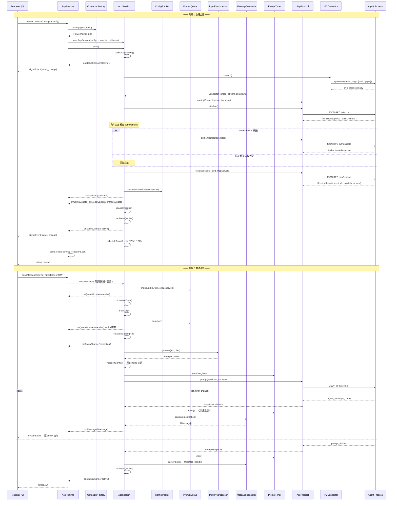

### 2.3 步骤分解

| #   | 组件              | 方法                                 | 数据变化                                                                                             |
| --- | ----------------- | ------------------------------------ | ---------------------------------------------------------------------------------------------------- |
| 1   | AcpRuntime        | `createConversation(agentConfig)`    | 生成 convId (UUID)                                                                                   |
| 2   | ConnectorFactory  | `create(agentConfig)`                | 判断 `remoteUrl` 不存在，创建 IPCConnector                                                           |
| 3   | AcpSession        | `constructor(...)`                   | 初始化所有 7 个组件，status = `'idle'`                                                               |
| 4   | AcpSession        | `start()`                            | status: `idle` → `starting`                                                                          |
| 5   | IPCConnector      | `connect()`                          | `spawn(command, args)` 启动子进程                                                                    |
| 6   | AcpProtocol       | `initialize()`                       | 协议初始化，返回 `InitializeResponse { authMethods }`                                                |
| 6a  | AcpSession        | 条件认证检查                         | 检查 `initResult.authMethods`；非空则调用 `authNegotiator.authenticate()`，为空则跳过（详见场景 10） |
| 7   | AcpProtocol       | `createSession({ cwd, mcpServers })` | 获得 SessionResult                                                                                   |
| 8   | ConfigTracker     | `syncFromSessionResult(result)`      | 填充 currentModelId, availableModels 等                                                              |
| 9   | AcpSession        | `reassertConfig()`                   | 检查 desiredModelId — 此时为 null，跳过                                                              |
| 10  | AcpSession        | `setStatus('active')`                | status: `starting` → `active`                                                                        |
| 11  | AcpSession        | `sendMessage(text)`                  | 构造 QueuedPrompt，入队 PromptQueue                                                                  |
| 12  | AcpSession        | `scheduleDrain()` → `drainLoop()`    | dequeue，status: `active` → `prompting`                                                              |
| 13  | InputPreprocessor | `process(text, files)`               | 解析 @file 引用（此处无），构建 PromptContent                                                        |
| 14  | AcpProtocol       | `prompt(sessionId, content)`         | 发送 JSON-RPC prompt 请求                                                                            |
| 15  | MessageTranslator | `translate(notification)`            | 将 SessionNotification 翻译为 TMessage                                                               |
| 16  | PromptTimer       | `reset()`                            | 每收到 chunk 重置超时计时                                                                            |
| 17  | MessageTranslator | `onTurnEnd()`                        | 增量清理 messageMap 中已完成条目                                                                     |
| 18  | AcpSession        | `setStatus('active')`                | status: `prompting` → `active`                                                                       |

### 2.4 异常路径

**E1: spawn 失败**

- IPCConnector.connect() 抛出 `AcpError { code: 'CONNECTION_FAILED', retryable: true }`
- AcpSession.handleStartError() 进入指数退避重试 (1s → 2s → 4s)
- maxStartRetries=3，共 4 次尝试（1 次初始 + 3 次重试），全部失败 → `setStatus('error')` + `onSignal({ type: 'error', recoverable: false })`
- 验证 INV-S-03: 最终收敛到 error 状态

**E2: 认证失败**

- AuthNegotiator.authenticate() 抛出 `AcpError { code: 'AUTH_REQUIRED', retryable: true }`
- 不进入 error 状态，发 `onSignal({ type: 'auth_required', auth })` 通知 UI
- 停留在 `starting` 状态，等待用户登录后调用 `retryAuth()`
- 验证 INV-S-15: 认证信号必达
- 完整认证流程详见场景 10

**E3: 队列已满**

- PromptQueue.enqueue() 返回 false（已有 5 条）
- AcpSession 抛出 `AcpError { code: 'QUEUE_FULL' }`
- 验证 INV-S-14: 队列长度不超过 maxSize

---

## 3. 场景 2: 消息排队与 drain loop 处理

### 3.1 场景描述

| 项目         | 内容                                                                    |
| ------------ | ----------------------------------------------------------------------- |
| **前置条件** | 会话已处于 `active` 状态，一个 prompt 正在执行中 (status = `prompting`) |
| **触发动作** | 用户连续快速发送 3 条消息："消息A"、"消息B"、"消息C"                    |
| **期望结果** | 3 条消息全部入队，当前 prompt 完成后 drain loop 按 FIFO 顺序逐条执行    |

### 3.2 时序图

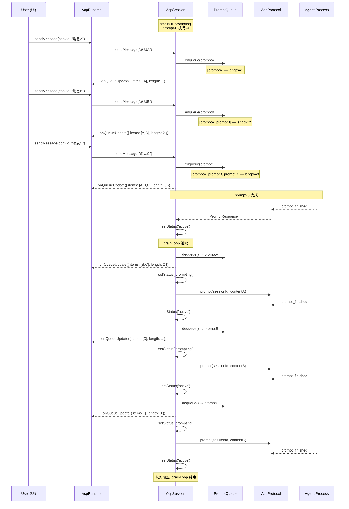

### 3.3 步骤分解

| #    | 组件        | 方法                                   | 数据变化                                           |
| ---- | ----------- | -------------------------------------- | -------------------------------------------------- |
| 1    | AcpSession  | `sendMessage("消息A")`                 | status = `prompting`，进入 case `'prompting'` 分支 |
| 2    | PromptQueue | `enqueue(promptA)`                     | items: [] → [promptA]，返回 true                   |
| 3    | AcpSession  | —                                      | status 非 `active`，**不触发** scheduleDrain       |
| 4-5  | 同上        | `enqueue(promptB)`, `enqueue(promptC)` | items: [A] → [A,B] → [A,B,C]                       |
| 6    | AcpSession  | prompt-0 完成 → `setStatus('active')`  | drainLoop 的 while 循环回到顶部                    |
| 7    | PromptQueue | `dequeue()` → promptA                  | items: [A,B,C] → [B,C]                             |
| 8    | AcpSession  | `executePrompt(promptA)`               | status: `active` → `prompting` → `active`          |
| 9-10 | 同上        | `dequeue()` → promptB → promptC        | 逐条执行，严格 FIFO                                |
| 11   | AcpSession  | drainLoop while 条件不满足             | `draining = false`，循环结束                       |

**关键不变量验证**：

- **INV-S-01**: 任意时刻只有一个 prompt 在执行。drainLoop 中 `await executePrompt(item)` 确保串行。
- **INV-S-02**: 所有消息统一通过 PromptQueue.enqueue() 入队，drainLoop 串行出队。
- **INV-S-14**: 如果队列已有 5 条（maxSize=5），第 6 条 enqueue 返回 false，抛 QUEUE_FULL。
- **INV-X-02**: 每次入队/出队后都推送完整 QueueSnapshot（包含 items 数组 + length），不依赖增量。

> **与 Doc 3 状态转换表的关系**: 上方时序图展示的是细粒度路径——每条 prompt 完成后先经过 T9 (prompting→active) 再经过 T5 (active→prompting) 进入下一条。Doc 3 的转换表中 T10 (prompting→prompting) 是对这一连续 drain 过程的逻辑等价简化，两者语义一致。

### 3.4 异常路径

**E1: 中间某条 prompt 执行失败（非 crash）**

- executePrompt 的 catch 块调用 handlePromptError()
- 如果不是 PROCESS_CRASHED → 发 onSignal + setStatus('active')
- drainLoop 继续处理队列中的下一条消息
- 队列中后续消息不受影响

**E2: cancelAll() 在排队期间被调用**

- PromptQueue.clear() 清空所有待处理项，返回被清空的 QueuedPrompt[]
- 当前执行的 prompt 被 protocol.cancel() 取消
- queuePaused = false
- onQueueUpdate 推送空快照

---

## 4. 场景 3: 权限审批流程

### 4.1 场景描述

| 项目         | 内容                                                                        |
| ------------ | --------------------------------------------------------------------------- |
| **前置条件** | 会话处于 `prompting` 状态，Agent 正在执行 prompt                            |
| **触发动作** | Agent 请求执行一个 bash 命令，需要用户批准                                  |
| **期望结果** | PermissionResolver 按 YOLO → Cache → UI 三级决策，用户审批后 Agent 继续执行 |

### 4.2 时序图 — YOLO 模式

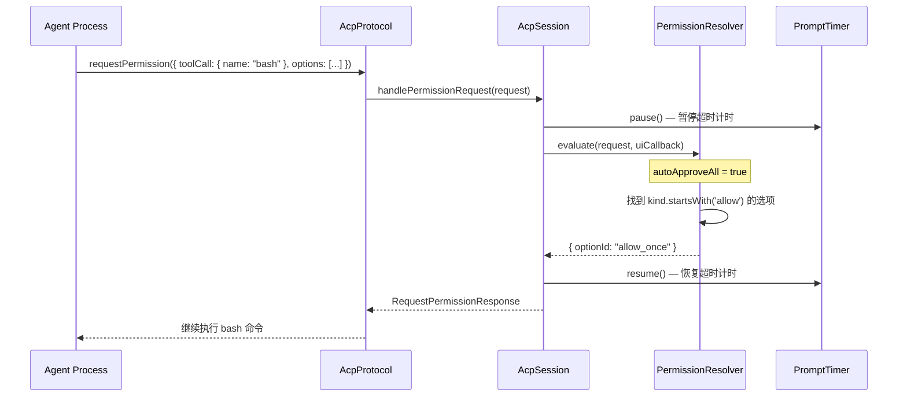

### 4.3 时序图 — Cache 命中

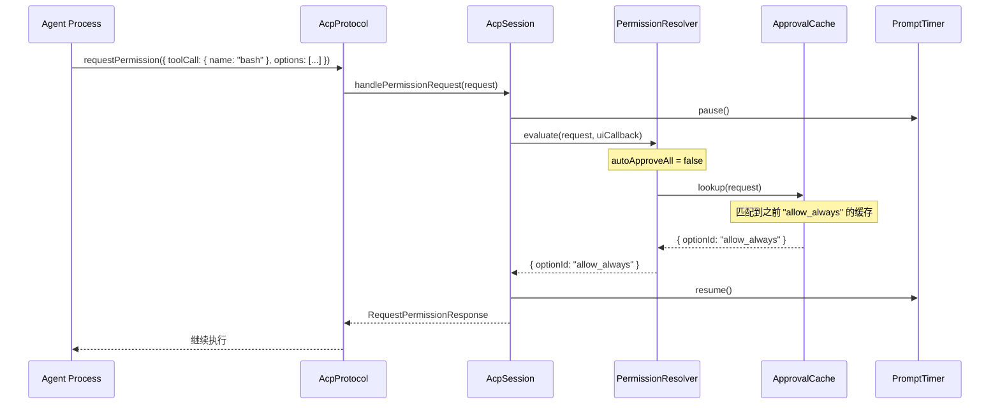

### 4.4 时序图 — UI 审批

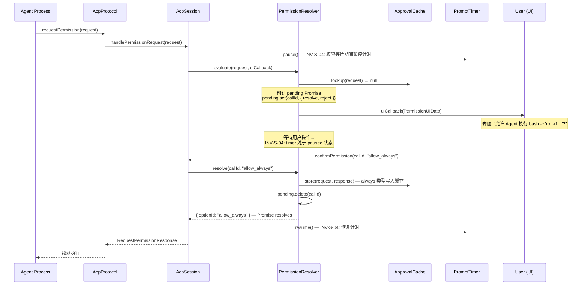

### 4.5 步骤分解 (UI 审批路径)

| #   | 组件               | 方法                                  | 数据变化                                        |
| --- | ------------------ | ------------------------------------- | ----------------------------------------------- |
| 1   | AcpProtocol        | SDK 回调 `onRequestPermission`        | 收到 Agent 的权限请求                           |
| 2   | AcpSession         | `handlePermissionRequest(request)`    | 进入权限处理流程                                |
| 3   | PromptTimer        | `pause()`                             | state: `running` → `paused`，记录剩余时间       |
| 4   | PermissionResolver | `evaluate(request, uiCallback)`       | 检查 YOLO → 检查 Cache                          |
| 5   | ApprovalCache      | `lookup(request)`                     | 缓存未命中，返回 null                           |
| 6   | PermissionResolver | 创建 pending Promise                  | pending Map 新增 `callId → { resolve, reject }` |
| 7   | PermissionResolver | `uiCallback(PermissionUIData)`        | 通过 callbacks.onPermissionRequest 推送到 UI    |
| 8   | UI                 | 用户点击"允许"                        | —                                               |
| 9   | AcpSession         | `confirmPermission(callId, optionId)` | 路由到 PermissionResolver                       |
| 10  | PermissionResolver | `resolve(callId, optionId)`           | pending Map 删除该条目                          |
| 11  | ApprovalCache      | `store(request, response)`            | 如果选项是 `always` 类型，写入 LRU 缓存         |
| 12  | PromptTimer        | `resume()`                            | state: `paused` → `running`，剩余时间继续倒计时 |

### 4.6 异常路径

**E1: 权限等待期间进程 crash**

- handleDisconnect() 被触发
- `permissionResolver.cancelAll()` → 所有 pending Promise 被 reject(`PERMISSION_CANCELLED`)
- handlePermissionRequest 的 try-catch 捕获异常
- promptTimer.resume() 在 finally 块中执行（随后被 handleDisconnect 中的 stop() 覆盖）
- 验证 INV-S-10: 非 prompting 状态下 pending 为空
- 验证 INV-X-04: 无泄漏的 pending Promise

**E2: ApprovalCache 达到上限 (500 条)**

- LRU 淘汰最旧条目，然后写入新条目
- 验证 INV-S-13: 缓存大小始终 <= maxSize

---

## 5. 场景 4: 会话挂起与恢复

### 5.1 场景描述

| 项目         | 内容                                                             |
| ------------ | ---------------------------------------------------------------- |
| **前置条件** | 会话处于 `active` 状态，队列为空，Agent 进程在运行               |
| **触发动作** | (1) 系统调用 suspend() 挂起；(2) 用户发送新消息触发恢复          |
| **期望结果** | 进程被优雅关闭，sessionId 保留；恢复时重新启动进程并 loadSession |

### 5.2 时序图

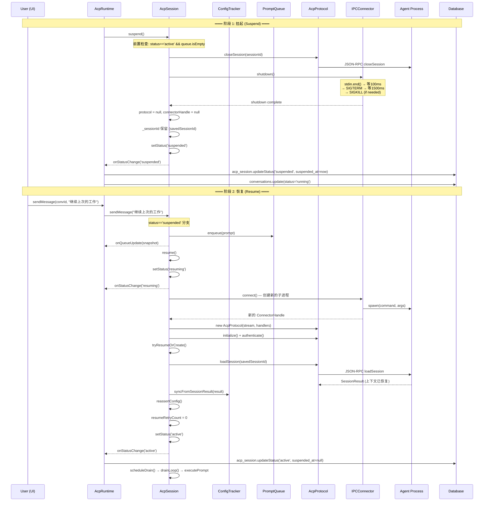

### 5.3 步骤分解

**挂起阶段**:

| #   | 组件         | 方法                                | 数据变化                                              |
| --- | ------------ | ----------------------------------- | ----------------------------------------------------- |
| 1   | AcpSession   | `suspend()`                         | 前置检查: status == `active` && queue.isEmpty         |
| 2   | AcpSession   | `teardownConnection()`              | 调用 protocol.closeSession + connectorHandle.shutdown |
| 3   | IPCConnector | `shutdown()` → `gracefulShutdown()` | 三阶段关闭 (INV-I-02)                                 |
| 4   | AcpSession   | 清理引用                            | protocol = null, connectorHandle = null               |
| 5   | AcpSession   | `setStatus('suspended')`            | 保留 \_sessionId 用于后续 resume                      |
| 6   | AcpRuntime   | onStatusChange callback             | 写入 DB: suspended_at = Date.now() (INV-A-01)         |

**恢复阶段**:

| #   | 组件          | 方法                              | 数据变化                                    |
| --- | ------------- | --------------------------------- | ------------------------------------------- |
| 7   | AcpSession    | `sendMessage(text)`               | status = `suspended` → 入队 + 调用 resume() |
| 8   | AcpSession    | `resume()`                        | status: `suspended` → `resuming`            |
| 9   | IPCConnector  | `connect()`                       | 启动新的 Agent 子进程                       |
| 10  | AcpProtocol   | `initialize()` + `authenticate()` | 新连接上的协议握手                          |
| 11  | AcpProtocol   | `loadSession(savedSessionId)`     | 尝试恢复之前的上下文                        |
| 12  | ConfigTracker | `syncFromSessionResult(result)`   | 同步恢复后的配置                            |
| 13  | AcpSession    | `reassertConfig()`                | 如果 resume 前用户切换了 model，此时 apply  |
| 14  | AcpSession    | `setStatus('active')`             | 恢复完成，开始 drain 队列                   |

### 5.4 异常路径

**E1: loadSession 失败 (session 过期)**

- loadSession 抛异常
- tryResumeOrCreate 的 catch 块发送 `onSignal({ type: 'session_expired' })`
- 降级调用 `protocol.createSession()` 创建新 session
- 用户看到"会话已过期，已创建新会话"提示，但操作不中断

**E2: resume 过程中连接失败**

- handleResumeError 检查 retryable 和 resumeRetryCount
- 最多重试 2 次 (INV-S-08: maxResumeRetries = 2)
- 指数退避: 1s → 2s
- 超限后 → enterErrorState() → status = `error`, 清空队列 (INV-S-07)

**E3: suspend() 被调用时队列非空**

- suspend() 检测到 `!this.promptQueue.isEmpty`，直接 return
- 不执行任何操作
- 验证 INV-S-05: 有队列不挂起

---

## 6. 场景 5: Agent 进程崩溃与错误恢复

### 6.1 场景描述

| 项目         | 内容                                                                  |
| ------------ | --------------------------------------------------------------------- |
| **前置条件** | 会话处于 `prompting` 状态，Agent 正在执行 prompt，队列中还有 2 条消息 |
| **触发动作** | Agent 进程意外崩溃 (SIGSEGV / OOM)                                    |
| **期望结果** | 自动 resume，队列暂停 (queuePaused = true)，等待用户决定是否继续      |

### 6.2 时序图

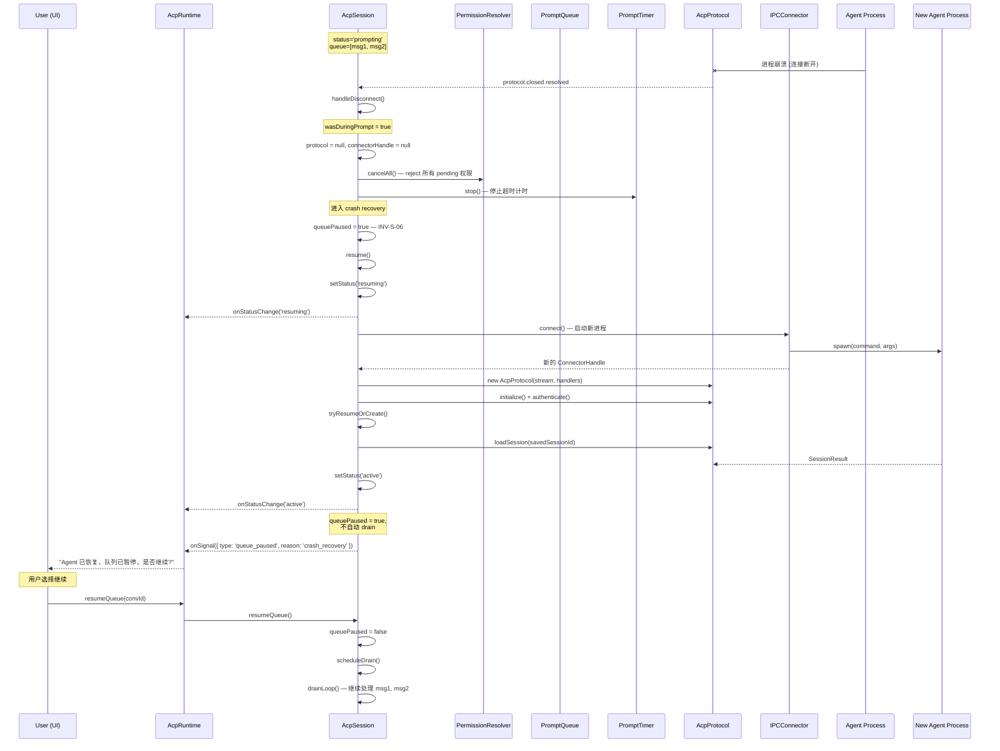

### 6.3 步骤分解

| #   | 组件               | 方法                      | 数据变化                                            |
| --- | ------------------ | ------------------------- | --------------------------------------------------- |
| 1   | AcpProtocol        | `closed` Promise resolves | 进程崩溃导致连接断开                                |
| 2   | AcpSession         | `handleDisconnect()`      | 检测 wasDuringPrompt = true (status 是 `prompting`) |
| 3   | AcpSession         | 清理引用                  | protocol = null, connectorHandle = null             |
| 4   | PermissionResolver | `cancelAll()`             | 所有 pending Promise 被 reject (INV-S-10, INV-X-04) |
| 5   | PromptTimer        | `stop()`                  | state: 任意 → `idle`                                |
| 6   | AcpSession         | `queuePaused = true`      | INV-S-06: crash 后队列暂停                          |
| 7   | AcpSession         | `resume()`                | 开始恢复流程，status → `resuming`                   |
| 8   | IPCConnector       | `connect()`               | 启动新的 Agent 子进程                               |
| 9   | AcpProtocol        | 握手 + loadSession        | 恢复协议 session                                    |
| 10  | AcpSession         | `setStatus('active')`     | 恢复成功                                            |
| 11  | AcpSession         | 检测 queuePaused          | 不调用 scheduleDrain，发送 queue_paused 信号        |
| 12  | UI                 | 用户点击"继续"            | AcpRuntime.resumeQueue(convId)                      |
| 13  | AcpSession         | `resumeQueue()`           | queuePaused = false, scheduleDrain() 开始处理       |

### 6.4 异常路径

**E1: 非 prompt 期间的进程退出**

- handleDisconnect 中 wasDuringPrompt = false
- 不设 queuePaused，直接 `setStatus('suspended')`
- 静默挂起，下次用户操作时 resume
- 与场景 4 (正常 suspend/resume) 的恢复流程相同

**E2: 恢复重试超限**

- resume() 中 connect 或 loadSession 失败
- handleResumeError 检查 resumeRetryCount < 2 (INV-S-08)
- 首次重试: 延迟 1s；第二次重试: 延迟 2s
- 超限后: `enterErrorState(err)` → 清空队列 (INV-S-07)，status → `error`
- 验证 INV-S-03: 异常路径最终收敛到 error 态

**E3: 用户选择不继续，执行 cancelAll()**

- `cancelAll()`: cancel 当前 prompt + promptQueue.clear() + queuePaused = false
- 队列清空，msg1 和 msg2 被丢弃

---

## 7. 场景 6: 空闲回收

### 7.1 场景描述

| 项目         | 内容                                                 |
| ------------ | ---------------------------------------------------- |
| **前置条件** | 用户 30 分钟未操作，会话处于 `active` 状态，队列为空 |
| **触发动作** | IdleReclaimer 定时扫描发现超时 session               |
| **期望结果** | 自动 suspend，释放 Agent 进程资源                    |

### 7.2 时序图

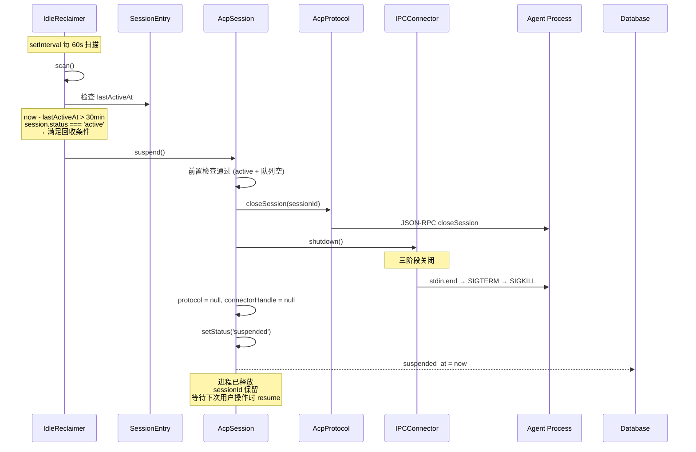

### 7.3 步骤分解

| #   | 组件          | 方法                      | 数据变化                                                      |
| --- | ------------- | ------------------------- | ------------------------------------------------------------- |
| 1   | IdleReclaimer | `scan()` (定时器触发)     | 遍历 sessions Map                                             |
| 2   | IdleReclaimer | 条件检查                  | `now - lastActiveAt > idleTimeoutMs` && `status === 'active'` |
| 3   | AcpSession    | `suspend()`               | 前置检查: status=active, queue.isEmpty                        |
| 4   | AcpSession    | `teardownConnection()`    | closeSession + shutdown                                       |
| 5   | IPCConnector  | `gracefulShutdown(child)` | 三阶段关闭 (INV-I-02)                                         |
| 6   | AcpSession    | `setStatus('suspended')`  | sessionId 保留                                                |
| 7   | AcpRuntime    | onStatusChange            | DB 写入 suspended_at (INV-A-01)                               |

### 7.4 异常路径

**E1: session 处于 prompting 状态**

- IdleReclaimer.scan() 检查 `session.status === 'active'`
- prompting 不等于 active，跳过
- 验证 INV-A-02: 不回收正在执行 prompt 的 session

**E2: 队列非空**

- suspend() 内部检查 `!this.promptQueue.isEmpty`，直接 return
- IdleReclaimer 不知道 suspend 被跳过，下次扫描再检查
- 验证 INV-A-02: 不回收有待处理消息的 session

**E3: shutdown 过程中进程不响应**

- gracefulShutdown 按三阶段执行: stdin.end → SIGTERM → SIGKILL
- 最终 child.unref() 确保 Electron 主进程可正常退出
- 验证 INV-I-01: shutdown 后 isAlive() = false

---

## 8. 场景 7: 运行中切换模型/模式

### 8.1 场景描述

| 项目         | 内容                                                                           |
| ------------ | ------------------------------------------------------------------------------ |
| **前置条件** | 会话处于 `prompting` 状态，用户在 UI 切换了 model                              |
| **触发动作** | 用户将 model 从 "claude-sonnet" 切换为 "claude-opus"                           |
| **期望结果** | model 意图被缓存，当前 prompt 完成后在下一次 prompt 前通过 reassertConfig 生效 |

### 8.2 时序图

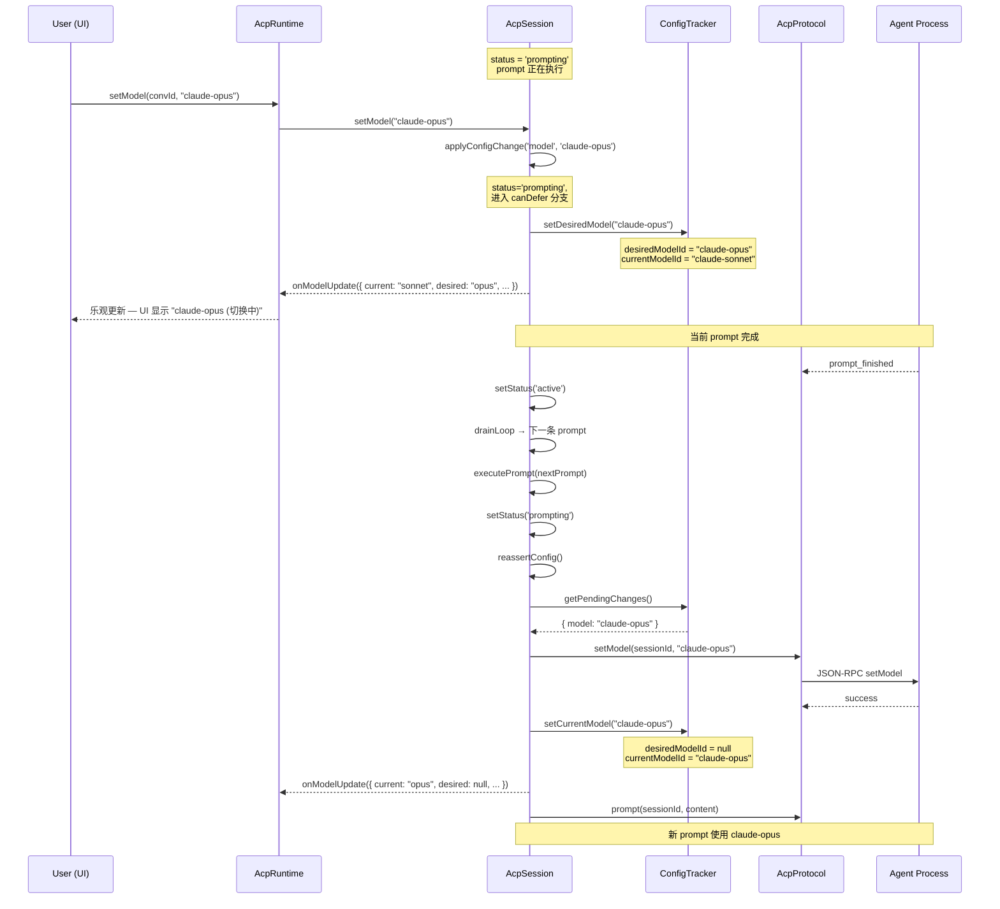

### 8.3 步骤分解

| #   | 组件          | 方法                                                          | 数据变化                                           |
| --- | ------------- | ------------------------------------------------------------- | -------------------------------------------------- |
| 1   | AcpSession    | `setModel("claude-opus")` → `applyConfigChange('model', ...)` | status = prompting → canDefer 分支                 |
| 2   | ConfigTracker | `setDesiredModel("claude-opus")`                              | desiredModelId = "claude-opus"                     |
| 3   | AcpSession    | 通过 callback 推送                                            | onModelUpdate 包含 desired 和 current，UI 乐观更新 |
| 4   | AcpSession    | 当前 prompt 完成                                              | status → active                                    |
| 5   | AcpSession    | `executePrompt(nextPrompt)`                                   | drainLoop 出队下一条                               |
| 6   | AcpSession    | `reassertConfig()`                                            | 在发送 prompt 前检查 pending changes               |
| 7   | ConfigTracker | `getPendingChanges()`                                         | 返回 `{ model: "claude-opus" }`                    |
| 8   | AcpProtocol   | `setModel(sessionId, "claude-opus")`                          | 通知 Agent 切换模型                                |
| 9   | ConfigTracker | `setCurrentModel("claude-opus")`                              | currentModelId 更新，desiredModelId = null         |

**关键不变量验证**：

- **INV-S-11**: reassertConfig 完成后 `desiredModelId === null || desiredModelId === currentModelId`

### 8.4 异常路径

**E1: setModel 在 active 状态下调用**

- canDirect 分支: 直接调用 `protocol.setModel()`
- 不经过 desired/reassert 流程，立即生效

**E2: setModel 在 idle 或 error 状态下调用**

- 抛出 `AcpError { code: 'INVALID_STATE' }`

**E3: reassertConfig 中 protocol.setModel 失败**

- reassertConfig 中的 await 抛异常
- 如果发生在 start() 流程中，被 handleStartError 捕获
- 如果发生在 executePrompt 流程中，被 executePrompt 的 catch 块捕获
- desiredModelId 保持不变，下次 reassertConfig 会再次尝试

---

## 9. 场景 8: WebSocket 远程连接

### 9.1 场景描述

| 项目         | 内容                                                                      |
| ------------ | ------------------------------------------------------------------------- |
| **前置条件** | AgentConfig 中 remoteUrl 不为空 (如 `wss://remote-agent.example.com/acp`) |
| **触发动作** | 创建新会话                                                                |
| **期望结果** | ConnectorFactory 创建 WebSocketConnector，通过 WebSocket 建立连接         |

### 9.2 时序图

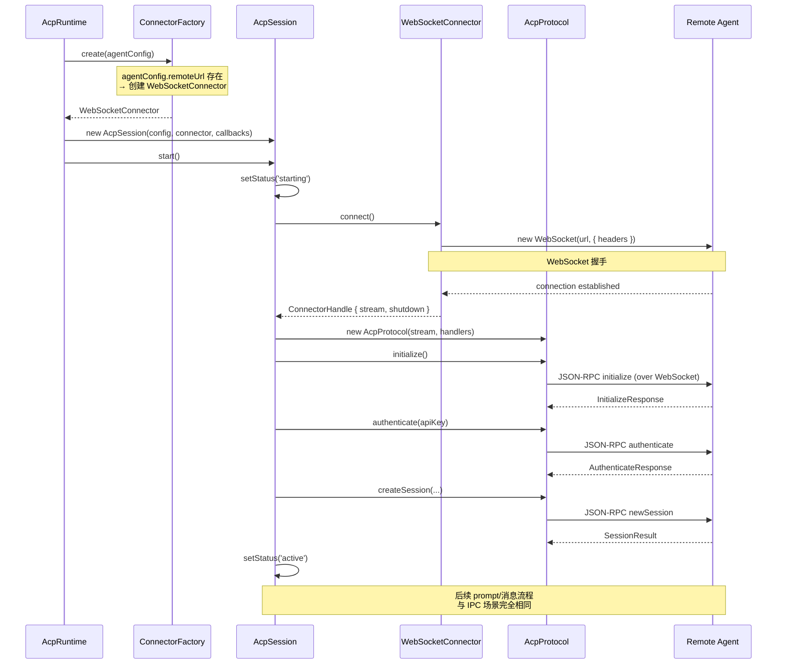

### 9.3 与 IPC 的差异对比

| 维度              | IPCConnector                                | WebSocketConnector                                                 |
| ----------------- | ------------------------------------------- | ------------------------------------------------------------------ |
| **连接建立**      | `spawn(command, args)` 启动本地子进程       | `new WebSocket(url, headers)` 建立远程连接                         |
| **Stream 来源**   | `NdjsonTransport.fromChildProcess(child)`   | SDK 内置 WebSocket transport（由 `@agentclientprotocol/sdk` 提供） |
| **关闭方式**      | 三阶段: stdin.end → SIGTERM → SIGKILL       | `ws.close()`                                                       |
| **isAlive 判断**  | `isProcessAlive(child.pid)` (signal-0 探测) | `ws.readyState === WebSocket.OPEN`                                 |
| **错误特征**      | 进程 crash (SIGSEGV/OOM/exit)               | 网络断开 / 服务端关闭                                              |
| **resume 成功率** | 较高 (本地进程重启快)                       | 依赖网络和服务端状态                                               |

**关键一致性**: 一旦 connect() 返回 ConnectorHandle，后续的 AcpProtocol 交互、状态机转换、PromptQueue 行为完全相同。AgentConnector 接口隔离了连接建立方式的差异。

### 9.4 异常路径

**E1: WebSocket 连接失败**

- waitForOpen(ws) 超时或被拒绝
- 抛出 `AcpError { code: 'CONNECTION_FAILED', retryable: true }`
- AcpSession 进入与 IPC 相同的重试逻辑

**E2: 远程连接意外断开**

- WebSocket onclose 事件触发
- AcpProtocol.closed Promise resolves
- AcpSession.handleDisconnect() — 与 IPC 进程 crash 处理流程完全相同

**E3: resume 时远程服务不可用**

- connect() 失败 → handleResumeError → 指数退避重试
- 网络恢复后 resume 可能成功
- 如果服务端没有保留 session，loadSession 失败 → 降级 createSession

---

## 10. 场景 9: 从错误状态手动恢复

### 10.1 场景描述

| 项目         | 内容                                                                            |
| ------------ | ------------------------------------------------------------------------------- |
| **前置条件** | 会话处于 `error` 状态（例如场景 5 E2 中 resume 重试超限后的终态），队列已被清空 |
| **触发动作** | 用户点击"重试"按钮                                                              |
| **期望结果** | 重新启动 Agent 进程，完成 ACP 协议握手，session 回到 `active` 状态              |

### 10.2 时序图

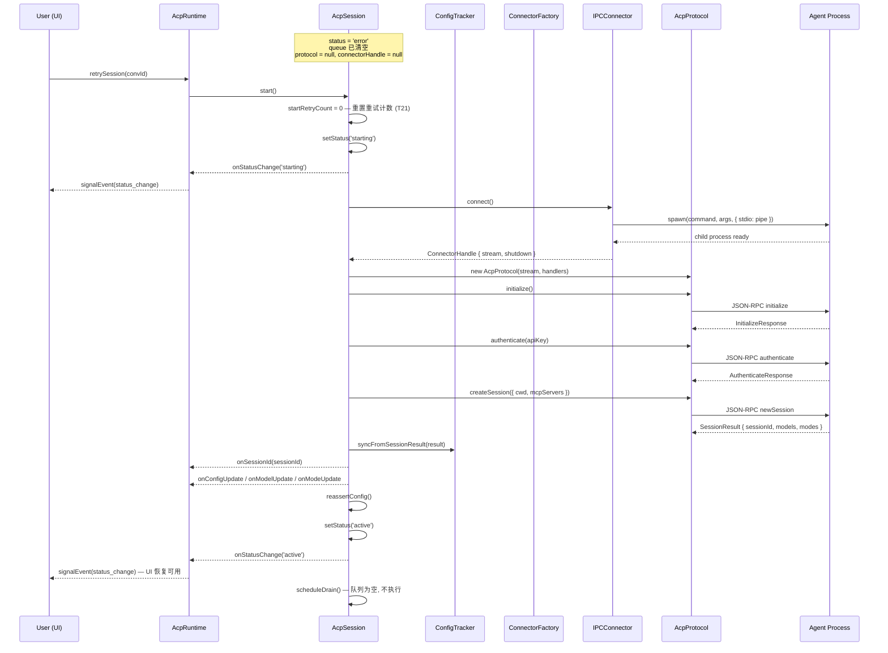

### 10.3 步骤分解

| #   | 组件          | 方法                              | 数据变化                                                     |
| --- | ------------- | --------------------------------- | ------------------------------------------------------------ |
| 1   | UI            | 用户点击"重试"                    | 触发 retrySession(convId)                                    |
| 2   | AcpRuntime    | `retrySession(convId)`            | 路由到对应 AcpSession                                        |
| 3   | AcpSession    | `start()`                         | 重置 startRetryCount = 0，status: `error` → `starting` (T21) |
| 4   | IPCConnector  | `connect()`                       | 启动新的 Agent 子进程                                        |
| 5   | AcpProtocol   | `initialize()` + `authenticate()` | 协议握手                                                     |
| 6   | AcpProtocol   | `createSession(...)`              | 获得新的 SessionResult（旧 session 已失效，创建新会话）      |
| 7   | ConfigTracker | `syncFromSessionResult(result)`   | 填充 model/mode 配置                                         |
| 8   | AcpSession    | `reassertConfig()`                | 如果 error 前用户切换过 model，此时 apply                    |
| 9   | AcpSession    | `setStatus('active')`             | status: `starting` → `active`，恢复完成                      |

**关键不变量验证**：

- **INV-S-09**: error → starting → active 是合法转换路径 (T21 + T2)
- **INV-S-03**: 从 error 状态成功恢复，验证状态收敛的可逆性

### 10.4 异常路径

**E1: 重试时 spawn 再次失败**

- 与场景 1 E1 相同的重试逻辑：指数退避 (1s → 2s → 4s)
- maxStartRetries=3，共 4 次尝试（1 次初始 + 3 次重试）
- 全部失败 → 再次 `setStatus('error')`
- 用户可再次点击"重试"

**E2: 重试时认证失败**

- 不可重试错误，直接 `setStatus('error')`
- 用户需检查 API Key 配置后再重试

---

## 11. 场景 10: 未认证用户条件认证流程

### 11.1 场景描述

| 项目         | 内容                                                                                                                |
| ------------ | ------------------------------------------------------------------------------------------------------------------- |
| **前置条件** | 用户未登录（无有效 token / API Key），选择了需要认证的 Agent（如 Claude）                                           |
| **触发动作** | 创建新会话并发送消息                                                                                                |
| **期望结果** | 系统检测到需要认证 → 发 `auth_required` 信号给 UI → 用户通过某种方式登录 → `retryAuth()` → 完整重启 → 进入 `active` |

### 11.2 时序图

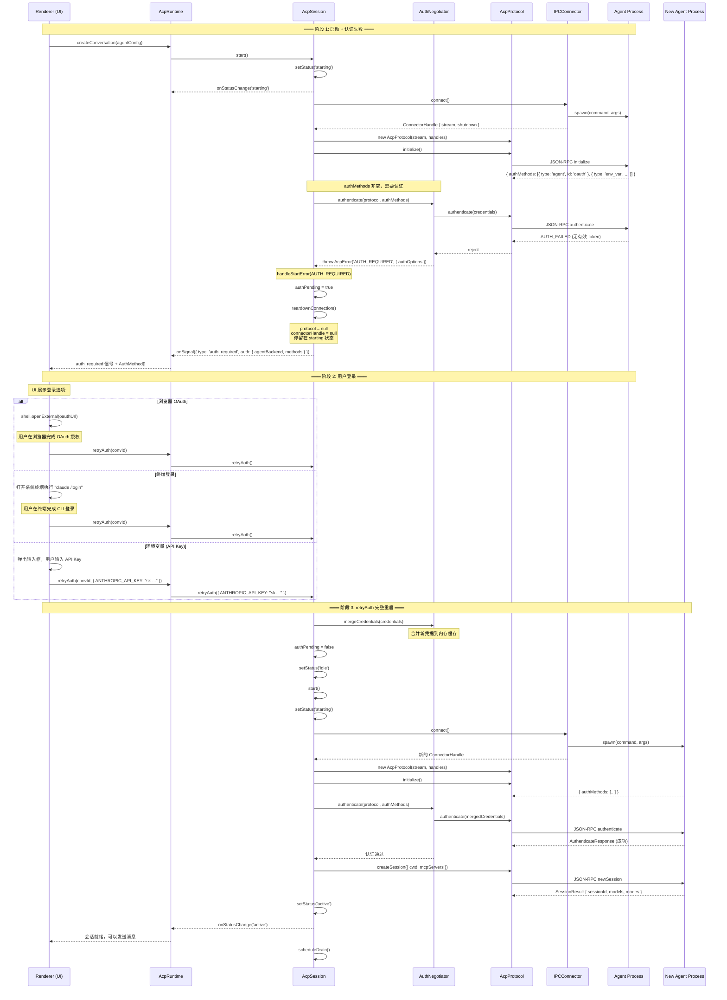

### 11.3 步骤分解

**阶段 1: 启动 + 认证失败**

| #   | 组件           | 方法                                  | 数据变化                                                        |
| --- | -------------- | ------------------------------------- | --------------------------------------------------------------- |
| 1   | AcpSession     | `start()`                             | status: `idle` → `starting`                                     |
| 2   | IPCConnector   | `connect()`                           | spawn Agent 子进程                                              |
| 3   | AcpProtocol    | `initialize()`                        | 返回 `{ authMethods: [...] }`，authMethods 非空                 |
| 4   | AuthNegotiator | `authenticate(protocol, authMethods)` | 调用 `protocol.authenticate(credentials)`                       |
| 5   | AcpProtocol    | `authenticate()`                      | Agent 返回 AUTH_FAILED (无有效 token)                           |
| 6   | AuthNegotiator | 抛出 `AcpError('AUTH_REQUIRED')`      | 附带 `AuthRequiredData { agentBackend, methods: AuthMethod[] }` |
| 7   | AcpSession     | `handleStartError(AUTH_REQUIRED)`     | 设置 `authPending = true`                                       |
| 8   | AcpSession     | `teardownConnection()`                | 关闭连接，`protocol = null`, `connectorHandle = null`           |
| 9   | AcpSession     | `callbacks.onSignal(auth_required)`   | 通知 Application 层，附带 AuthMethod[] 供 UI 展示               |

**三种登录方式 (UI 职责)**

| 方式           | UI 行为                                                | retryAuth 参数                                            |
| -------------- | ------------------------------------------------------ | --------------------------------------------------------- |
| OAuth (浏览器) | `shell.openExternal(url)` 打开授权页面，用户完成后回调 | `retryAuth()` — 无需传凭据，Agent CLI 已自动获取 token    |
| 终端登录       | 打开系统终端执行 `claude /login`，用户完成 CLI 登录    | `retryAuth()` — 无需传凭据，Agent CLI 已自动获取 token    |
| 环境变量       | 弹出输入框，用户输入 API Key                           | `retryAuth({ ANTHROPIC_API_KEY: "sk-..." })` — 传入键值对 |

**阶段 3: retryAuth 重启**

| #   | 组件           | 方法                                  | 数据变化                                                      |
| --- | -------------- | ------------------------------------- | ------------------------------------------------------------- |
| 10  | AuthNegotiator | `mergeCredentials(credentials)`       | 合并新凭据到内存缓存（仅 env_var 方式有凭据）                 |
| 11  | AcpSession     | `authPending = false`                 | 清除认证等待标志                                              |
| 12  | AcpSession     | `setStatus('idle')` + `start()`       | 完整重启: connect → initialize → authenticate → createSession |
| 13  | IPCConnector   | `connect()`                           | spawn 新的 Agent 子进程                                       |
| 14  | AcpProtocol    | `initialize()`                        | 新连接上的协议初始化                                          |
| 15  | AuthNegotiator | `authenticate(protocol, authMethods)` | 使用合并后的凭据认证                                          |
| 16  | AcpProtocol    | `authenticate(mergedCredentials)`     | 认证成功                                                      |
| 17  | AcpProtocol    | `createSession(...)`                  | 创建新 session                                                |
| 18  | AcpSession     | `setStatus('active')`                 | status: `starting` → `active`，会话就绪                       |

**关键不变量验证**:

- **INV-S-15**: 认证失败时必须通过 `callbacks.onSignal({ type: 'auth_required' })` 通知 UI，不进入 error 状态
- **INV-S-03**: 认证等待期间保持 `starting` 状态且资源已释放 (`connectorHandle === null && protocol === null`)，由 `retryAuth()` 或 `stop()` 推进到下一状态

### 11.4 异常路径

**E1: retryAuth 后仍然失败**

- `retryAuth()` 触发完整 `start()` 流程
- `authenticate()` 再次失败 → 再次抛 `AUTH_REQUIRED`
- `handleStartError(AUTH_REQUIRED)` 再次发 `auth_required` 信号
- 用户可无限重试，不存在重试次数限制（与连接失败的有限重试不同）
- 每次 retryAuth 都是 reset 模式: teardown → idle → 完整 start()

**E2: 用户不登录直接关闭**

- 用户在认证等待期间调用 `stop()`
- `stop()` 检测到 `authPending = true`，清理状态
- status → `idle`，正常关闭
- 验证 INV-S-03: 认证等待可通过 `stop()` 安全退出

**E3: 不需要认证的 Agent**

- `initResult.authMethods` 为空数组或字段缺失
- AcpSession 跳过 `authNegotiator.authenticate()` 调用
- 直接进入 `createSession()` → `active`
- 整个认证分支不被执行

**E4: resuming 状态下的认证失败**

- `resume()` 流程中 `authenticate()` 也可能失败
- 行为与 starting 状态一致: 发 `auth_required` 信号，停留在 `resuming` 状态
- `retryAuth()` 同样走 reset 模式 (teardown + start)

---

## 参考文档

- [完整架构设计](../round-02/arch-a/final-architecture.md) — 核心组件定义和状态机详情
- [23 条不变量](../round-02/arch-b/invariants.md) — 测试需要验证的系统不变量
- [共识决议](../round-01/inspector/consensus-decisions.md) — D1-D13 设计决策
- [Connector 简化](../round-04/inspector/consensus-update.md) — IPCConnector + WebSocketConnector
- [数据库持久化](../round-05/inspector/consensus-decisions.md) — D14-D20 DB 方案
- [测试计划](./05-test-plan.md) — 基于本文档场景设计的测试策略，各场景的测试验证方案详见该文档
