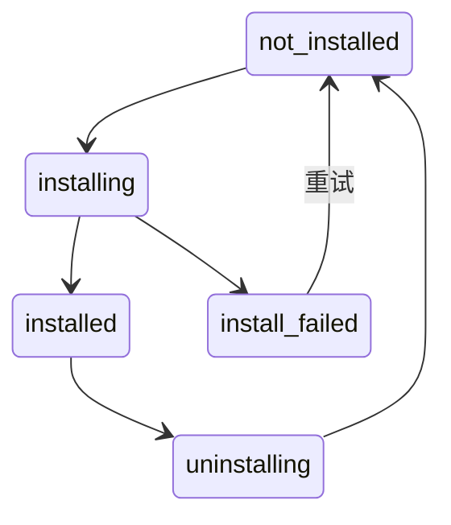

# Agent Hub — 需求文档

> 日期：2026-03-30
> 状态：Draft
> 调研参考：[research/](research/) (架构、Contribution 类型、Gap 分析、安全模型、分发管线)

## 1. 背景与问题

### 现状

AionUI 设置页 > Agent > Local Agent 页，APP 启动时自动扫描本地已安装的 CLI backend（Claude Code、Opencode、iflow、Kimi 等），将检测到的 agent 展示在列表中供用户使用。

### 痛点

1. **路径发现失败**：部分用户将 CLI 安装在非默认路径，AcpDetector 的 `which` 命令扫描不到
2. **必须先装 CLI**：用户需要自行在终端安装 CLI backend（如 `npm install -g @anthropic-ai/claude-code`），APP 才能发现。对非技术用户门槛高
3. **不知道有哪些可用**：用户不知道 AionUI 支持哪些 agent backend，缺少发现入口

### 目标

构建 **Agent Hub**，在 Local Agent 页内展示所有可用 agent（内置 + 远程），用户可一键安装，降低使用门槛。

**一句话**：打开 APP → 看到所有可用 agent → 点 Install → 自动安装 → 可用。

---

## 2. 核心概念

### 2.1 Extension 与 Agent 的关系

Hub 中的每个 "Agent" 实际上是一个 **Extension**（包含 `contributes.acpAdapters`）。安装一个 agent = 安装一个 extension + 执行其 `onInstall` 钩子（通常是 `bun add -g <cli-package>`）。

```
Hub 中展示的 Agent ──── 对应 ──── 一个 Extension (aion-extension.json)
                                    └── contributes.acpAdapters
                                    └── lifecycle.onInstall → bun add -g <cli>
```

### 2.2 Extension 来源

| 来源     | 说明                                                                                    | 网络依赖 |
| -------- | --------------------------------------------------------------------------------------- | -------- |
| **内置** | 打包在 APP 资源目录中的 .tgz 包。确保核心 agent（Claude Code、Kimi 等）零网络可见       | 无       |
| **远程** | 从 GitHub `aionui/hub` 仓库拉取的 index.json 中，存在于远程但不在内置列表中的 extension | 需要网络 |

### 2.3 Extension 状态

一个 extension 在客户端有以下状态：



| 状态               | 含义                       | UI 展示                                     |
| ------------------ | -------------------------- | ------------------------------------------- |
| `not_installed`    | 未安装（仅在列表中可见）   | 显示 Install 按钮                           |
| `installing`       | 安装中（解压 + bun add）   | 显示 loading 状态                           |
| `installed`        | 已安装且可用               | 显示正常的 agent 配置界面（与现有样式一致） |
| `install_failed`   | 安装失败（bun add 出错等） | 显示 Retry 按钮 + 错误信息                  |
| `update_available` | 已安装但有新版可用         | 显示 Update 按钮                            |
| `uninstalling`     | 卸载中                     | 显示 loading 状态                           |

---

## 3. 数据模型

### 3.1 Hub Index (index.json)

由 CI 从 `aionui/hub` 仓库自动生成，客户端拉取此文件获取可用 extension 列表。

```jsonc
{
  "schemaVersion": 1,
  "generatedAt": "2026-03-30T12:00:00Z",
  "extensions": [
    {
      // === 身份 ===
      "name": "ext-claude-code", // kebab-case, 全局唯一 ID (即 aion-extension.json 的 name)
      "displayName": "Claude Code", // UI 展示名 (可变)
      "description": "Anthropic Claude Code agent",
      "author": "aionui",
      "icon": "icon.png", // 相对于 extension 目录的路径

      // === 分发 ===
      "dist": {
        "tarball": "extensions/ext-claude-code/ext-claude-code.tgz",
        "integrity": "sha512-abc123...", // SRI hash，防传输损坏
        "unpackedSize": 12480, // bytes
      },

      // === 兼容性 ===
      "engines": {
        "aionui": ">=2.0.0", // 最低 APP 版本要求
      },

      // === Hub 分类 ===
      "hubs": ["agent"], // 从 contributes 自动推导
      "tags": ["anthropic", "claude", "coding"],

      // === 权限摘要 ===
      "riskLevel": "moderate",

      // === 内置标记 ===
      "bundled": true, // 是否打包在 APP 内
    },
  ],
}
```

### 3.2 安装状态推导

安装状态不额外持久化，从已有数据源实时推导：

```
判断 Hub extension 的展示状态:

  extension 目录不存在 (~/.aionui/extensions/ext-xxx/)
    → not_installed (显示 Install)

  extension 目录存在 + CLI 已检测到 (AcpDetector)
    → installed (显示已安装样式)

  extension 目录存在 + CLI 未检测到
    → install_failed (显示 Retry)
       错误信息从 extension-states.json 的 installError 字段读取

  Hub index 中 dist.integrity ≠ 已安装 extension 的 integrity
    → update_available (显示 Update)
```

**数据源**:

| 状态信号           | 数据来源                                         | 说明           |
| ------------------ | ------------------------------------------------ | -------------- |
| extension 是否存在 | `ExtensionLoader` 扫描 `~/.aionui/extensions/`   | 已有能力       |
| CLI 是否可用       | `AcpDetector` 扫描 `which <command>`             | 已有能力       |
| 启用/禁用          | `extension-states.json`（`statePersistence.ts`） | 已有能力       |
| 安装错误信息       | `extension-states.json` 新增 `installError` 字段 | 唯一需要扩展的 |
| 是否有更新         | 对比 Hub index integrity 与本地 manifest         | 启动时计算     |

---

## 4. UI 需求

### 4.1 Local Agent 页布局变更

**当前布局**：

```
┌────────────────────────────────────┐
│ Detected Agents                    │
│   ├── Gemini (内置, 有设置入口)    │
│   ├── Claude Code (已检测)         │
│   └── Opencode (已检测)            │
├────────────────────────────────────┤
│ Custom Agents                      │
│   ├── [+ Add Custom Agent]         │
│   └── My Agent (用户配置的)        │
└────────────────────────────────────┘
```

**新布局**：

```
┌────────────────────────────────────┐
│ Detected Hub                       │
│   ├── Gemini         [*]           │  ← (内置, 始终置顶, 显示设置入口)
│   ├── Claude Code    [Install]     │  ← 内置, 未安装
│   ├── Kimi           [已安装 ✓]    │  ← 内置, 已安装
│   ├── Opencode       [Update]      │  ← 内置, 有更新
│   ├── iflow          [Retry ⚠]     │  ← 安装失败
│   └── Qwen Code      [Install]     │  ← 非内置 (远程增量)
│   └── My-Local-Agent (不在 Hub 中) │  ← Hub 里没有的已检测 agent, 显示设置入口
├────────────────────────────────────┤
│ Custom Agents                      │
│   ├── [+ Add Custom Agent]         │
│   └── My Custom Agent              │
└────────────────────────────────────┘
```

### 4.2 区域说明

整个 Local Agent 页只有两个区域：

| 区域              | 数据来源                                                       | 说明                                            |
| ----------------- | -------------------------------------------------------------- | ----------------------------------------------- |
| **Detected Hub**  | Hub index (内置 + 远程) + AcpDetector 扫描结果，合并为一个列表 | 统一展示所有 agent，包括 Hub 内的和本地检测到的 |
| **Custom Agents** | ConfigStorage `acp.customAgents`                               | 保持现有功能不变                                |

**Detected Hub 内部排序**:

1. **Gemini** — 始终置顶，保持现有样式和设置入口
2. **Hub agents** — 来自 Hub index 的 extension，按安装状态显示不同操作按钮（Install / 已安装 / Update / Retry）
3. **Detected-only agents** — AcpDetector 扫描到但不在 Hub index 中的 agent（用户自行安装的 CLI），显示与现有 Detected Agent 一致的样式和设置入口

三部分处于同一个列表中，**不分隔、不分组**，只是按上述顺序排列。

### 4.3 Detected Hub 卡片状态

同一列表中的每个 agent 根据来源和状态显示不同样式：

| 来源          | 状态               | 卡片内容                                    | 操作                                         |
| ------------- | ------------------ | ------------------------------------------- | -------------------------------------------- |
| 内置          | —                  | Gemini icon + name                          | 设置入口 (齿轮图标，导航到 /settings/gemini) |
| Hub           | `not_installed`    | icon + name + description                   | **Install** 按钮                             |
| Hub           | `installing`       | icon + name + "安装中..."                   | Loading spinner (按钮禁用)                   |
| Hub           | `installed`        | icon + name，与现有 Detected Agent 样式一致 | 设置入口 + 卸载 (更多菜单)                   |
| Hub           | `install_failed`   | icon + name + 错误信息摘要                  | **Retry** 按钮                               |
| Hub           | `update_available` | icon + name + "有新版本"                    | **Update** 按钮                              |
| Detected-only | —                  | icon + name，与现有 Detected Agent 样式一致 | 设置入口                                     |

### 4.4 已安装 Hub agent 的展示

已安装的 Hub agent 展示样式应与**现有的 Detected Agent 样式完全一致**。用户无法区分"通过 Hub 安装的 agent"和"本地自动检测到的 agent"——它们看起来一样、用起来一样。Hub 只改变了"agent 从哪来"，不改变"已安装 agent 长什么样"。

### 4.5 Hub 与 Detected 合并去重

Hub agents 和 AcpDetector 检测结果在合并到同一列表时需要去重：

1. 如果一个 agent 同时存在于 Hub index 和 AcpDetector 检测结果中（如用户之前手动装了 Claude Code CLI），**按 Hub agent 展示**（标记为 `installed`），不在列表末尾重复出现
2. 只有 AcpDetector 检测到但 **Hub index 中没有**的 agent，才追加到列表末尾作为 Detected-only 项
3. 匹配规则：Hub extension 的 `contributes.acpAdapters[].cliCommand` 与 AcpDetector 检测到的 CLI command 一致

---

## 5. 核心流程

### 5.1 APP 启动 — 加载 Hub 列表

```
APP 启动
  │
  ├── 1. 读取内置 bundled-index.json (APP 资源目录)
  │      → 得到内置 extension 列表
  │
  ├── 2. ExtensionLoader 扫描 ~/.aionui/extensions/ (现有逻辑)
  │      → 得到已安装 extension 列表
  │
  ├── 3. AcpDetector 扫描本地 CLI (现有逻辑不变)
  │      → 用于推导安装状态 + Detected-only 展示
  │
  ├── 4. 异步: 尝试从 GitHub 拉取 remote-index.json
  │      ├── 成功 → 计算差集 (remote - bundled)
  │      │          → 将新增 extension 补充到列表
  │      └── 失败 → 忽略, 仅用内置列表 (静默, 不报错)
  │
  ├── 5. 推导每个 Hub extension 的状态 (见 3.2)
  │
  └── 6. 合并后的列表通过 IPC 推送到 renderer
         → UI 渲染完整 Hub 列表
```

### 5.2 安装 Extension

```
用户点击 Install
  │
  ├── 1. 状态 → installing, UI 显示 loading
  │
  ├── 2. 获取 .tgz 包
  │      ├── 内置 extension → 从 APP 资源目录读取
  │      └── 非内置 extension → 从 GitHub 下载
  │
  ├── 3. 验证 integrity (SHA-512 SRI)
  │      └── 失败 → 状态 → install_failed, 记录错误
  │
  ├── 4. 解压到临时目录
  │      └── ~/.aionui/extensions/.tmp/ext-xxx/
  │
  ├── 5. 校验 aion-extension.json 合法性
  │      └── 失败 → 清理临时目录, 状态 → install_failed
  │
  ├── 6. 原子移动到正式目录
  │      └── .tmp/ext-xxx/ → ~/.aionui/extensions/ext-xxx/
  │
  ├── 7. 执行 onInstall 钩子 (如 bun add -g @anthropic-ai/claude-code)
  │      ├── 成功 → 继续
  │      └── 失败 → 保留 extension 目录, 状态 → install_failed, 记录错误
  │         (不回滚解压, 方便 Retry 时跳过解压直接重试 bun add)
  │
  ├── 8. 执行 onActivate 钩子
  │
  ├── 9. 触发 ExtensionRegistry 热重载
  │      └── 新 agent 注册到系统
  │
  └── 10. 状态自动推导为 installed (目录存在 + CLI 检测到)
          UI 切换为已安装样式
```

### ~~5.3 卸载 Extension~~

> (先不做卸载功能，后续版本再加)

```
用户点击 Uninstall (更多菜单中)
  │
  ├── 1. 确认弹窗: "确定卸载 Claude Code?"
  │
  ├── 2. 状态 → uninstalling
  │
  ├── 3. 执行 onDeactivate 钩子
  │
  ├── 4. 执行 onUninstall 钩子 (如 bun remove -g @anthropic-ai/claude-code)
  │      └── 失败 → 仅 warn 日志, 不阻塞卸载
  │
  ├── 5. 删除 ~/.aionui/extensions/ext-xxx/ 目录
  │
  ├── 6. 触发 ExtensionRegistry 热重载
  │
  └── 7. 状态自动推导为 not_installed (目录不存在)
         UI 切换回 Install 按钮
```

### 5.4 更新 Extension

```
APP 更新后首次启动
  │
  ├── 对比新内置版本与已安装版本
  │   (内置 index 中的 dist.integrity 与已安装 extension 的 integrity 对比)
  │
  ├── 如果不同 → 标记为 update_available
  │   └── UI 显示 Update 按钮
  │
  └── 用户点击 Update
      └── 执行安装流程 (5.2), 覆盖现有目录
```

### 5.5 重试安装

```
用户点击 Retry (在 install_failed 状态)
  │
  ├── 检查 ~/.aionui/extensions/ext-xxx/ 是否已存在
  │   ├── 存在 → 跳过解压, 直接从步骤 7 (onInstall) 开始
  │   └── 不存在 → 从步骤 2 开始完整安装
  │
  └── 后续同安装流程
```

---

## 6. 技术架构

### 6.1 GitHub 仓库 (AionHub)

> (拆另外仓库, 比如 `iOfficeAI/AionHub`，专门存放 Hub 相关的 extension 和构建脚本)

```
AionHub/
├── extensions/
│   ├── ext-claude-code/
│   │   ├── aion-extension.json
│   │   ├── icon.png
│   │   └── README.md
│   ├── ext-opencode/
│   ├── ext-kimi/
│   └── ...
├── dist/                            ← CI 自动生成
│   ├── index.json                   ← 客户端拉取的远程索引
│   ├── ext-claude-code.tgz          ← 打包后的 extension
│   ├── ext-opencode.tgz
│   └── ...
├── scripts/
│   └── build.ts                     ← 扫描 extensions/ → 打包 .tgz → 生成 index.json
└── .github/
    └── workflows/
        └── build.yml                ← PR merge → build → commit dist/
```

### 6.2 APP 资源目录

```
AionUI.app/Contents/Resources/
└── hub/
    ├── index.json                   ← 构建 APP 时从 aionui/hub 的 dist/ 复制
    ├── ext-claude-code.tgz          ← 内置 extension (bundled: true)
    ├── ext-kimi.tgz
    └── ext-opencode.tgz
```

### 6.3 用户数据目录

```
~/.aionui/
├── extensions/                      ← 已安装的 extension
│   ├── ext-claude-code/
│   │   ├── aion-extension.json
│   │   └── ...
│   ├── ext-kimi/
│   └── .tmp/                        ← 安装过程的临时目录
├── cache/                           ← 下载缓存 (非内置 extension)
│   └── ext-qwen-code.tgz
└── extension-states.json            ← 已有文件, 新增 installError 字段
```

### 6.4 新增 IPC 通道

| 通道                 | 方向          | 输入               | 输出                       | 用途                        |
| -------------------- | ------------- | ------------------ | -------------------------- | --------------------------- |
| `hub.get-agent-list` | renderer→main | void               | `HubAgentItem[]`           | 获取合并后的 Hub agent 列表 |
| `hub.install`        | renderer→main | `{ name: string }` | `IBridgeResponse`          | 安装 extension              |
| `hub.uninstall`      | renderer→main | `{ name: string }` | `IBridgeResponse`          | 卸载 extension              |
| `hub.retry-install`  | renderer→main | `{ name: string }` | `IBridgeResponse`          | 重试安装                    |
| `hub.check-updates`  | renderer→main | void               | `{ name: string }[]`       | 检查可更新的 extension      |
| `hub.update`         | renderer→main | `{ name: string }` | `IBridgeResponse`          | 更新 extension              |
| `hub.state-changed`  | main→renderer | —                  | `{ name, status, error? }` | 安装/卸载状态变更推送       |

### 6.5 主要模块

| 模块              | 层            | 职责                                               |
| ----------------- | ------------- | -------------------------------------------------- |
| `HubIndexManager` | main process  | 加载内置 index + 拉取远程 index + 合并 + 缓存      |
| `HubInstaller`    | main process  | 下载/解压/验证/安装/卸载 extension 的完整流程      |
| `HubStateManager` | main process  | 管理 extension-hub-states.json 的读写              |
| `hubBridge.ts`    | main process  | IPC 通道注册，对接 HubIndexManager 和 HubInstaller |
| `useHubAgents`    | renderer hook | 通过 IPC 获取 Hub 列表 + 监听状态变更              |

### 6.6 远程 Index 拉取策略

```
拉取 remote-index.json
  ├── 优先: GitHub Raw
  │   https://raw.githubusercontent.com/aionui/hub/main/dist/index.json
  │
  ├── 备选: jsDelivr CDN
  │   https://cdn.jsdelivr.net/gh/aionui/hub@main/dist/index.json
  │
  ├── 超时: 5s (不阻塞 APP 启动)
  ├── 重试: 1 次
  │
  └── 失败: 静默忽略, 仅用内置 index
```

非内置 extension 的 .tgz 下载同理，优先 GitHub Raw 备选 jsDelivr。

---

## 7. Detected Hub 列表合并逻辑

引入 Hub 后，AcpDetector 仍正常工作（扫描本地已安装 CLI）。Detected Hub 是一个统一列表，由 Hub agents + Detected-only agents 合并而成：

```typescript
// 伪代码
const gemini = getBuiltinGemini();
const hubAgents = hubIndexManager.getAgentList();
const detectedAgents = acpDetector.getDetectedAgents(); // 排除 gemini
const customAgents = configStorage.get('acp.customAgents');

// 1. Hub 中的 agent，如果本地 CLI 已检测到，标记为 installed
for (const hubAgent of hubAgents) {
  const cliCommand = hubAgent.contributes.acpAdapters[0]?.cliCommand;
  if (detectedAgents.some((d) => d.cliCommand === cliCommand)) {
    hubAgent.status = 'installed';
  }
}

// 2. Detected 中排除已在 Hub 中的，剩余的作为 Detected-only
const hubCliCommands = new Set(hubAgents.map((a) => a.contributes.acpAdapters[0]?.cliCommand));
const detectedOnly = detectedAgents.filter((d) => !hubCliCommands.has(d.cliCommand));

// 3. 合并为统一的 Detected Hub 列表
const detectedHubList = [
  gemini, // 始终置顶
  ...hubAgents, // Hub agents (各种状态)
  ...detectedOnly, // 不在 Hub 中的已检测 agent
];

// 4. 最终 UI 渲染
// ┌── Detected Hub ──────────────┐
// │  detectedHubList             │
// ├── Custom Agents ─────────────┤
// │  customAgents                │
// └──────────────────────────────┘
```

---

## 8. 范围外 (P0 不做)

| 项                              | 原因                                                                            |
| ------------------------------- | ------------------------------------------------------------------------------- |
| 社区自由上传                    | 前期不开放，等审核环节设计好再开放                                              |
| 复杂版本管理                    | Aion 统一维护最新版，跟随 APP 更新                                              |
| Sigstore 签名                   | 来源可信（官方仓库），P0 仅做 SHA-512 完整性校验                                |
| 沙箱权限执行                    | 依赖沙箱基建完善，属于 Extension 系统整体演进                                   |
| Skill Hub / MCP Hub / Theme Hub | 架构设计已支持多 Hub（index.json 的 `hubs` 字段），但 UI 和安装流程后续逐步开放 |
| Extension 搜索/筛选             | 初期 agent 数量少 (<30)，列表直接展示足够                                       |
| 评分/下载量/评论                | 需服务端支持                                                                    |
| 非内置 extension 的 Update      | P0 只支持跟随 APP 更新的内置 extension 更新                                     |

## 9. 后续规划

| 阶段   | 内容                                             |
| ------ | ------------------------------------------------ |
| **P1** | Skill Hub、MCP Hub 开放（UI 复用，index 已支持） |
| **P2** | Sigstore 签名 + 社区提交 PR 审核流程             |
| **P3** | Theme Hub、Channel Hub、Assistant Hub            |
| **P4** | 沙箱权限执行 + 评分/统计系统                     |
