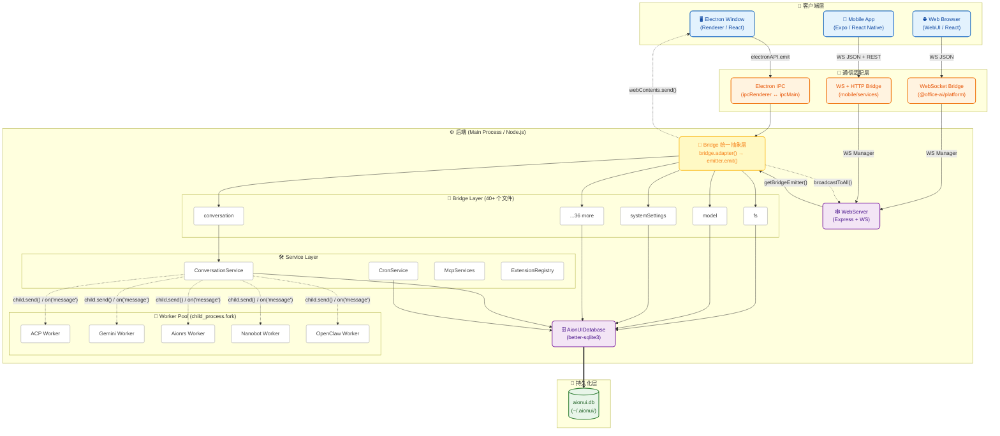
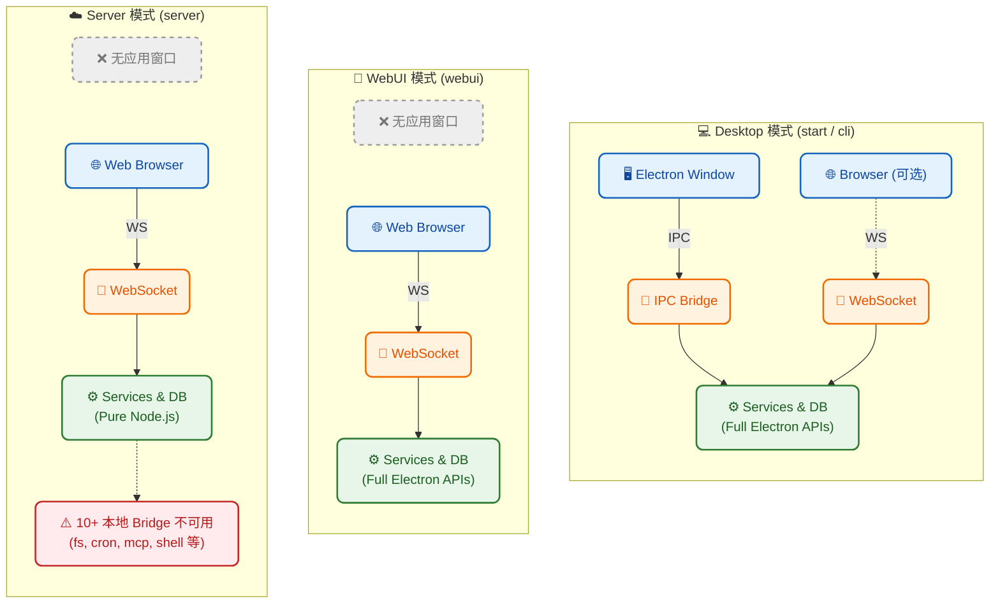

# AionUi Architecture

> 基于代码分析，非文档推断。最后更新：2026-04-08

## 模块通信总览



## 四端架构

| 端                  | 技术栈                   | 代码位置        | 通信方式                                 |
| ------------------- | ------------------------ | --------------- | ---------------------------------------- |
| **桌面端 Renderer** | Electron + React         | `src/renderer/` | Electron IPC (contextBridge)             |
| **Web 端**          | React (同 Renderer 代码) | `src/renderer/` | WebSocket (`@office-ai/platform` bridge) |
| **移动端**          | Expo + React Native      | `mobile/`       | WebSocket + HTTP REST (自实现 bridge)    |
| **后端 Process**    | Node.js / Electron Main  | `src/process/`  | —                                        |

## 三种运行模式



## 通信协议细节

| 路径                    | 传输层                                  | 消息格式                                           | 认证                                                       |
| ----------------------- | --------------------------------------- | -------------------------------------------------- | ---------------------------------------------------------- |
| Electron Window → Main  | Electron IPC (`ipcRenderer.invoke`)     | `JSON.stringify({name, data})`                     | 无需（同进程组）                                           |
| Browser → WebServer     | WebSocket (`ws://` / `wss://`)          | `JSON {name, data}`                                | JWT (Cookie)                                               |
| Mobile → WebServer      | WebSocket (`ws://`) + HTTP (`axios`)    | WS: `JSON {name, data}`; HTTP: REST + Bearer Token | JWT (Sec-WebSocket-Protocol header / Authorization header) |
| Main → Renderer         | `webContents.send()`                    | `JSON {name, data}`                                | 无需                                                       |
| Main → Browser / Mobile | `WebSocketManager.broadcast()`          | `JSON {name, data}`                                | 已认证连接                                                 |
| Main → Worker           | `child_process.fork()` + `child.send()` | Node.js IPC (structured clone)                     | 无需（子进程）                                             |

### Mobile Bridge 协议

Mobile 端自实现了 `@office-ai/platform` 的 subscribe 协议：

- **请求**：`send('subscribe-{name}', { id, data })` → 等待 `subscribe.callback-{name}{id}` 响应
- **推送**：直接监听 WebSocket 事件名
- **认证**：JWT token 通过 `Sec-WebSocket-Protocol` header 传递；HTTP 通过 `Authorization: Bearer` header
- **心跳**：服务端 ping → 客户端 pong（50s 无心跳判定死连接）
- **Token 刷新**：过期时调用 `POST /api/auth/refresh`

## 关键文件索引

| 模块                        | 入口 / 核心文件                                       |
| --------------------------- | ----------------------------------------------------- |
| Electron 主进程             | `src/index.ts`                                        |
| Standalone Server           | `src/server.ts`                                       |
| Renderer (React)            | `src/renderer/main.tsx`                               |
| Preload                     | `src/preload/main.ts`                                 |
| Adapter (Electron 主进程侧) | `src/common/adapter/main.ts`                          |
| Adapter (Browser 侧)        | `src/common/adapter/browser.ts`                       |
| Adapter (Standalone 侧)     | `src/common/adapter/standalone.ts`                    |
| Adapter (共享注册表)        | `src/common/adapter/registry.ts`                      |
| Bridge API 定义             | `src/common/adapter/ipcBridge.ts`                     |
| Bridge 实现                 | `src/process/bridge/*.ts` (40 files)                  |
| WebServer                   | `src/process/webserver/index.ts`                      |
| WebSocket 管理              | `src/process/webserver/websocket/WebSocketManager.ts` |
| Worker 协议                 | `src/process/worker/WorkerProtocol.ts`                |
| 数据库                      | `src/process/services/database/index.ts`              |
| Mobile WebSocket            | `mobile/src/services/websocket.ts`                    |
| Mobile Bridge               | `mobile/src/services/bridge.ts`                       |
| Mobile HTTP API             | `mobile/src/services/api.ts`                          |

## 后端功能域

后端代码位于 `src/process/`，按功能可划分为 15 个域。

### 后端架构总览

<table>
<tr>
<td width="120" align="center" style="background:#c8e6c9;"><strong>客户端层</strong></td>
<td style="background:#e8f5e9;">
  <table width="100%"><tr>
    <td align="center" width="33%" style="background:#fff;border:1px solid #a5d6a7;">Electron Window<br/><sub>Renderer / React</sub></td>
    <td align="center" width="33%" style="background:#fff;border:1px solid #a5d6a7;">Web Browser<br/><sub>WebUI / React</sub></td>
    <td align="center" width="33%" style="background:#fff;border:1px solid #a5d6a7;">Mobile App<br/><sub>Expo / React Native</sub></td>
  </tr></table>
</td>
</tr>
<tr>
<td align="center" style="background:#bbdefb;"><strong>通信层</strong></td>
<td style="background:#e3f2fd;">

  <table width="100%"><tr>
    <td align="center" width="33%" style="background:#fff;border:1px solid #90caf9;">Electron IPC<br/><sub>ipcRenderer ↔ ipcMain</sub></td>
    <td align="center" width="33%" style="background:#fff;border:1px solid #90caf9;">WebSocket<br/><sub>@office-ai/platform bridge</sub></td>
    <td align="center" width="33%" style="background:#fff;border:1px solid #90caf9;">HTTP REST<br/><sub>Express + axios</sub></td>
  </tr></table>
</td>
</tr>

<tr>
<td align="center" style="background:#fff9c4;"><strong>Bridge<br/>抽象层</strong></td>
<td align="center" style="background:#fffde7;border:2px solid #fbc02d;">
  <strong>bridge.adapter()</strong> → 40+ handler 统一分发 → <code>src/process/bridge/*.ts</code>
</td>
</tr>

<tr>
<td align="center" style="background:#ffe0b2;"><strong>核心<br/>业务域</strong></td>
<td style="background:#fff3e0;">
  <table width="100%"><tr>
    <td align="center" style="background:#fff;border:1px solid #ffcc80;"><strong>会话管理</strong><br/><sub>CRUD · 迁移<br/>状态 · 确认队列</sub></td>
    <td align="center" style="background:#fff;border:1px solid #ffcc80;"><strong>Agent 运行时</strong><br/><sub>ACP · Gemini<br/>OpenClaw · Remote<br/>Aionrs · Nanobot</sub></td>
    <td align="center" style="background:#fff;border:1px solid #ffcc80;"><strong>Team 编排</strong><br/><sub>Mailbox · TaskBoard<br/>MCP Server<br/>状态机</sub></td>
    <td align="center" style="background:#fff;border:1px solid #ffcc80;"><strong>频道网关</strong><br/><sub>Telegram · 飞书<br/>钉钉 · 微信<br/>配对授权</sub></td>
    <td align="center" style="background:#fff;border:1px solid #ffcc80;"><strong>扩展系统</strong><br/><sub>Loader · Registry<br/>沙箱 · Hub</sub></td>
    <td align="center" style="background:#fff;border:1px solid #ffcc80;"><strong>模型管理</strong><br/><sub>多平台 Provider<br/>协议检测<br/>Bedrock</sub></td>
    <td align="center" style="background:#fff;border:1px solid #ffcc80;"><strong>MCP 服务</strong><br/><sub>协议 · OAuth<br/>Agent 集成</sub></td>
  </tr></table>
</td>
</tr>

<tr>
<td align="center" style="background:#e1bee7;"><strong>平台<br/>服务层</strong></td>
<td style="background:#f3e5f5;">
  <table width="100%"><tr>
    <td align="center" style="background:#fff;border:1px solid #ce93d8;"><strong>定时任务</strong><br/><sub>croner 调度<br/>BusyGuard</sub></td>
    <td align="center" style="background:#fff;border:1px solid #ce93d8;"><strong>文件系统</strong><br/><sub>读写 · 监听<br/>技能管理 · ZIP</sub></td>
    <td align="center" style="background:#fff;border:1px solid #ce93d8;"><strong>文件快照</strong><br/><sub>Git / 临时对比<br/>stage · diff</sub></td>
    <td align="center" style="background:#fff;border:1px solid #ce93d8;"><strong>预览 &amp; 转换</strong><br/><sub>Office 预览<br/>格式转换</sub></td>
    <td align="center" style="background:#fff;border:1px solid #ce93d8;"><strong>认证</strong><br/><sub>JWT · QR 码<br/>微信 · Google</sub></td>
    <td align="center" style="background:#fff;border:1px solid #ce93d8;"><strong>更新系统</strong><br/><sub>GitHub Release<br/>electron-updater</sub></td>
    <td align="center" style="background:#fff;border:1px solid #ce93d8;"><strong>WebServer</strong><br/><sub>Express 路由<br/>WS 适配</sub></td>
  </tr></table>
</td>
</tr>

<tr>
<td align="center" style="background:#cfd8dc;"><strong>系统<br/>能力层</strong></td>
<td style="background:#eceff1;">
  <table width="100%"><tr>
    <td align="center" style="background:#fff;border:1px solid #b0bec5;">应用控制<br/><sub>重启 · CDP<br/>开机启动</sub></td>
    <td align="center" style="background:#fff;border:1px solid #b0bec5;">系统设置<br/><sub>语言 · 通知<br/>唤醒</sub></td>
    <td align="center" style="background:#fff;border:1px solid #b0bec5;">窗口控制<br/><sub>最小化<br/>最大化</sub></td>
    <td align="center" style="background:#fff;border:1px solid #b0bec5;">Shell 操作<br/><sub>打开文件<br/>终端 · VS Code</sub></td>
    <td align="center" style="background:#fff;border:1px solid #b0bec5;">系统通知<br/><sub>原生通知<br/>点击跳转</sub></td>
    <td align="center" style="background:#fff;border:1px solid #b0bec5;">桌面宠物<br/><sub>状态机<br/>确认气泡</sub></td>
    <td align="center" style="background:#fff;border:1px solid #b0bec5;">托盘菜单<br/><sub>深度链接<br/>aionui://</sub></td>
  </tr></table>
</td>
</tr>

<tr>
<td align="center" style="background:#ffe0b2;"><strong>Agent<br/>协议层</strong></td>
<td style="background:#fff3e0;">
  <table width="100%"><tr>
    <td align="center" style="background:#fff;border:1px solid #ffcc80;"><strong>ACP</strong><br/><sub>AcpConnection<br/>CLI 启动 · MCP 集成</sub></td>
    <td align="center" style="background:#fff;border:1px solid #ffcc80;"><strong>Gemini</strong><br/><sub>Gemini API 适配<br/>OAuth · 流式</sub></td>
    <td align="center" style="background:#fff;border:1px solid #ffcc80;"><strong>OpenClaw</strong><br/><sub>Gateway 连接<br/>冲突检测</sub></td>
    <td align="center" style="background:#fff;border:1px solid #ffcc80;"><strong>Remote</strong><br/><sub>远程 WebSocket<br/>设备身份认证</sub></td>
    <td align="center" style="background:#fff;border:1px solid #ffcc80;"><strong>Aionrs</strong><br/><sub>Rust 桥接<br/>aionrs 运行时</sub></td>
    <td align="center" style="background:#fff;border:1px solid #ffcc80;"><strong>Nanobot</strong><br/><sub>轻量级本地<br/>Agent</sub></td>
  </tr></table>
</td>
</tr>

<tr>
<td align="center" style="background:#b3e5fc;"><strong>Worker<br/>隔离层</strong></td>
<td style="background:#e1f5fe;">
  <table width="100%"><tr>
    <td align="center" width="33%" style="background:#fff;border:1px solid #81d4fa;">ForkTask<br/><sub>child_process.fork()</sub></td>
    <td align="center" width="33%" style="background:#fff;border:1px solid #81d4fa;">Pipe 通信<br/><sub>双向 Promise · pipeId</sub></td>
    <td align="center" width="33%" style="background:#fff;border:1px solid #81d4fa;">Worker 脚本<br/><sub>acp · gemini · aionrs<br/>nanobot · openclaw</sub></td>
  </tr></table>
</td>
</tr>

<tr>
<td align="center" style="background:#c8e6c9;"><strong>数据<br/>存储层</strong></td>
<td style="background:#e8f5e9;">
  <table width="100%"><tr>
    <td align="center" width="33%" style="background:#fff;border:1px solid #a5d6a7;">SQLite (WAL)<br/><sub>better-sqlite3 / BunSqlite</sub></td>
    <td align="center" width="33%" style="background:#fff;border:1px solid #a5d6a7;">Repository 模式<br/><sub>Conversation · Channel · Cron</sub></td>
    <td align="center" width="33%" style="background:#fff;border:1px solid #a5d6a7;">Schema &amp; 迁移<br/><sub>6 表 · 版本化迁移</sub></td>
  </tr></table>
</td>
</tr>

<tr>
<td align="center" style="background:#ffcdd2;"><strong>外部系统</strong></td>
<td style="background:#ffebee;">
  <table width="100%"><tr>
    <td align="center" style="background:#fff;border:1px solid #ef9a9a;">ACP CLI</td>
    <td align="center" style="background:#fff;border:1px solid #ef9a9a;">Gemini API</td>
    <td align="center" style="background:#fff;border:1px solid #ef9a9a;">AWS Bedrock</td>
    <td align="center" style="background:#fff;border:1px solid #ef9a9a;">Telegram API</td>
    <td align="center" style="background:#fff;border:1px solid #ef9a9a;">飞书 / 钉钉</td>
    <td align="center" style="background:#fff;border:1px solid #ef9a9a;">MCP Servers</td>
    <td align="center" style="background:#fff;border:1px solid #ef9a9a;">GitHub Releases</td>
  </tr></table>
</td>
</tr>
</table>

```
                                    客户端
                     Electron Window · Browser · Mobile
                              │ IPC / WS / HTTP
              ┌───────────────▼──────────────────────────────────┐
              │         Bridge 抽象层 + WebServer                │
              │    40+ handlers · Express · WS 适配 · JWT 认证   │
              └───┬──────┬──────┬──────┬──────┬──────────────┬───┘
                  │      │      │      │      │              │
                  ▼      ▼      ▼      ▼      ▼              ▼
┌──────────────────────────────────────────────────┐   ┌──────────────────────────────────────┐
│                 Agent 消费者                     │   │          独立功能域                  │
│                                                  │   │                                      │
│  ┌────────────┐  ┌──────────────┐                │   │   模型管理          MCP 服务         │
│  │  会话管理  │  │  Team 编排   │                │   │   多平台 Provider   协议 · OAuth     │
│  │            │  │              │                │   │   协议检测          Agent 集成       │
│  │  CRUD      │  │  Mailbox     │                │   │   Bedrock 适配                       │
│  │  迁移      │  │  TaskBoard   │                │   │                                      │
│  │  状态机    │  │  MCP Server  │                │   │   文件系统          文件快照         │
│  │  确认队列  │  │  状态机编排  │                │   │   读写 · 监听       Git/临时对比     │
│  └──────┬─────┘  └──────┬───────┘                │   │   技能管理 · ZIP    stage · diff     │
│         │               │                        │   │                                      │
│  ┌──────┴───────────────┴──────────────────────┐ │   │   预览 & 转换       认证 & 更新      │
│  │                                             │ │   │   Office 预览       JWT · QR 码      │
│  │  ┌──────────────────┐  ┌────────────────┐   │ │   │   格式转换          electron-updater │
│  │  │  Channels 网关   │  │  Cron 定时任务 │   │ │   │                                      │
│  │  │                  │  │                │   │ │   │   WebServer         系统管理         │
│  │  │ Telegram (grammY)│  │  croner 调度   │   │ │   │   Express 路由      应用控制         │
│  │  │  飞书 (WebSocket)│  │  BusyGuard     │   │ │   │   WS 适配           系统设置         │
│  │  │  钉钉 (Stream)   │  │  Job 执行器    │   │ │   │                     窗口 · Shell     │
│  │  │  微信            │  └───────┬────────┘   │ │   │   扩展系统          桌面宠物         │
│  │  │  配对 · 会话隔离 │          │            │ │   │   Loader · Registry 状态机           │
│  │  └────────┬─────────┘          │            │ │   │   沙箱 · 权限       确认气泡         │
│  │           │                    │            │ │   │   Hub 市场          托盘 · 菜单      │
│  └───────────┼────────────────────┼────────────┘ │   │   10 Resolver                        │
│              │                    │              │   └──────────────────────────────────────┘
└──────────────┼────────────────────┼──────────────┘
               │                    │
               ▼                    ▼
          所有 Agent 消费者统一通过此接口调度 Agent
               │                    │
               ▼                    ▼
    ┌───────────────────────────────────────────────┐
    │             Agent 编排层                      │
    │                                               │
    │   WorkerTaskManager                           │
    │   AgentFactory · 实例缓存 · 30min 空闲回收    │
    │   MessageMiddleware (think tag / cron 检测)   │
    ├───────────────────────────────────────────────┤
    │             Agent Manager 层                  │
    │                                               │
    │   AcpAgentMgr         GeminiAgentMgr          │
    │   OpenClawMgr         RemoteAgentMgr          │
    │   AionrsMgr           NanobotMgr              │
    │                                               │
    │   继承链: *AgentManager → BaseAgentManager    │
    │           → ForkTask → Pipe → EventEmitter    │
    ├───────────────────────────────────────────────┤
    │             Worker 进程隔离                   │
    │                                               │
    │   ForkTask: child_process.fork()              │
    │   Pipe: 双向 Promise 通信 (pipeId 匹配)       │
    │   getEnhancedEnv(): 继承完整 PATH             │
    ╞═══════════════════════════════════════════════╡
    │             Agent 协议层  (子进程内)          │ ← 进程边界
    │                                               │
    │   AcpAgent · AcpConnection · acpConnectors    │
    │   GeminiAgent · OpenClawAgent · RemoteAgent   │
    │   AionrsAgent · NanobotAgent                  │
    │                                               │
    │   连接方式: stdio / WebSocket / HTTP          │
    └───────────────────────┬───────────────────────┘
                            │
                            │ stdio JSON-RPC / HTTP API / WebSocket
                            ▼
    ┌───────────────────────────────────────────────┐
    │                   外部系统                    │
    │                                               │
    │   ACP CLI (claude / qwen / codex)             │
    │   Gemini API · AWS Bedrock                    │
    │   OpenClaw Gateway · MCP Servers              │
    └───────────────────────────────────────────────┘


    ── 横切关注点 (贯穿多层) ──────────────────────────

    ┌─────────────────────────┐    ┌───────────────────────────┐
    │       扩展系统          │    │         数据库            │
    │                         │    │                           │
    │   注入到:               │    │   SQLite WAL 模式         │
    │     Channels (插件)     │    │   6 张核心表              │
    │     Models (Provider)   │    │   版本化迁移              │
    │     MCP (Server 声明)   │    │   Repository 模式         │
    │     Skills · Theme      │    │   BetterSqlite3 / Bun     │
    │     Settings · I18n     │    │                           │
    └─────────────────────────┘    └───────────────────────────┘
```

### 1. 会话管理

| 职责                                    | 核心文件                                            |
| --------------------------------------- | --------------------------------------------------- |
| 会话 CRUD（7 种 agent 类型）            | `services/ConversationServiceImpl.ts`               |
| 会话接口定义                            | `services/IConversationService.ts`                  |
| IPC handler（创建/删除/更新/重置/停止） | `bridge/conversationBridge.ts`                      |
| 数据持久化                              | `services/database/SqliteConversationRepository.ts` |

- 支持会话迁移（跨对话复制消息和定时任务）
- 会话状态：pending → running → finished/stopped
- 工具确认队列 + yoloMode 自动确认

### 2. Agent 运行时

| 职责                                    | 核心文件                                          |
| --------------------------------------- | ------------------------------------------------- |
| Agent 工厂（按会话类型创建）            | `task/AgentFactory.ts`                            |
| 基类（进程管理 + 确认队列）             | `task/BaseAgentManager.ts`                        |
| 实例缓存 + 空闲回收（30min）            | `task/WorkerTaskManager.ts`                       |
| 消息中间件（think tag / cron 命令检测） | `task/MessageMiddleware.ts`                       |
| ACP Agent 实现                          | `task/AcpAgentManager.ts`、`agent/acp/`           |
| Gemini Agent 实现                       | `task/GeminiAgentManager.ts`、`agent/gemini/`     |
| OpenClaw Agent 实现                     | `task/OpenClawAgentManager.ts`、`agent/openclaw/` |
| Remote Agent 实现                       | `task/RemoteAgentManager.ts`、`agent/remote/`     |
| Aionrs Agent 实现                       | `task/AionrsManager.ts`、`agent/aionrs/`          |
| Nanobot Agent 实现                      | `task/NanoBotAgentManager.ts`、`agent/nanobot/`   |

进程隔离链：`WorkerTaskManager` → `AgentFactory.create()` → `BaseAgentManager` (extends `ForkTask`) → `child_process.fork()` → `worker/{type}.ts`

### 3. Worker 进程隔离

| 职责                                        | 核心文件                   |
| ------------------------------------------- | -------------------------- |
| 子进程封装                                  | `worker/fork/ForkTask.ts`  |
| 双向 Promise 通信管道                       | `worker/fork/pipe.ts`      |
| ACP/Gemini/Aionrs/Nanobot/OpenClaw 启动脚本 | `worker/acp.ts` 等         |
| 通信协议定义                                | `worker/WorkerProtocol.ts` |

- 主进程通过 `child.send()` / `process.on('message')` 与 worker 双向通信
- `Pipe` 实现 pipeId 匹配的 Promise 模式
- `ForkTask.init()` 使用 `getEnhancedEnv()` 继承完整 PATH

### 4. Team 多 Agent 编排

| 职责                                                   | 核心文件                           |
| ------------------------------------------------------ | ---------------------------------- |
| 团队会话工厂（创建/列表/删除）                         | `team/TeamSessionService.ts`       |
| 运行时协调器                                           | `team/TeamSession.ts`              |
| Agent 状态机编排（idle→active→finalize）               | `team/TeammateManager.ts`          |
| 异步消息邮箱                                           | `team/Mailbox.ts`                  |
| 共享任务看板（pending/in_progress/completed + 依赖链） | `team/TaskManager.ts`              |
| TCP MCP 服务器（向 Agent 暴露团队工具）                | `team/TeamMcpServer.ts`            |
| 跨平台 Agent 适配                                      | `team/adapters/PlatformAdapter.ts` |
| IPC handler                                            | `bridge/teamBridge.ts`             |

MCP 工具：`send_message` / `create_task` / `update_task` / `spawn_agent` / `get_agents` / `rename_agent`

### 5. 多平台频道网关

| 职责                                      | 核心文件                                  |
| ----------------------------------------- | ----------------------------------------- |
| 单例管理中心                              | `channels/core/ChannelManager.ts`         |
| per-chat 会话隔离（userId:chatId 复合键） | `channels/core/SessionManager.ts`         |
| 插件生命周期管理                          | `channels/gateway/PluginManager.ts`       |
| 消息路由引擎                              | `channels/gateway/ActionExecutor.ts`      |
| 6 位码配对授权（10min 过期）              | `channels/pairing/PairingService.ts`      |
| 流式消息回调（与 Agent 解耦）             | `channels/agent/ChannelMessageService.ts` |
| IPC handler                               | `bridge/channelBridge.ts`                 |

内置插件：

| 平台     | SDK                     | 连接方式         |
| -------- | ----------------------- | ---------------- |
| Telegram | grammY                  | Long Polling     |
| 飞书     | @larksuiteoapi/node-sdk | WebSocket 长连接 |
| 钉钉     | dingtalk-stream         | WebSocket Stream |
| 微信     | 自实现                  | 主动消息         |

插件基类 `BasePlugin` 生命周期：`created → initializing → ready → starting → running → stopping → stopped`

### 6. 扩展系统

| 职责                                                          | 核心文件                            |
| ------------------------------------------------------------- | ----------------------------------- |
| 扩展发现（4 个来源：builtin/user/workspace/hub）              | `extensions/ExtensionLoader.ts`     |
| 全局注册表（验证/排序/激活/缓存）                             | `extensions/ExtensionRegistry.ts`   |
| 生命周期钩子（onActivate/onDeactivate/onInstall/onUninstall） | `extensions/lifecycle/lifecycle.ts` |
| 沙箱隔离 + 权限分析（safe/moderate/dangerous）                | `extensions/sandbox/`               |
| Hub 市场（下载/安装/更新）                                    | `extensions/hub/HubInstaller.ts`    |
| IPC handler（扩展管理）                                       | `bridge/extensionsBridge.ts`        |
| IPC handler（Hub 安装）                                       | `bridge/hubBridge.ts`               |

10 种贡献 Resolver（`extensions/resolvers/`）：

| Resolver              | 解析对象       |
| --------------------- | -------------- |
| AcpAdapterResolver    | ACP 后端适配器 |
| McpServerResolver     | MCP 服务器声明 |
| SkillResolver         | 技能/工具      |
| AssistantResolver     | 预制助手       |
| ThemeResolver         | CSS 主题       |
| ChannelPluginResolver | 频道插件       |
| SettingsTabResolver   | 设置标签页     |
| ModelProviderResolver | 模型提供商     |
| I18nResolver          | 多语言翻译     |
| WebuiResolver         | Web UI 贡献    |

### 7. 数据管理

| 职责                                  | 核心文件                          |
| ------------------------------------- | --------------------------------- |
| 数据库核心（SQLite WAL 模式）         | `services/database/index.ts`      |
| Schema 定义（6 张表）                 | `services/database/schema.ts`     |
| 版本化迁移                            | `services/database/migrations.ts` |
| 驱动抽象（BetterSqlite3 / BunSqlite） | `services/database/drivers/`      |
| IPC handler                           | `bridge/databaseBridge.ts`        |

核心表：`users` / `conversations` / `messages` / `teams` / `mailbox` / `team_tasks`

Repository 模式：`SqliteConversationRepository` / `SqliteChannelRepository` / `SqliteCronRepository`

### 8. 文件系统

| 职责                                                | 核心文件                                                                    |
| --------------------------------------------------- | --------------------------------------------------------------------------- |
| 文件读写 + Workspace + 技能管理 + ZIP               | `bridge/fsBridge.ts`（1661 行，最大 bridge）                                |
| 通用文件变化监听                                    | `bridge/fileWatchBridge.ts`                                                 |
| Office 文件监听（.pptx/.docx/.xlsx）                | `bridge/officeWatchBridge.ts`                                               |
| 文件快照（Git/临时快照对比，stage/unstage/discard） | `services/WorkspaceSnapshotService.ts`、`bridge/workspaceSnapshotBridge.ts` |

fsBridge 子功能：文件读写（文本/二进制/gzip）、Workspace 目录树、文件复制、远程下载、ZIP 打包/取消、技能 CRUD（读取/安装/卸载/扫描/符号链接导入/导出）、内置资源多语言回退

### 9. 模型/Provider 管理

| 职责                           | 核心文件                                          |
| ------------------------------ | ------------------------------------------------- |
| 模型列表 + 协议检测 + 配置管理 | `bridge/modelBridge.ts`（1275 行，第二大 bridge） |
| AWS Bedrock 连接测试           | `bridge/bedrockBridge.ts`                         |
| Gemini 订阅状态                | `bridge/geminiBridge.ts`                          |

支持平台：OpenAI 兼容 / Vertex AI / Bedrock / OpenRouter / 阿里云 / 百度千帆 / 智谱 / 火山引擎 / 讯飞 / 腾讯 / Google / Claude 等。自动协议检测 + base URL 修复 + 多 Key 支持。

### 10. 定时任务

| 职责                | 核心文件                                        |
| ------------------- | ----------------------------------------------- |
| 调度引擎（croner）  | `services/cron/CronService.ts`                  |
| 任务数据管理        | `services/cron/CronStore.ts`                    |
| 通过 Agent 执行任务 | `services/cron/WorkerTaskManagerJobExecutor.ts` |
| 并发防护            | `services/cron/CronBusyGuard`                   |
| IPC handler         | `bridge/cronBridge.ts`                          |

- 调度格式：cron 表达式 / 间隔 / 一次性
- 执行模式：`existing`（复用会话）/ `new_conversation`（新建会话）
- 每个 cron job 可绑定一个 skill 文件

### 11. MCP 服务

| 职责                               | 核心文件                                                       |
| ---------------------------------- | -------------------------------------------------------------- |
| MCP 协调（获取配置/测试连接/同步） | `services/mcpServices/McpService.ts`                           |
| MCP 协议实现                       | `services/mcpServices/McpProtocol.ts`                          |
| OAuth 支持                         | `services/mcpServices/McpOAuthService.ts`                      |
| 多平台 MCP Agent                   | `services/mcpServices/agents/` (Claude/Gemini/Codex/Aionrs 等) |
| IPC handler                        | `bridge/mcpBridge.ts`                                          |

### 12. 认证与 WebServer

| 职责                                 | 核心文件                                                               |
| ------------------------------------ | ---------------------------------------------------------------------- |
| WebServer 入口（Express + WS）       | `webserver/index.ts`                                                   |
| JWT 认证（签发/验证/黑名单）         | `webserver/auth/service/AuthService.ts`                                |
| Token 中间件                         | `webserver/auth/middleware/TokenMiddleware.ts`                         |
| 用户数据访问                         | `webserver/auth/repository/UserRepository.ts`                          |
| 速率限制                             | `webserver/auth/repository/RateLimitStore.ts`                          |
| 认证路由（/login /logout /qr-login） | `webserver/routes/authRoutes.ts`                                       |
| 业务 API 路由                        | `webserver/routes/apiRoutes.ts`                                        |
| 静态资源路由                         | `webserver/routes/staticRoutes.ts`                                     |
| WebSocket 适配                       | `webserver/adapter.ts`                                                 |
| WebUI 管理（启动/停止/状态）         | `bridge/webuiBridge.ts`                                                |
| QR 码登录 URL 生成                   | `bridge/webuiQR.ts`                                                    |
| Google OAuth                         | `bridge/authBridge.ts`                                                 |
| 微信登录 SSE 流                      | `webserver/routes/weixinLoginRoutes.ts`、`bridge/weixinLoginBridge.ts` |

### 13. 系统管理

| 职责                                          | 核心文件                          |
| --------------------------------------------- | --------------------------------- |
| 应用控制（重启/DevTools/缩放/开机启动/CDP）   | `bridge/applicationBridge.ts`     |
| 跨平台路径（home/desktop/downloads）          | `bridge/applicationBridgeCore.ts` |
| 系统设置（托盘/通知/唤醒/语言/宠物/命令队列） | `bridge/systemSettingsBridge.ts`  |
| 窗口控制（最小化/最大化/关闭）                | `bridge/windowControlsBridge.ts`  |
| Shell 操作（打开文件/VS Code/终端/工具检测）  | `bridge/shellBridge.ts`           |
| 系统通知                                      | `bridge/notificationBridge.ts`    |
| 深度链接 `aionui://`                          | `utils/deepLink.ts`               |
| 系统托盘                                      | `utils/tray.ts`                   |
| 应用菜单                                      | `utils/appMenu.ts`                |

### 14. 更新系统

| 职责                                          | 核心文件                         |
| --------------------------------------------- | -------------------------------- |
| 手动更新（GitHub Release 解析/下载/安全校验） | `bridge/updateBridge.ts`         |
| 自动更新（electron-updater 封装）             | `services/autoUpdaterService.ts` |

- 多平台资源：macOS (.dmg) / Windows (.exe/.msi) / Linux (.deb/.rpm)
- 安全：下载 Host 白名单 + 扩展名校验 + 重定向跟踪（最多 8 次）

### 15. 预览与文档转换

| 职责                                                  | 核心文件                                                              |
| ----------------------------------------------------- | --------------------------------------------------------------------- |
| Office 实时预览（PPT/Word/Excel via officecli watch） | `bridge/pptPreviewBridge.ts`                                          |
| 文档转换引擎                                          | `services/conversionService.ts`                                       |
| 转换 IPC                                              | `bridge/documentBridge.ts`                                            |
| 预览历史管理                                          | `services/previewHistoryService.ts`、`bridge/previewHistoryBridge.ts` |

转换能力：Word↔Markdown (mammoth) / Excel→JSON (xlsx) / PPT→JSON (PPTX2Json) / HTML↔Markdown (Turndown)

### 附：桌面宠物

| 职责                               | 核心文件                   |
| ---------------------------------- | -------------------------- |
| 窗口管理（透明/置顶/拖拽碰撞检测） | `pet/petManager.ts`        |
| 状态机（20 种状态 + 优先级转换）   | `pet/petStateMachine.ts`   |
| 闲置动画轮询                       | `pet/petIdleTicker.ts`     |
| 工具确认浮动气泡                   | `pet/petConfirmManager.ts` |
| 事件桥接                           | `pet/petEventBridge.ts`    |
